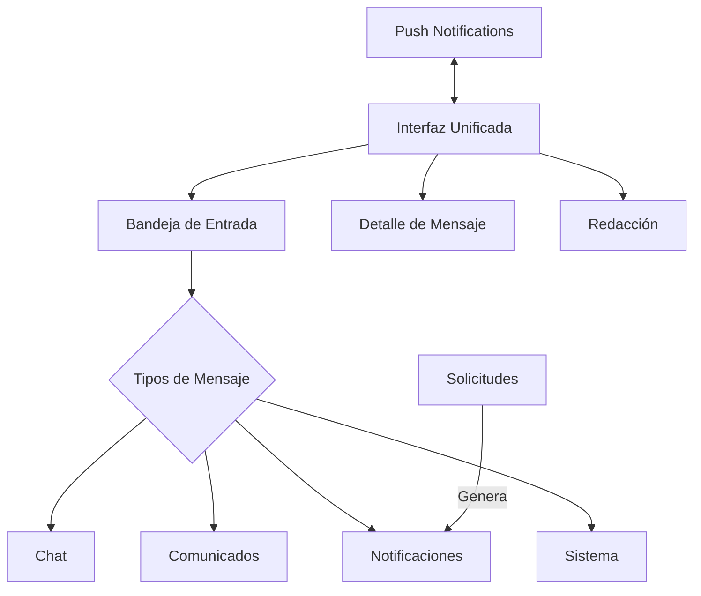
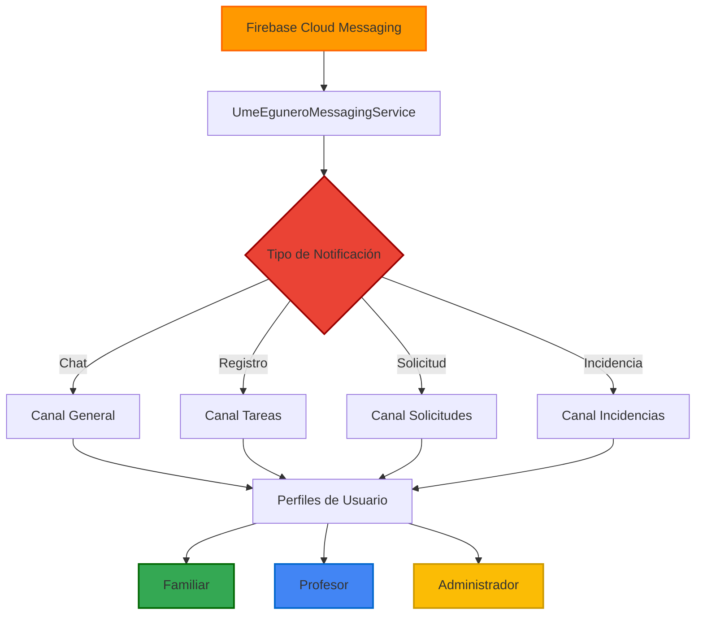
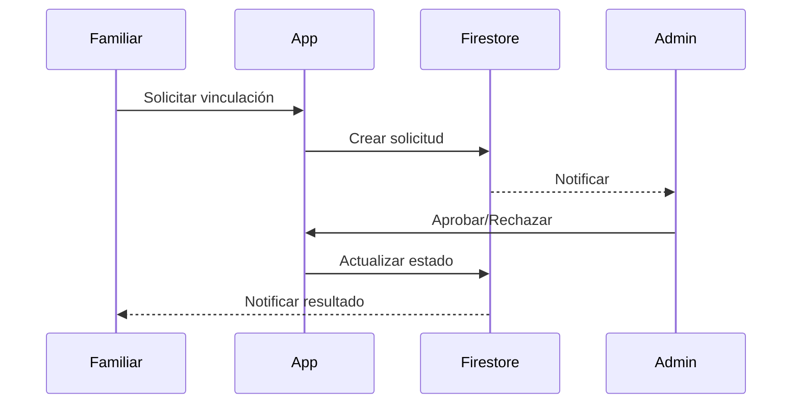

# UmeEgunero - Plataforma de Gestión Educativa para Centros Preescolares

[](https://kotlinlang.org/)
[](https://developer.android.com/jetpack/compose)
[](https://firebase.google.com/)
[](https://dagger.dev/hilt/)
[](https://developers.google.com/apps-script)

<div align="center">
  
</div>

UmeEgunero es una aplicación Android nativa desarrollada como Trabajo Fin de Grado para el ciclo de Desarrollo de Aplicaciones Multiplataforma. Diseñada con tecnología punta, esta solución integral facilita la comunicación y gestión en centros educativos de educación infantil, conectando a administradores, profesores y familias en un entorno digital seguro y eficiente.

## 🚀 Características Principales

### 🔐 Gestión de Usuarios Multi-Rol
- **Plataforma Multi-Perfil**: Sistema completo de perfiles con permisos específicos (Administrador App, Administrador Centro, Profesor, Familiar)
- **Autenticación Segura**: Implementación de Firebase Authentication con opciones biométricas
- **Gestión de Vinculaciones**: Relaciones entre profesores, aulas, familiares y alumnos

### 📊 Administración Educativa
- **Dashboard Analítico**: Estadísticas en tiempo real y visualización de datos relevantes
- **Gestión de Centros**: Administración completa de centros educativos, cursos y aulas
- **Seguimiento Académico**: Monitorización del progreso educativo de cada alumno

### 📱 Experiencia de Usuario Avanzada
- **UI Moderna**: Interfaz fluida desarrollada íntegramente con Jetpack Compose
- **Navegación Intuitiva**: Experiencia de usuario adaptada a cada perfil
- **Diseño Responsive**: Adaptación óptima a diferentes tamaños de pantalla
- **Feedback Háptico**: Retroalimentación táctil para mejorar la interactividad y confirmar acciones importantes

### 📝 Sistema de Comunicación Unificado
- **Bandeja Unificada**: Una sola interfaz para todas las formas de comunicación (mensajes, comunicados, notificaciones)
- **Tipos de Mensajes**: Soporte para múltiples formatos de comunicación adaptados a cada contexto:
  - Chat: Comunicación directa entre usuarios
  - Comunicados: Anuncios oficiales del centro
  - Notificaciones: Avisos automáticos del sistema
  - Incidencias: Registro de eventos importantes
  - Asistencia: Información sobre presencia y ausencias
  - Registros Diarios: Actividades y evolución de los alumnos
- **Sistema de Prioridades**: Diferenciación visual entre mensajes normales, prioritarios y urgentes
- **Arquitectura Centralizada**: Repositorio único para todas las operaciones de mensajería
- **Personalización por Rol**: Experiencia adaptada a cada perfil de usuario (administrador, profesor, familiar)
- **Integración con Solicitudes**: Generación automática de notificaciones para solicitudes de vinculación
- **Soporte para FCM**: Notificaciones push en tiempo real para todos los tipos de mensajes
- **Canal de Notificaciones Dedicado**: Canal específico para comunicaciones del sistema unificado

### 🔗 Integración del Sistema
El sistema de comunicación unificado se integra con:
- **Solicitudes de Vinculación**: Notificaciones automáticas durante el proceso de vinculación familiar-alumno
- **Sistema de Notificaciones FCM**: Notificaciones push en segundo plano y en primer plano
- **Deeplinks**: Navegación directa a los mensajes desde las notificaciones
- **Perfiles de Usuario**: Interfaces adaptadas para cada tipo de usuario



### 👶 Gestión Preescolar Especializada
- **Registros Diarios**: Seguimiento detallado de actividades, comidas, siestas y más
- **Desarrollo Infantil**: Monitorización del progreso educativo y evolutivo
- **Actividades Preescolares**: Asignación y seguimiento de tareas adaptadas

### 🔔 Sistema Avanzado de Notificaciones
- **Notificaciones Contextuales**: Adaptadas a cada perfil de usuario (profesor, familiar, administrador)
- **Canales Múltiples**: Diferentes canales según importancia (general, tareas, solicitudes, incidencias)
- **Firebase Cloud Messaging**: Implementación optimizada para entrega confiable y en tiempo real
- **Deeplinks Inteligentes**: Navegación directa a secciones específicas al interactuar con notificaciones



### 🔄 Sistema de Solicitudes y Vinculaciones
- **Proceso Seguro**: Flujo controlado para vincular familiares con alumnos
- **Sistema Dual**: Implementación híbrida con Firebase Cloud Messaging y Google Apps Script
- **Aprobación Administrativa**: Verificación por administradores del centro
- **Trazabilidad Completa**: Registro detallado de cada etapa del proceso
- **Interacción Mejorada**: Diálogos de confirmación con feedback háptico para acciones críticas



### 🛡️ Arquitectura Híbrida para Operaciones Administrativas
- **Google Apps Script para Administración de Usuarios**: Implementación de microservicios serverless para operaciones críticas
- **Eliminación Segura de Usuarios**: Sistema robusto para eliminación completa de perfiles sin costos adicionales
- **Backend Ligero**: Solución innovadora que evita dependencias de servicios premium

## 🛠️ Arquitectura y Tecnologías

UmeEgunero ha sido desarrollada siguiendo las mejores prácticas actuales en desarrollo Android:

### Arquitectura
- **Patrón MVVM**: Separación clara entre datos, lógica de negocio y UI
- **Clean Architecture**: Organización del código en capas independientes y desacopladas
- **Principios SOLID**: Implementación de principios de diseño para código mantenible

### Stack Tecnológico
- **Kotlin**: Lenguaje principal con utilización de características avanzadas (Coroutines, Flow, Extensions)
- **Jetpack Compose**: Framework declarativo para construcción de UI moderna con componentes interactivos y feedback háptico
- **Firebase Suite**: 
  - Firestore: Base de datos NoSQL en tiempo real
  - Firebase Authentication: Gestión de usuarios y autenticación
  - Cloud Storage: Almacenamiento de archivos y documentos
  - Firebase Cloud Messaging: Sistema de notificaciones push multiplataforma
- **Google Apps Script**: 
  - Utilizado como backend simple para el envío fiable de correos electrónicos HTML, superando limitaciones de Intents
  - Implementación de endpoints para gestión administrativa de usuarios en Firebase Authentication
  - Solución gratuita y eficiente para operaciones administrativas
- **Inyección de Dependencias**: Hilt para gestión eficiente de dependencias
- **Navegación**: Jetpack Navigation Compose para rutas y transiciones
- **Asincronía**: Coroutines y Flow para operaciones no bloqueantes
- **Networking**: OkHttp y Ktor Client para realizar llamadas HTTP a servicios externos
- **Serialización**: Kotlinx Serialization y JSONObject para procesamiento de datos

## 📂 Estructura del Proyecto

El proyecto sigue una estructura modular organizada por características:

```
app/
├── src/
│   ├── main/
│   │   ├── java/com/tfg/umeegunero/
│   │   │   ├── data/               # Capa de datos
│   │   │   │   ├── model/          # Modelos de dominio
│   │   │   │   ├── repository/     # Repositorios
│   │   │   │   └── source/         # Fuentes de datos
│   │   │   ├── di/                 # Módulos de inyección de dependencias
│   │   │   ├── feature/            # Módulos de características
│   │   │   │   ├── admin/          # Funcionalidades de administración
│   │   │   │   ├── auth/           # Autenticación y registro
│   │   │   │   ├── centro/         # Gestión de centros educativos
│   │   │   │   ├── common/         # Componentes compartidos
│   │   │   │   ├── familiar/       # Funcionalidades para familiares
│   │   │   │   └── profesor/       # Funcionalidades para profesores
│   │   │   ├── navigation/         # Sistema de navegación
│   │   │   ├── notification/       # Sistema de notificaciones
│   │   │   │   ├── AppNotificationManager.kt  # Gestión de canales
│   │   │   │   ├── NotificationHelper.kt     # Utilidades para notificaciones
│   │   │   │   └── UmeEguneroMessagingService.kt  # Servicio FCM
│   │   │   ├── ui/                 # Componentes UI reutilizables
│   │   │   └── util/               # Utilidades y extensiones
```

## 📋 Requisitos Técnicos

- **Android Studio**: Hedgehog | 2023.1.1 o superior
- **Kotlin**: 1.9.22 o superior
- **JDK**: Java 17
- **Firebase**: Proyecto configurado con google-services.json
- **Dispositivo/Emulador**: Android 8.0 (API 26) o superior
- **Permisos**: Acceso a notificaciones, Internet

## ⚙️ Configuración del Proyecto

1. **Clonar el repositorio**
   ```bash
   git clone https://github.com/usuario/UmeEgunero.git
   cd UmeEgunero
   ```

2. **Configurar Firebase**
   - Crear proyecto en [Firebase Console](https://console.firebase.google.com/)
   - Descargar el archivo `google-services.json` y colocarlo en la carpeta `/app`
   - Habilitar los servicios necesarios (Authentication, Firestore, Storage, Cloud Messaging)

3. **Configurar Google Apps Script**
   - Crear un nuevo proyecto en [Google Apps Script](https://script.google.com/)
   - Implementar el endpoint para procesamiento de correos y gestión de usuarios
   - La URL del servicio es: https://script.google.com/macros/s/AKfycbze3MmQnykWCV_ymsZgnICiC1wFIZG37-8Pr66ZbJS9X87LiL10wC3JJYVu1MVzsjxP/exec
   - Configurar esta URL en la aplicación

4. **Compilar y ejecutar**
   - Abrir el proyecto en Android Studio
   - Sincronizar con archivos Gradle
   - Ejecutar en dispositivo o emulador

## 📚 Documentación

UmeEgunero incluye documentación completa disponible en múltiples formatos:

### 📖 Documentación Técnica Dokka

La documentación completa del código fuente está disponible en formato HTML generado con Dokka:

- **🏠 [Página Principal de Documentación](app/build/dokka/index.html)**: Punto de entrada a toda la documentación técnica
- **📱 Navegación Interactiva**: Explora todas las clases, funciones y módulos del proyecto
- **🔍 Búsqueda Avanzada**: Encuentra rápidamente cualquier elemento del código
- **📊 Estadísticas**: 5,540+ archivos HTML documentados en 934+ paquetes

#### 🚀 Cómo Generar la Documentación Dokka

```bash
# Generar documentación HTML completa
./gradlew dokkaHtml

# La documentación se generará en: app/build/dokka/
# Abrir en navegador: app/build/dokka/index.html
```

> **💡 Nota**: La documentación Dokka se genera localmente. Después de ejecutar el comando, puedes abrir el archivo `app/build/dokka/index.html` directamente en tu navegador para navegar por toda la documentación técnica del proyecto.

#### 📂 Estructura de la Documentación Dokka

- **Paquetes Principales**: Navegación por módulos y características
- **Clases Documentadas**: Todas las clases con documentación KDoc completa
- **Arquitectura del Sistema**: Documentación detallada de patrones y diseño
- **Utilidades y Extensiones**: Funciones helper y extensiones de Kotlin

#### 🎯 Clases Principales Documentadas

| Componente | Descripción | Ubicación en Dokka |
|------------|-------------|-------------------|
| **MainActivity** | Actividad principal con inicialización completa de Firebase | `com.tfg.umeegunero/-main-activity/` |
| **Navigation** | Sistema de navegación con 1,236 líneas documentadas | `com.tfg.umeegunero.navigation/-navigation/` |
| **DetalleClaseViewModel** | ViewModel con gestión de estado y estadísticas | `com.tfg.umeegunero.feature.common.academico.viewmodel/-detalle-clase-view-model/` |
| **AppUtils** | Utilidades generales y funciones helper | `com.tfg.umeegunero.util/-app-utils/` |
| **NetworkUtils** | Verificación de conectividad y red | `com.tfg.umeegunero.util/-network-utils/` |

### 📋 Documentación Principal

- **[Documentación Técnica](docs/Documentacion_Tecnica.md)**: Arquitectura del sistema, patrones de diseño y consideraciones técnicas
- **[Estructura de Base de Datos](docs/Estructura_Base_Datos.md)**: Detalle de colecciones Firestore y relaciones entre entidades
- **[Manual de Usuario](docs/Manual_Usuario.md)**: Guía de uso para cada perfil de usuario
- **[Testing Aplicación](docs/Testing_Aplicacion.md)**: Estructura y metodología de pruebas

### 🔔 Sistema de Notificaciones y Comunicación

- **[Sistema de Notificaciones](docs/Sistema_Notificaciones.md)**: Arquitectura completa del sistema de notificaciones, diagnóstico y confirmación de lectura
- **[Sistema de Solicitudes](docs/Sistema_Solicitudes.md)**: Implementación del proceso de vinculación familiar-alumno

### ☁️ Cloud Functions y Google Apps Script

- **[Documentación Cloud Functions & GAS](docs/cloud_functions_gas/README.md)**: Resumen ejecutivo completo del sistema backend
- **[Configuración Final](docs/cloud_functions_gas/configuracion_final.md)**: Configuración de servicios
- **[Backup Código Completo](docs/cloud_functions_gas/codigo_backup/index_js_backup_completo.md)**: Backup unificado del código de Cloud Functions

### 🔧 Servicios Auxiliares

- **[Google Apps Script para Firebase Auth](docs/Google_Apps_Script_Firebase_Auth.md)**: Implementación de microservicios serverless para gestión de usuarios

### 📊 Índice de Funcionalidades Documentadas

| Funcionalidad | Documento Principal | Archivos Técnicos |
|---------------|-------------------|-------------------|
| **Notificaciones Push** | [Sistema de Notificaciones](docs/Sistema_Notificaciones.md) | `NotificationDiagnostic.kt`, `UmeEguneroMessagingService.kt` |
| **Confirmación de Lectura** | [Sistema de Notificaciones](docs/Sistema_Notificaciones.md) | `LecturaFamiliar.kt`, `RegistroDiarioRepository.kt` |
| **Solicitudes de Vinculación** | [Sistema de Solicitudes](docs/Sistema_Solicitudes.md) | `SolicitudRepository.kt`, Cloud Functions |
| **Cloud Functions** | [Cloud Functions & GAS](docs/cloud_functions_gas/README.md) | `/functions/index.js` |
| **Google Apps Script** | [Cloud Functions & GAS](docs/cloud_functions_gas/README.md) | 3 servicios desplegados |
| **Diagnóstico del Sistema** | [Sistema de Notificaciones](docs/Sistema_Notificaciones.md) | `NotificationDiagnostic.kt` |

## 🧪 Testing

El proyecto incluye varias capas de pruebas:

```kotlin
// Ejemplo de test unitario de ViewModel
@HiltAndroidTest
class LoginViewModelTest {
    @get:Rule
    val hiltRule = HiltAndroidRule(this)
    
    @Inject
    lateinit var authRepository: AuthRepository
    
    private lateinit var viewModel: LoginViewModel
    
    @Before
    fun setup() {
        hiltRule.inject()
        viewModel = LoginViewModel(authRepository)
    }
    
    @Test
    fun `login con credenciales válidas retorna éxito`() = runBlocking {
        // Test implementation
    }
}
```

## 🤝 Contribución

Este proyecto ha sido desarrollado como Trabajo Fin de Grado. Para contribuciones:

1. Solicita acceso al repositorio
2. Crea una rama para tu funcionalidad (`git checkout -b feature/nueva-funcionalidad`)
3. Haz commit de tus cambios (`git commit -m 'Añadir nueva funcionalidad'`)
4. Envía tu rama (`git push origin feature/nueva-funcionalidad`)
5. Abre una Pull Request

## 📄 Licencia

Este proyecto está licenciado bajo la Licencia MIT - ver el archivo [LICENSE](LICENSE) para más detalles.

## 👨‍💻 Autor

**Maitane Ibáñez Irazabal** - *Desarrollo de Aplicaciones Multiplataforma* - [Enlace GitHub](https://github.com/Nojabeach)

### 📊 Sistema de Confirmación de Lectura

UmeEgunero incluye un sistema avanzado de confirmación de lectura que permite al profesorado conocer exactamente qué familiares han leído cada registro de actividad:

**Características principales:**
- ✅ **Registro automático**: Se registra automáticamente cuando un familiar lee un registro
- ✅ **Información detallada**: Nombre del familiar, fecha y hora exacta de lectura
- ✅ **Indicador visual**: El profesorado ve un resumen claro de las lecturas
- ✅ **Detalles completos**: Diálogo con información detallada de cada lectura
- ✅ **Sincronización offline**: Funciona sin conexión y sincroniza cuando está disponible

**Implementación técnica:**
- Modelo de datos `LecturaFamiliar` con información completa
- Almacenamiento local con Room y sincronización con Firestore
- Base de datos actualizada a versión 4
- Interfaz intuitiva con Material Design 3

Para más detalles, consulta la [documentación completa del sistema](docs/sistema_confirmacion_lectura.md).

## 🙏 Agradecimientos

- A los profesores del ciclo por su guía y apoyo
- A los centros educativos que colaboraron en la fase de pruebas
- A las bibliotecas open source utilizadas en el proyecto
