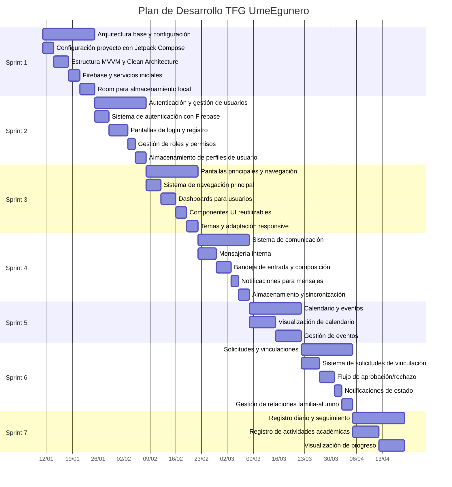

```mermaid
gantt
    title Plan de Desarrollo TFG UmeEgunero
    dateFormat  YYYY-MM-DD
    axisFormat  %d/%m
    todayMarker off
    
    section Sprint 1
    Arquitectura base y configuración :s1, 2025-01-11, 14d
    Configuración proyecto con Jetpack Compose :t1_1, 2025-01-11, 3d
    Estructura MVVM y Clean Architecture      :t1_2, after t1_1, 4d
    Firebase y servicios iniciales            :t1_3, after t1_2, 3d
    Room para almacenamiento local            :t1_4, after t1_3, 4d
    
    section Sprint 2
    Autenticación y gestión de usuarios :s2, after s1, 14d
    Sistema de autenticación con Firebase     :t2_1, after s1, 4d
    Pantallas de login y registro             :t2_2, after t2_1, 5d
    Gestión de roles y permisos               :t2_3, after t2_2, 2d
    Almacenamiento de perfiles de usuario     :t2_4, after t2_3, 3d
    
    section Sprint 3
    Pantallas principales y navegación :s3, after s2, 14d
    Sistema de navegación principal           :t3_1, after s2, 4d
    Dashboards para usuarios                  :t3_2, after t3_1, 4d
    Componentes UI reutilizables              :t3_3, after t3_2, 3d
    Temas y adaptación responsive             :t3_4, after t3_3, 3d
    
    section Sprint 4
    Sistema de comunicación :s4, after s3, 14d
    Mensajería interna                        :t4_1, after s3, 5d
    Bandeja de entrada y composición          :t4_2, after t4_1, 4d
    Notificaciones para mensajes              :t4_3, after t4_2, 2d
    Almacenamiento y sincronización           :t4_4, after t4_3, 3d
    
    section Sprint 5
    Calendario y eventos :s5, after s4, 14d
    Visualización de calendario               :t5_1, after s4, 7d
    Gestión de eventos                        :t5_2, after t5_1, 7d
    
    section Sprint 6
    Solicitudes y vinculaciones :s6, after s5, 14d
    Sistema de solicitudes de vinculación     :t6_1, after s5, 5d
    Flujo de aprobación/rechazo               :t6_2, after t6_1, 4d
    Notificaciones de estado                  :t6_3, after t6_2, 2d
    Gestión de relaciones familia-alumno      :t6_4, after t6_3, 3d
    
    section Sprint 7
    Registro diario y seguimiento :s7, after s6, 14d
    Registro de actividades académicas        :t7_1, after s6, 7d
    Visualización de progreso                 :t7_2, after t7_1, 7d
```
