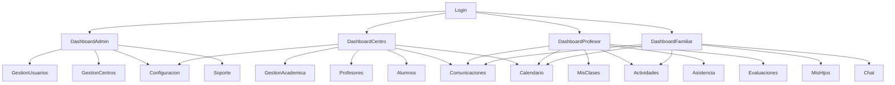

# Avance del Trabajo de Fin de Grado (TFG): UmeEgunero

## 1. Resumen del Proyecto

UmeEgunero es una plataforma digital integral para la gestión educativa, diseñada para conectar centros escolares, profesorado y familias en un entorno seguro, accesible y eficiente. El objetivo es digitalizar y centralizar la comunicación, la gestión académica y la administración de usuarios, facilitando la interacción entre todos los agentes educativos y mejorando la experiencia educativa y administrativa de los centros.

---

## 2. Estado Actual del Desarrollo

### 2.1 Funcionalidades Implementadas

- **Gestión de usuarios**: Alta, edición y eliminación de administradores, profesores, familiares y alumnos.
- **Gestión de centros**: Alta, edición y eliminación de centros educativos.
- **Gestión académica**: Creación y gestión de cursos, clases y vinculación de usuarios.
- **Paneles de control (Dashboards)** para cada perfil: Admin, Centro, Profesor, Familiar.
- **Comunicación**: Envío y recepción de comunicados, notificaciones y mensajes internos.
- **Soporte técnico**: Configuración de email de soporte y acceso a preguntas frecuentes.
- **Configuración avanzada**: Pantalla centralizada de configuración para el admin, con acceso a seguridad, soporte y selector de tema (modo oscuro).
- **Gestión de seguridad**: Políticas de contraseñas, sesión, verificación en dos pasos, bloqueo de IPs.
- **Accesibilidad y UX**: Diseño adaptado a Material 3 y buenas prácticas de accesibilidad.

---

## 3. Arquitectura, Tecnologías y Dependencias

### 3.1 Arquitectura General

- **MVVM (Model-View-ViewModel)** con principios de Clean Architecture.
- **Separación de capas**: datos, dominio, presentación y UI.
- **Inyección de dependencias**: Hilt.
- **Gestión de estado reactivo**: StateFlow, MutableStateFlow.

### 3.2 Tecnologías y Frameworks

- **Lenguaje principal**: Kotlin DSL.
- **UI**: Jetpack Compose (Material 3).
- **Persistencia**:
  - **Firebase Firestore** y **Firebase Auth** para datos en la nube y autenticación.
  - **Room** para persistencia local estructurada y sincronización offline.
  - **DataStore** para almacenamiento eficiente de preferencias y configuración de usuario (tema, login, etc.).
- **Navegación**: Navigation Compose.
- **Networking**: 
    - **Ktor Client**: Para realizar llamadas HTTP (ej. al servicio de envío de emails).
- **Serialización**: 
    - **Kotlinx Serialization**: Para parsear respuestas JSON (ej. del servicio de envío de emails).
- **Backend Auxiliar (Envío Emails)**:
    - **Google Apps Script**: Utilizado como backend simple para el envío fiable de correos electrónicos HTML, superando limitaciones de Intents.
- **Control de versiones**: GitHub.
- **Otras dependencias**:
  - **Timber** para logging avanzado.
  - **Coroutines** para asincronía y flujos reactivos.
  - **Google Play Services** y **Firebase Remote Config** para configuración remota y servicios adicionales.
  - **Material Icons** y recursos vectoriales para una UI moderna.
  - **Firebase Cloud Messaging** para notificaciones push.
  - **Firebase Crashlytics** para reportes de errores.

### 3.3 Estructura del Proyecto

```text
com.tfg.umeegunero/
├── data/ (model, repository, datasource, util)
├── di/ (inyección de dependencias)
├── domain/ (repository, usecase, model)
├── feature/ (auth, admin, profesor, familiar, common, centro)
├── navigation/
├── service/
├── notification/
├── ui/ (theme, components)
└── util/
```

---

## 4. Estructura de la Base de Datos

### 4.1 Modelo de Datos en Firestore

- **Colección usuarios**: datos personales, perfiles, notificaciones.
- **Colección centros**: datos del centro, cursos, clases, eventos.
- **Colección alumnos**: datos, evaluaciones, asistencias.
- **Colección comunicados**: mensajes, adjuntos, confirmaciones de lectura.
- **Colección chats**: conversaciones y mensajes.
- **Colección actividades**: actividades preescolares.

> Ver documento `Estructura_Base_Datos.md` para detalles y ejemplos JSON.

#### Ejemplo de documento de usuario en Firestore:

```json
{
  "uid": "string",
  "email": "usuario@umeegunero.com",
  "dni": "12345678A",
  "nombre": "Nombre Apellido",
  "apellidos": "Apellido",
  "telefono": "600123456",
  "fotoPerfil": "url_foto",
  "tipoUsuario": "ADMIN_APP",
  "centroId": "centro123",
  "fechaRegistro": "2023-09-01T12:00:00Z",
  "activo": true
}
```

---

## 5. Pantallas, Navegación y Experiencia de Usuario

### 5.1 Pantallas Principales

- Login y registro.
- Dashboards (Admin, Centro, Profesor, Familiar).
- Gestión de usuarios y centros.
- Comunicación (comunicados, notificaciones, chat).
- Configuración (general, seguridad, soporte, tema).
- Soporte técnico y FAQ.

### 5.2 Navegación

- Modular, con rutas parametrizadas y navegación segura entre pantallas.
- Flujos diferenciados por perfil de usuario.
- Accesos rápidos y menús contextuales.

#### Diagrama de navegación simplificado:



### 5.3 Accesibilidad y UX

- Contraste de color alto y fuentes legibles.
- Botones y áreas táctiles grandes (>48dp).
- Navegación sencilla y jerarquía visual clara.
- Compatible con lectores de pantalla y TalkBack.
- Uso de descripciones (contentDescription) en imágenes y botones.
- Iconografía clara y universal, colores suaves y amigables para infantil.
- Animaciones sencillas y feedback visual.
- Personalización de temas y pruebas de contraste.

---

## 6. Innovaciones Técnicas y Funcionalidades Destacadas

- **Integración de DataStore y Room**: Experiencia fluida y persistente, incluso en escenarios offline, sincronizando datos locales y en la nube.
- **API de geolocalización por código postal**: Autocompletado de municipio y provincia, mejorando la experiencia y reduciendo errores de entrada.
- **Selector de tema (modo claro/oscuro/sistema)**: Preferencia persistente con DataStore.
- **Gestión avanzada de seguridad**: Políticas de contraseñas, control de sesión, verificación en dos pasos, bloqueo automático de IPs sospechosas.
- **Arquitectura desacoplada y escalable**: Patrones de diseño modernos, separación de capas, ViewModels reactivos y navegación desacoplada.
- **Soporte técnico integrado**: Configuración de email de soporte y acceso directo a FAQ desde la app.
- **Logging profesional**: Uso de Timber para trazabilidad y depuración avanzada.
- **Notificaciones push y mensajería interna**: Comunicación en tiempo real entre usuarios.
- **Pruebas de accesibilidad y usabilidad**: Adaptación a diferentes públicos y dispositivos.
- **Envío de Emails HTML Robusto vía Google Apps Script**: Superación de las limitaciones de los Intents de Android para el envío de correos HTML mediante la implementación de un backend simple en Google Apps Script y el uso de Ktor Client en Android para la comunicación. Esto asegura un renderizado consistente del formato en el cliente receptor.

#### Ejemplo de ViewModel con StateFlow y uso de DataStore

```kotlin
@HiltViewModel
class ConfiguracionViewModel @Inject constructor(
    private val preferenciasRepository: PreferenciasRepository
) : ViewModel() {
    private val _uiState = MutableStateFlow(ConfiguracionUiState())
    val uiState: StateFlow<ConfiguracionUiState> = _uiState.asStateFlow()

    fun cambiarTema(tema: TemaPref) {
        viewModelScope.launch {
            preferenciasRepository.setTemaPreferencia(tema)
            _uiState.update { it.copy(temaSeleccionado = tema) }
        }
    }
}
```

---

## 7. Pruebas, Validación y Calidad

### 7.1 Metodología de Pruebas

- Pruebas funcionales y de integración para cada dashboard y módulo.
- Verificación de navegación, visualización de datos, tiempo real, interactividad y rendimiento.
- Pruebas de accesibilidad y usabilidad en dispositivos reales y emuladores.
- Validación de tiempos de carga, consumo de recursos y actualización en tiempo real.

#### Ejemplo de checklist de pruebas para el dashboard de administrador

| Elemento | Estado | Observaciones |
|----------|--------|---------------|
| Botón de Perfil | 🔄 | |
| Menú lateral | 🔄 | |
| Botón Gestión de Centros | 🔄 | |
| Botón Gestión de Usuarios | 🔄 | |
| Botón Configuración | 🔄 | |
| Botón Estadísticas | 🔄 | |
| Botón Notificaciones | 🔄 | |
| Botón Soporte | 🔄 | |
| Botón Cerrar Sesión | 🔄 | |

> Ver documento `pruebas_dashboard.md` para checklist y resultados detallados.

---

## 8. Despliegue y Publicación

### 8.1 Guía de Despliegue

- Preparación del entorno: Android Studio, JDK, Git, Firebase CLI.
- Configuración de Firebase y servicios asociados.
- Generación de APK y Bundle firmados.
- Pruebas en dispositivos reales y emuladores.
- Publicación en Google Play Store: recursos gráficos, ficha de producto, subida de APK/AAB, revisión y publicación.

> Ver documento `Guia_Despliegue.md` para pasos detallados y checklist.

---

## 9. Retos, Tareas Pendientes y Futuras Mejoras

### 9.1 Retos Técnicos

- Unificación de componentes visuales y ViewModels entre dashboards.
- Optimización de rendimiento y paginación en listas largas.
- Implementación de autenticación biométrica.
- Mejoras en la gestión de notificaciones y comunicación en tiempo real.
- Refactorización y normalización del código.

### 9.2 Tareas Pendientes

- Completar integración de pantallas secundarias y pruebas de usabilidad.
- Mejorar documentación técnica y manuales de usuario.
- Añadir tests instrumentados y unitarios.
- Mejorar la adaptación a tablets y dispositivos de diferentes densidades.
- Implementar nuevas funcionalidades: sistema de asistencia, calendario compartido, módulo de actividades preescolares, etc.

> Ver documento `Pendientes.md` para lista completa y priorizada.

---

## 10. Documentación y Manuales

- **Manual de Usuario**: Guía detallada para cada perfil, flujos de registro, uso de módulos principales, solución de problemas y FAQ.
- **Documentación Técnica**: Descripción de la arquitectura, modelos de datos, patrones de diseño, inyección de dependencias, gestión de estados y estructura de repositorios.
- **Estructura de Base de Datos**: Modelo entidad-relación y equivalencia en Firestore.
- **Accesibilidad y UX**: Principios aplicados, recomendaciones y justificación de decisiones de diseño.

---

## 11. Enlaces de Referencia

- **Enlace a Figma (diseño de pantallas)**: [Añadir aquí tu enlace a Figma]
- **Repositorio GitHub**: [Añadir aquí tu enlace a GitHub]

---

## 12. Conclusiones y Valor Añadido

UmeEgunero representa una solución integral, moderna y escalable para la gestión educativa, con un enfoque en la accesibilidad, la experiencia de usuario y la robustez técnica. El proyecto destaca por su arquitectura desacoplada, la integración de tecnologías de vanguardia y la atención a las necesidades reales de los centros educativos y las familias.

---

### 18. Ejemplos Prácticos y Snippets Relevantes

#### 18.1. Ejemplo de Composable reutilizable (Jetpack Compose)

```kotlin
@Composable
fun DashboardCard(
    title: String,
    icon: ImageVector,
    onClick: () -> Unit,
    modifier: Modifier = Modifier
) {
    Card(
        modifier = modifier
            .padding(8.dp)
            .fillMaxWidth()
            .clickable { onClick() },
        elevation = CardDefaults.cardElevation(4.dp)
    ) {
        Row(
            verticalAlignment = Alignment.CenterVertically,
            modifier = Modifier.padding(16.dp)
        ) {
            Icon(icon, contentDescription = null, modifier = Modifier.size(32.dp))
            Spacer(modifier = Modifier.width(16.dp))
            Text(text = title, style = MaterialTheme.typography.titleMedium)
        }
    }
}
```

#### 18.2. Ejemplo de gestión de estado con StateFlow en ViewModel

```kotlin
@HiltViewModel
class UsuariosViewModel @Inject constructor(
    private val usuarioRepository: UsuarioRepository
) : ViewModel() {
    private val _uiState = MutableStateFlow<UiState<List<Usuario>>>(UiState.Loading)
    val uiState: StateFlow<UiState<List<Usuario>>> = _uiState.asStateFlow()

    fun cargarUsuarios() {
        viewModelScope.launch {
            usuarioRepository.obtenerTodosLosUsuarios()
                .collect { resultado ->
                    _uiState.value = when (resultado) {
                        is Result.Success -> UiState.Success(resultado.data)
                        is Result.Error -> UiState.Error(resultado.message)
                        is Result.Loading -> UiState.Loading
                    }
                }
        }
    }
}
```

#### 18.3. Ejemplo de función de extensión DSL para construir una lista de acciones

```kotlin
fun buildAccionesDashboard(init: MutableList<String>.() -> Unit): List<String> {
    val acciones = mutableListOf<String>()
    acciones.init()
    return acciones
}

// Uso:
val acciones = buildAccionesDashboard {
    add("Gestión de Usuarios")
    add("Gestión de Centros")
    add("Configuración")
    add("Soporte Técnico")
}
```

#### 18.4. Ejemplo de workflow de CI/CD con GitHub Actions para Android

```yaml
name: Android CI

on:
  push:
    branches: [ main ]
  pull_request:
    branches: [ main ]

jobs:
  build:
    runs-on: ubuntu-latest
    steps:
      - uses: actions/checkout@v3
      - name: Set up JDK 17
        uses: actions/setup-java@v3
        with:
          java-version: '17'
          distribution: 'temurin'
      - name: Cache Gradle packages
        uses: actions/cache@v3
        with:
          path: ~/.gradle/caches
          key: gradle-${{ runner.os }}-${{ hashFiles('**/*.gradle*', '**/gradle-wrapper.properties') }}
      - name: Build with Gradle
        run: ./gradlew build
      - name: Run unit tests
        run: ./gradlew testDebugUnitTest
      - name: Lint
        run: ./gradlew lint
```

#### 18.5. Ejemplo de patrón Repository en Kotlin

```kotlin
interface UsuarioRepository {
    fun obtenerTodosLosUsuarios(): Flow<Result<List<Usuario>>>
    fun obtenerUsuarioPorId(id: String): Flow<Result<Usuario>>
}

class UsuarioRepositoryImpl @Inject constructor(
    private val firestore: FirebaseFirestore
) : UsuarioRepository {
    override fun obtenerTodosLosUsuarios(): Flow<Result<List<Usuario>>> = flow {
        emit(Result.Loading)
        try {
            val snapshot = firestore.collection("usuarios").get().await()
            val usuarios = snapshot.toObjects(Usuario::class.java)
            emit(Result.Success(usuarios))
        } catch (e: Exception) {
            emit(Result.Error(e.message))
        }
    }
    // ...
}
```

---

> **Nota:** Este documento es un boceto avanzado del TFG y puede ser completado y adaptado antes de la entrega final. Puedes convertirlo fácilmente a Word desde Markdown para su subida a la plataforma. 