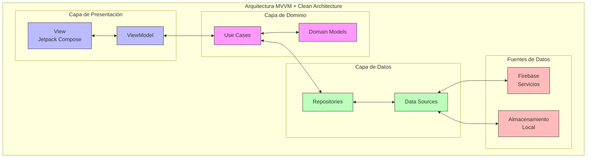
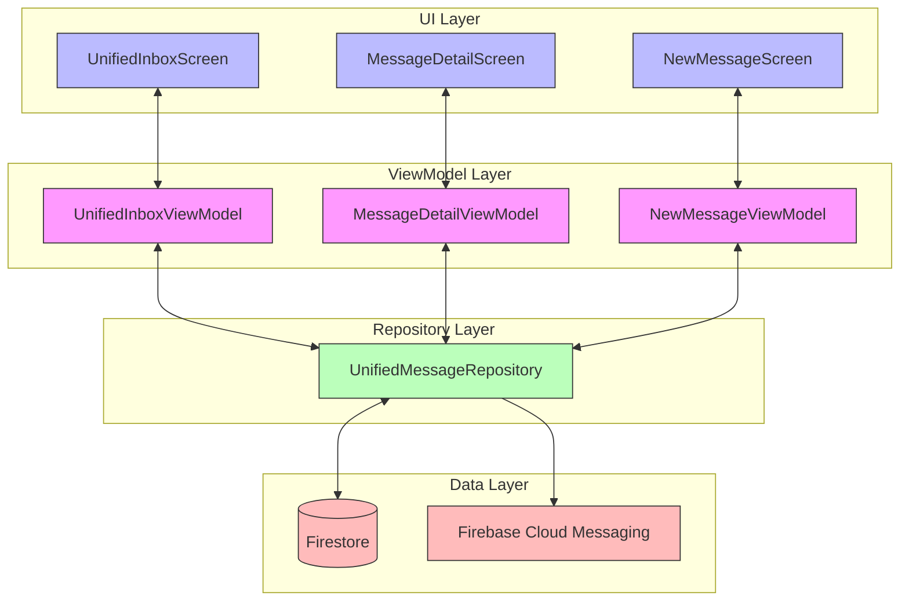
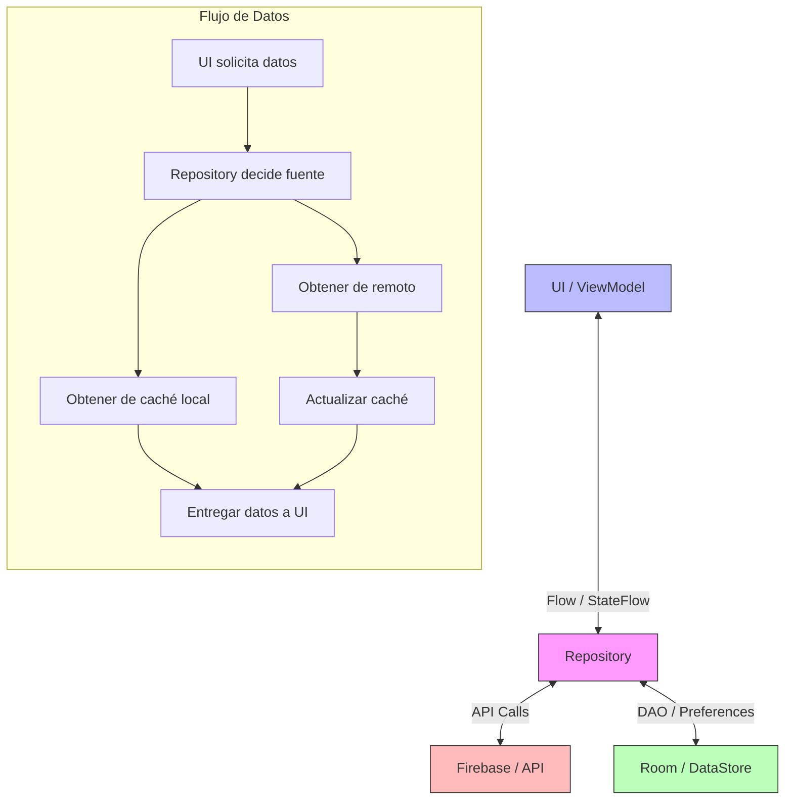
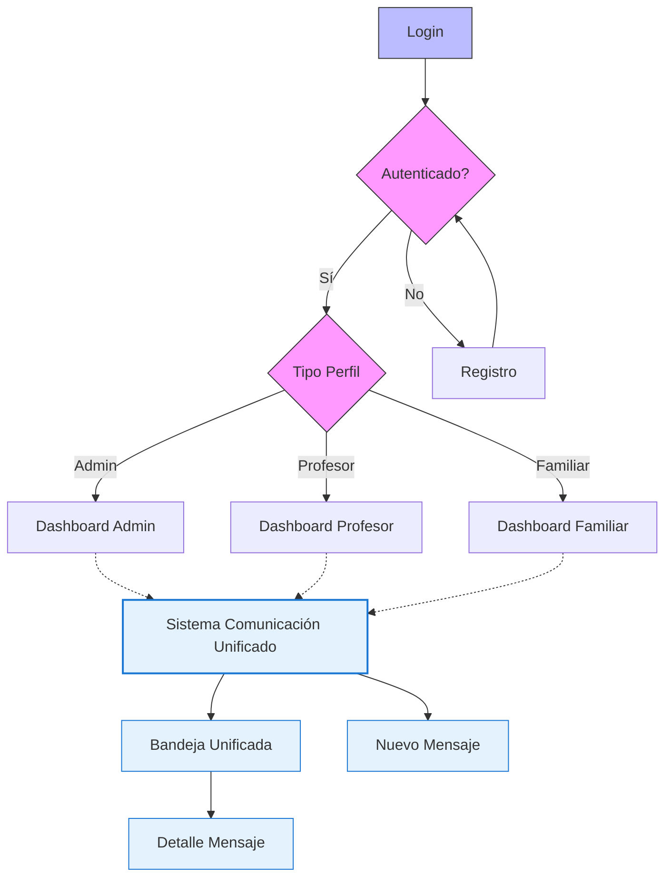
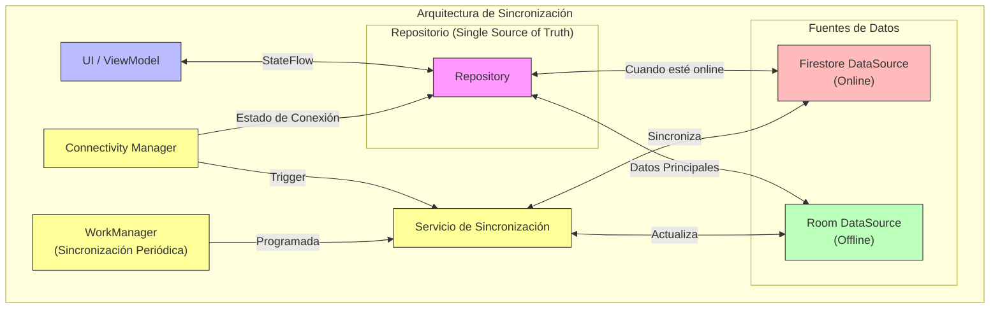
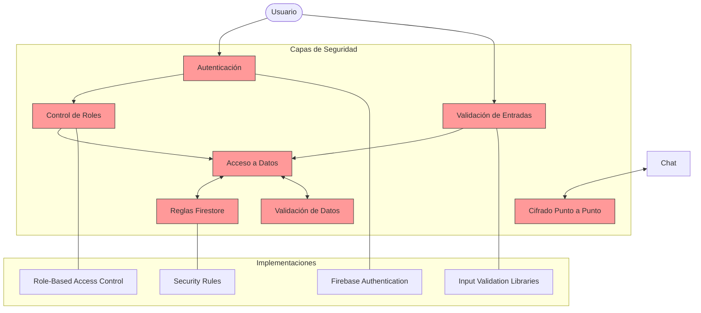
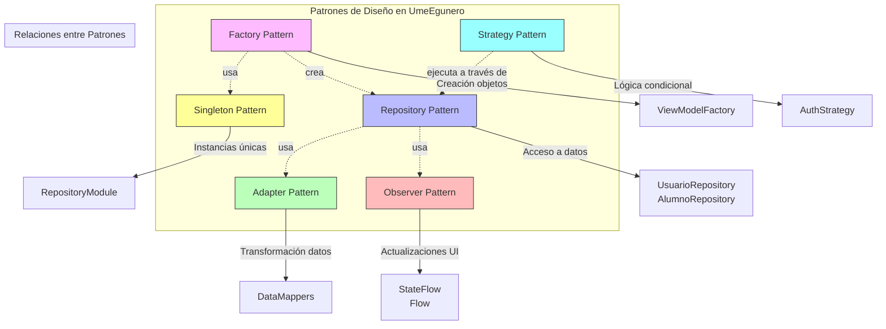

# Documentación Técnica - UmeEgunero

## Visión General de la Arquitectura

UmeEgunero es una aplicación Android desarrollada con Kotlin que sigue una arquitectura MVVM (Model-View-ViewModel) con principios de Clean Architecture. La aplicación utiliza Jetpack Compose para la interfaz de usuario y Firebase como backend principal.

<div align="center">



</div>

## Estructura del Proyecto

```
com.tfg.umeegunero/
├── data/                          # Capa de datos
│   ├── model/                     # Modelos de datos y entidades
│   ├── repository/                # Implementaciones de repositorios
│   ├── datasource/                # Fuentes de datos (local y remota)
│   └── util/                      # Utilidades relacionadas con datos
├── di/                            # Inyección de dependencias (Hilt)
├── domain/                        # Capa de dominio
│   ├── repository/                # Interfaces de repositorio
│   ├── usecase/                   # Casos de uso
│   └── model/                     # Modelos de dominio
├── feature/                       # Características organizadas por módulos
│   ├── auth/                      # Autenticación
│   ├── admin/                     # Funcionalidades de administrador
│   ├── profesor/                  # Funcionalidades de profesor
│   ├── familiar/                  # Funcionalidades de familia
│   ├── common/                    # Pantallas compartidas entre varios perfiles
│   │   └── comunicacion/          # Sistema de comunicación unificado
│   └── centro/                    # Gestión de centros
├── navigation/                    # Sistema de navegación
├── service/                       # Servicios en segundo plano
├── notification/                  # Sistema de notificaciones
├── ui/                            # Componentes de UI y temas
│   ├── theme/                     # Tema de la aplicación
│   └── components/                # Componentes reutilizables
└── util/                          # Utilidades generales
```

## Tecnologías Principales

### Frontend
- **Kotlin**: Lenguaje principal de desarrollo
- **Jetpack Compose**: Framework de UI declarativo
- **Material 3**: Guía de diseño y componentes
- **Coroutines + Flow**: Para operaciones asíncronas
- **Navigation Compose**: Navegación entre pantallas
- **Hilt**: Inyección de dependencias
- **ViewModel**: Gestión del estado de la UI
- **Room**: Base de datos local
- **Coil**: Carga y caché de imágenes

### Backend
- **Firebase Auth**: Autenticación de usuarios
- **Cloud Firestore**: Base de datos principal
- **Firebase Storage**: Almacenamiento de archivos
- **Firebase Cloud Messaging**: Notificaciones push
- **Firebase Crashlytics**: Reportes de errores

## Modelos de Datos Principales

### Result/Resultado

La aplicación utiliza un modelo unificado para representar resultados de operaciones asíncronas:

```kotlin
/**
 * Representa el resultado de una operación asíncrona.
 *
 * @param T Tipo de datos en caso de éxito
 */
sealed class Result<out T> {
    /**
     * Estado de carga, cuando la operación está en progreso.
     */
    object Loading : Result<Nothing>()
    
    /**
     * Estado de éxito, cuando la operación se completa correctamente.
     * 
     * @property data Datos resultantes de la operación
     */
    data class Success<T>(val data: T) : Result<T>()
    
    /**
     * Estado de error, cuando la operación falla.
     * 
     * @property message Mensaje descriptivo del error
     * @property exception Excepción capturada (opcional)
     */
    data class Error(
        val message: String?,
        val exception: Throwable? = null
    ) : Result<Nothing>()
}
```

### Sistema de Comunicación Unificado

El sistema de comunicación unificado centraliza todos los tipos de mensajes en un modelo común:

```kotlin
/**
 * Modelo que representa un mensaje unificado en el sistema.
 * 
 * Este modelo integra diferentes tipos de comunicación: mensajes,
 * notificaciones, comunicados, incidencias y más.
 */
data class UnifiedMessage(
    val id: String,
    val title: String,
    val content: String,
    val type: MessageType,
    val priority: MessagePriority,
    val senderId: String,
    val senderName: String,
    val receiverId: String,
    val receiversIds: List<String> = emptyList(),
    val timestamp: Timestamp = Timestamp.now(),
    val isRead: Boolean = false,
    val readTimestamp: Timestamp? = null,
    val metadata: Map<String, String> = emptyMap(),
    val relatedEntityId: String? = null,
    val relatedEntityType: String? = null,
    val attachments: List<Map<String, String>> = emptyList(),
    val conversationId: String? = null,
    val replyToId: String? = null
)

/**
 * Tipos de mensajes soportados por el sistema unificado.
 */
enum class MessageType {
    CHAT,            // Mensaje de chat entre usuarios
    NOTIFICATION,    // Notificación general del sistema
    ANNOUNCEMENT,    // Comunicado o circular
    INCIDENT,        // Reporte de incidencia
    ATTENDANCE,      // Registro de asistencia
    DAILY_RECORD,    // Registro diario
    SYSTEM           // Mensaje generado por el sistema
}

/**
 * Niveles de prioridad para los mensajes.
 */
enum class MessagePriority {
    LOW,      // Informativo, baja prioridad
    NORMAL,   // Prioridad estándar
    HIGH,     // Alta prioridad
    URGENT    // Urgente, requiere atención inmediata
}
```

### Usuario

```kotlin
/**
 * Modelo que representa un usuario en el sistema.
 *
 * @property id Identificador único del usuario
 * @property nombre Nombre completo del usuario
 * @property email Correo electrónico
 * @property tipo Tipo de perfil (ADMIN, PROFESOR, FAMILIAR)
 * @property fotoPerfil URL de la foto de perfil (opcional)
 * @property idCentro Identificador del centro educativo al que pertenece
 * @property fechaRegistro Timestamp de registro
 */
data class Usuario(
    val id: String,
    val nombre: String,
    val email: String,
    val tipo: TipoUsuario,
    val fotoPerfil: String? = null,
    val idCentro: String,
    val fechaRegistro: Timestamp = Timestamp.now()
)

/**
 * Tipos de usuario disponibles en el sistema.
 */
enum class TipoUsuario {
    ADMIN, PROFESOR, FAMILIAR
}
```

## Arquitectura MVVM

La aplicación sigue el patrón MVVM (Model-View-ViewModel):

### Modelo (Model)
- Representado por los repositorios y las fuentes de datos
- Encapsula la lógica de negocio y el acceso a datos
- Define las estructuras de datos utilizadas en la aplicación

### Vista (View)
- Implementada con Jetpack Compose
- Representa la interfaz de usuario
- Observa los cambios en el ViewModel y se actualiza en consecuencia
- No contiene lógica de negocio

### ViewModel
- Actúa como intermediario entre la Vista y el Modelo
- Mantiene el estado de la UI
- Procesa los eventos de la UI y ejecuta la lógica de negocio
- Expone Flows/StateFlows para que la Vista observe los cambios

## Sistema de Comunicación Unificado

El Sistema de Comunicación Unificado centraliza todas las formas de comunicación en la aplicación en una infraestructura común:



### Flujo de Datos en el Sistema Unificado

1. **Creación de Mensajes**:
   - Los mensajes pueden crearse desde diferentes orígenes (chat, sistema, etc.)
   - Todos los mensajes utilizan el mismo modelo `UnifiedMessage`
   - Se define el tipo y prioridad según el contexto

2. **Almacenamiento**:
   - Todos los mensajes se almacenan en la colección `unified_messages` en Firestore
   - Se utilizan índices compuestos para optimizar consultas frecuentes

3. **Notificaciones**:
   - El sistema está integrado con el framework de notificaciones
   - Cada nuevo mensaje puede generar notificaciones push a través de FCM
   - El tipo de canal de notificación se determina según `MessageType`

4. **Integración con otros subsistemas**:
   - Las solicitudes de vinculación generan mensajes automáticamente
   - El sistema de incidencias crea mensajes de tipo `INCIDENT`
   - Los registros diarios pueden generar mensajes de tipo `DAILY_RECORD`

## Arquitectura de Repositorios

Los repositorios proporcionan una API limpia para acceder a los datos:

```kotlin
/**
 * Interfaz para el repositorio de alumnos.
 */
interface AlumnoRepository {
    /**
     * Obtiene un alumno por su ID.
     *
     * @param id Identificador único del alumno
     * @return Un Flow con el resultado de la operación
     */
    fun obtenerAlumnoPorId(id: String): Flow<Result<Alumno>>
    
    /**
     * Obtiene todos los alumnos de una clase.
     *
     * @param idClase Identificador de la clase
     * @return Un Flow con el resultado de la operación
     */
    fun obtenerAlumnosPorClase(idClase: String): Flow<Result<List<Alumno>>>
    
    // Otros métodos...
}
```

<div align="center">



</div>

## Inyección de Dependencias

Hilt se utiliza para la inyección de dependencias:

```kotlin
@Module
@InstallIn(SingletonComponent::class)
object RepositoryModule {
    
    @Provides
    @Singleton
    fun provideCalendarioRepository(
        firestore: FirebaseFirestore,
        calendarioLocalDataSource: CalendarioLocalDataSource
    ): CalendarioRepository {
        return CalendarioRepositoryImpl(firestore, calendarioLocalDataSource)
    }
    
    @Provides
    @Singleton
    fun provideUnifiedMessageRepository(
        firestore: FirebaseFirestore,
        authRepository: AuthRepository
    ): UnifiedMessageRepository {
        return UnifiedMessageRepository(firestore, authRepository)
    }
    
    // Otras dependencias...
}
```

## Gestión de Estados en la UI

La aplicación utiliza clases selladas para representar los estados de la UI:

```kotlin
/**
 * Estado de la interfaz de usuario para las pantallas.
 */
sealed class UiState<out T> {
    /**
     * Estado inicial o de carga.
     */
    object Loading : UiState<Nothing>()
    
    /**
     * Estado de éxito con datos.
     */
    data class Success<T>(val data: T) : UiState<T>()
    
    /**
     * Estado de error.
     */
    data class Error(val message: String?) : UiState<Nothing>()
}
```

## Sistema de Navegación

La navegación se implementa con Navigation Compose:

```kotlin
/**
 * Rutas de navegación para los módulos de la aplicación.
 */
sealed class NavigationRoutes(val route: String) {
    // Rutas de autenticación
    object Login : NavigationRoutes("login")
    object Registro : NavigationRoutes("registro")
    object RecuperarContrasena : NavigationRoutes("recuperar_contrasena")
    
    // Rutas del sistema de comunicación unificado
    object UnifiedInbox : NavigationRoutes("unified_inbox")
    object MessageDetail : NavigationRoutes("message_detail/{messageId}")
    object NewMessage : NavigationRoutes("new_message")
    
    // Otras rutas...
}
```

<div align="center">



</div>

## Sincronización y Modo Offline

La aplicación implementa un sistema de sincronización que permite el trabajo offline, usando Room para almacenamiento local y servicios de sincronización.

```kotlin
/**
 * Base de datos local de la aplicación.
 */
@Database(
    entities = [
        AlumnoEntity::class,
        ComunicadoEntity::class,
        EventoEntity::class,
        // Otras entidades...
    ],
    version = 1
)
abstract class AppDatabase : RoomDatabase() {
    abstract fun alumnoDao(): AlumnoDao
    abstract fun comunicadoDao(): ComunicadoDao
    abstract fun eventoDao(): EventoDao
    // Otros DAOs...
}
```

<div align="center">



</div>

## Paginación y LazyLists

Se utilizan utilidades y componentes para paginación eficiente en listas y grids:

```kotlin
object PaginationUtils {
    data class PaginationState(
        val currentPage: Int = 0,
        val pageSize: Int = 20,
        val isLoading: Boolean = false,
        val isLastPage: Boolean = false,
        val totalItems: Int = 0
    )
    // ...
}
```

## Carga y Caché de Imágenes

Se utiliza Coil para la carga y caché de imágenes en la UI:

```kotlin
AsyncImage(
    model = imageUrl,
    contentDescription = "Foto de perfil",
    modifier = Modifier.size(64.dp)
)
```

## Preferencias y DataStore

El almacenamiento de preferencias y configuración de usuario se realiza con DataStore:

```kotlin
@Singleton
class PreferenciasRepository @Inject constructor(
    @ApplicationContext private val context: Context
) {
    // ...
    val temaPreferencia: Flow<TemaPref> = context.dataStore.data
        .map { preferences ->
            try {
                TemaPref.valueOf(preferences[temaKey] ?: TemaPref.SYSTEM.name)
            } catch (e: Exception) {
                TemaPref.SYSTEM
            }
        }
    // ...
}
```

## Seguridad

UmeEgunero implementa múltiples capas de seguridad para proteger los datos sensibles y garantizar un acceso adecuado a las funcionalidades:

<div align="center">



</div>

- **Firebase Auth** y reglas de Firestore para autenticación y autorización.
- **Protección de datos sensibles**: Uso de HTTPS, roles y reglas de acceso.
- **No se ha encontrado uso de EncryptedSharedPreferences ni MasterKey en el código actual.**

## Pruebas

- Pruebas unitarias y de UI con JUnit y Compose Test.
- Ejemplo de test de UI:

```kotlin
@RunWith(AndroidJUnit4::class)
class LoginScreenTest {
    @get:Rule
    val composeTestRule = createComposeRule()
    // ...
}
```

## Accesibilidad y Buenas Prácticas

- Uso de `contentDescription` en imágenes y botones.
- Contraste adecuado y tamaños mínimos de touch targets.
- Internacionalización con `strings.xml` y soporte multilenguaje.

## Patrones de Diseño

UmeEgunero implementa diversos patrones de diseño para garantizar la mantenibilidad y escalabilidad del código:

<div align="center">



</div>

- **Repository Pattern**: Abstracción de acceso a datos.
- **Factory Pattern**: Creación de ViewModels y objetos complejos.
- **Adapter Pattern**: Transformación de datos entre capas.
- **Observer Pattern**: StateFlow y Flow para sincronización UI-datos.
- **Singleton Pattern**: Instancias únicas de DAOs, repositorios y servicios críticos.
- **Strategy Pattern**: Estrategias de autenticación y lógica desacoplada.

## Optimización y Performance

- Uso de paginación para grandes conjuntos de datos.
- Caché de imágenes con Coil.
- Recomposición inteligente en Compose.
- LazyLists y LazyGrids para renderizado eficiente.

## Generación de Documentación

- Uso de Dokka para generar documentación a partir de comentarios KDoc.

## Tabla de Librerías Clave

| Librería               | Versión   | Uso principal           |
|------------------------|-----------|------------------------|
| Jetpack Compose        | 1.x       | UI declarativa         |
| Material 3             | 1.x       | Componentes UI         |
| Hilt                   | 2.x       | Inyección dependencias |
| Firebase (Auth, DB)    | Última    | Backend y auth         |
| Room                   | 2.x       | BD local               |
| Navigation Compose     | 2.x       | Navegación             |
| Coil                   | 2.x       | Carga de imágenes      |

## Internacionalización y Localización

- Uso de recursos en `strings.xml` para todos los textos.
- Soporte para español y euskera (añadir más idiomas si es necesario).

## Accesibilidad

- Uso de `contentDescription` para todos los elementos interactivos.
- Contraste mínimo de 4.5:1 para texto informativo.
- Tamaño mínimo de 48x48dp para touch targets.

## Testing y Cobertura

- Pruebas unitarias en ViewModel y lógica de dominio.
- Pruebas instrumentadas con Jetpack Compose Test.
- Cobertura mínima recomendada: 80% en lógica crítica.

## Integración y Seguridad con Firebase

- Uso de reglas de seguridad en Firestore.
- Validación de roles y permisos en el backend.

## Buenas Prácticas en Desarrollo Android

- Uso de Material 3 y Jetpack Compose en toda la UI.
- Arquitectura MVVM + Clean Architecture.
- Separación estricta de capas y responsabilidades.
- Inyección de dependencias con Hilt.
- Internacionalización (strings.xml) y soporte multilenguaje.
- Accesibilidad (contentDescription, contraste, tamaño mínimo de touch targets).

## Envío de Correos Electrónicos HTML

Una funcionalidad clave de la aplicación es la notificación a usuarios (familiares, profesores) mediante correo electrónico en eventos como aprobación/rechazo de solicitudes, bienvenida, recordatorios, etc. Se requiere que estos correos tengan un formato HTML enriquecido y consistente con la imagen de la aplicación.

### Desafío: Limitaciones de `Intent.ACTION_SEND`

Inicialmente, se exploró el uso del sistema estándar de Android `Intent.ACTION_SEND` con el tipo MIME `text/html` para delegar el envío al cliente de correo del usuario (Gmail, K-9 Mail, etc.). Sin embargo, se encontraron limitaciones significativas:

*   **Renderizado Inconsistente:** Muchos clientes de correo populares en Android (notablemente Gmail) no renderizan correctamente el HTML proporcionado a través de `Intent.EXTRA_HTML_TEXT` en la *ventana de composición*, mostrando en su lugar el texto plano de fallback (`Intent.EXTRA_TEXT`) o incluso el código HTML fuente.
*   **Experiencia de Usuario Pobre:** Esto generaba confusión, ya que la previsualización interna en la app (usando WebView) mostraba el HTML correctamente, pero la composición en el cliente de correo no.

### Solución: Backend con Google Apps Script

Para asegurar un envío fiable y un renderizado consistente del HTML en el correo *recibido*, se optó por implementar un pequeño backend utilizando Google Apps Script (GAS).

**Ventajas:**

*   **Envío Directo:** El script envía el correo directamente usando `MailApp.sendEmail`, que soporta `htmlBody` de forma nativa.
*   **Consistencia:** El formato HTML se mantiene intacto hasta llegar al servidor de correo del destinatario, mejorando la probabilidad de un renderizado correcto en la mayoría de clientes.
*   **Centralización:** La lógica de generación de plantillas HTML reside en el script, simplificando el código Android.
*   **Seguridad:** Evita manejar credenciales SMTP directamente en la aplicación Android. El script se ejecuta bajo la autoridad de la cuenta de Google que lo despliega.

**Componentes:**

1.  **Google Apps Script (`doGet`):**
    *   Desplegado como **Aplicación web** accesible mediante una URL `/exec`.
    *   Recibe parámetros por URL (GET): `destinatario`, `asunto`, `nombre`, `tipoPlantilla`.
    *   Contiene funciones JavaScript (`generarHtmlSegunPlantilla`) que replican las plantillas HTML definidas originalmente en Kotlin.
    *   Utiliza `MailApp.sendEmail()` especificando el `htmlBody`.
    *   Devuelve una respuesta JSON simple (`{status: "OK" | "ERROR", message: "..."}`).
    *   **Configuración de Despliegue:** Se ejecuta como "Yo" (el desarrollador) y con acceso para "Cualquier usuario" (requiere consideración de seguridad adicional, como un token secreto, para producción).

2.  **Implementación Android (Ktor Client):**
    *   Se utiliza **Ktor Client** para realizar llamadas HTTP GET a la URL del script desplegado.
    *   Se requiere la dependencia de Ktor (`ktor-client-core`, `ktor-client-cio`, `ktor-client-content-negotiation`, `ktor-serialization-kotlinx-json`) y el permiso `INTERNET`.
    *   Se usa **Kotlinx Serialization** (`kotlinx-serialization-json` y el plugin) para parsear la respuesta JSON del script en una data class (`ScriptResponse`).
    *   La llamada de red se ejecuta dentro de una **Coroutine** en el dispatcher `Dispatchers.IO` para no bloquear el hilo principal.
    *   La construcción de la URL con parámetros se realiza usando `Uri.Builder`.
    *   Se manejan los posibles errores de red y se informa al usuario mediante `Snackbar`.

**Flujo:**

```mermaid
graph LR
    A[App Android (EmailTestScreen)] -- GET Request con parámetros --> B(URL Apps Script /exec);
    B -- Ejecuta doGet() --> C{Google Apps Script};
    C -- Genera HTML --> C;
    C -- MailApp.sendEmail() --> D(Servidor Gmail);
    D -- Envía Email HTML --> E(Destinatario);
    C -- JSON Response (OK/ERROR) --> A;
```

**Consideraciones:**

*   **Dependencia Externa:** Introduce una dependencia en Google Apps Script.
*   **Mantenimiento de Plantillas:** Las plantillas HTML deben mantenerse sincronizadas entre el código original (si se conserva para previsualización) y el script JavaScript.
*   **Seguridad URL:** La URL del script es pública si se configura con acceso para "Cualquier usuario". Se recomienda añadir un token secreto como parámetro para validación básica en el script para entornos de producción.
*   **Cuotas de GAS/Gmail:** El envío está sujeto a las cuotas diarias de la cuenta de Google que ejecuta el script.

Esta solución proporciona una forma robusta y gratuita (dentro de las cuotas) de enviar correos HTML correctamente formateados desde la aplicación, superando las limitaciones de los Intents de Android.

## Conclusión

Esta documentación técnica proporciona una visión general de la arquitectura y los principales componentes de UmeEgunero. La aplicación sigue las mejores prácticas de desarrollo para Android, utilizando tecnologías modernas y un enfoque arquitectónico que facilita la mantenibilidad y la escalabilidad.

Para una información más detallada sobre clases específicas, consulte la documentación generada por Dokka en el directorio `build/dokka`.

---

*Documento actualizado por:* Equipo de Desarrollo UmeEgunero
*Fecha:* Mayo 2025
*Versión:* 2.0