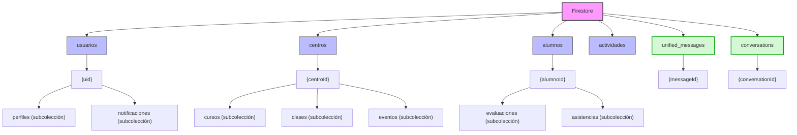
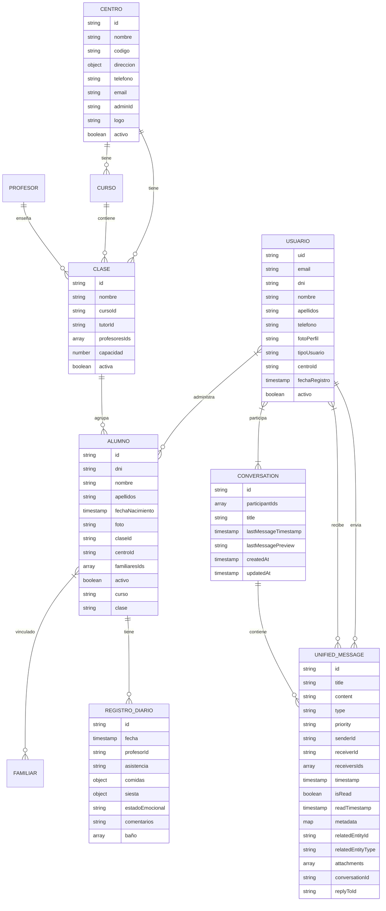
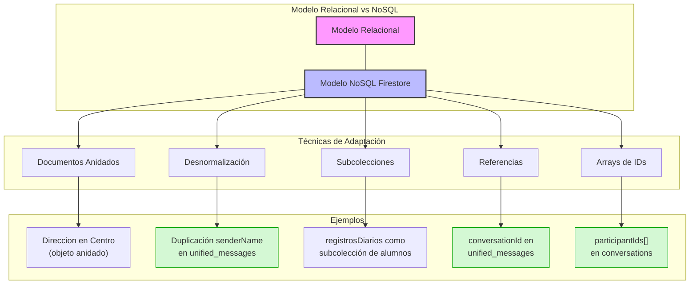
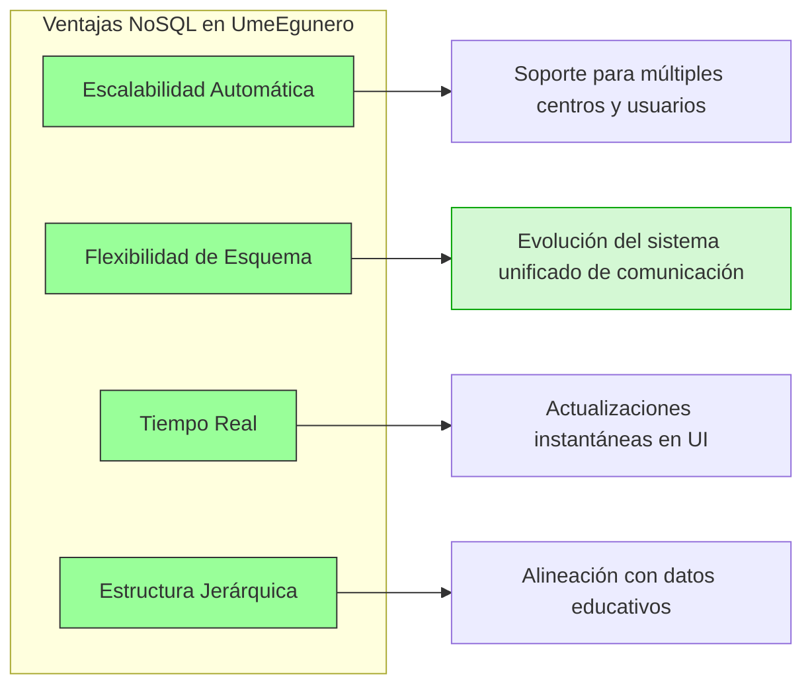
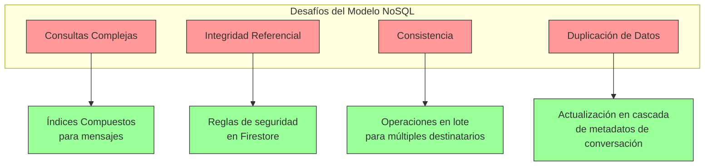

# Estructura de Base de Datos - UmeEgunero

## Introducción

Este documento detalla la estructura de la base de datos utilizada en UmeEgunero, implementada en Cloud Firestore. Aunque Firestore es una base de datos NoSQL orientada a documentos, este documento presenta tanto la estructura actual como su equivalente conceptual en términos de un modelo entidad-relación tradicional, facilitando su inclusión en la memoria del TFG.

## Modelo de Datos de Firestore

### Estructura General

UmeEgunero utiliza una estructura jerárquica de colecciones y documentos en Firestore, organizando los datos de la siguiente manera:



```
firestore/
├── usuarios/                    # Colección de usuarios
│   ├── {uid}/                   # Documento de usuario individual
│   │   ├── perfiles/            # Subcolección de perfiles
│   │   └── notificaciones/      # Subcolección de notificaciones
├── centros/                     # Colección de centros educativos
│   ├── {centroId}/              # Documento de centro individual
│   │   ├── cursos/              # Subcolección de cursos
│   │   ├── clases/              # Subcolección de clases
│   │   └── eventos/             # Subcolección de eventos
├── alumnos/                     # Colección de alumnos
│   └── {alumnoId}/              # Documento de alumno individual
│       ├── evaluaciones/        # Subcolección de evaluaciones
│       └── asistencias/         # Subcolección de registros de asistencia
├── unified_messages/            # Colección del sistema de comunicación unificado
│   └── {messageId}/             # Documento de mensaje individual
├── conversations/               # Colección de conversaciones
│   └── {conversationId}/        # Documento de conversación individual
└── actividades/                 # Colección de actividades preescolares
```

### Detalle de Colecciones Principales

#### Colección: `usuarios`

Almacena información de todos los usuarios registrados en la aplicación.

**Documento**: `{uid}` (ID generado por Firebase Auth)

```json
{
  "uid": "string",          // ID único de Firebase Auth
  "email": "string",        // Email del usuario
  "dni": "string",          // DNI/Documento de identidad
  "nombre": "string",       // Nombre completo
  "apellidos": "string",    // Apellidos
  "telefono": "string",     // Número de teléfono
  "fotoPerfil": "string",   // URL de la imagen de perfil
  "tipoUsuario": "string",  // Enum: "ADMIN_APP", "ADMIN_CENTRO", "PROFESOR", "FAMILIAR"
  "centroId": "string",     // Referencia al centro (para ADMIN_CENTRO, PROFESOR)
  "fechaRegistro": "timestamp", // Fecha de registro
  "activo": "boolean"       // Estado de la cuenta
}
```

**Subcolección**: `perfiles` (Solo para tipo FAMILIAR)

```json
{
  "alumnosIds": ["string"],  // Referencias a alumnos vinculados
  "relacion": "string"       // Relación con el alumno (padre/madre/tutor)
}
```

#### Colección: `centros`

Almacena información de los centros educativos.

**Documento**: `{centroId}`

```json
{
  "id": "string",            // ID único del centro
  "nombre": "string",        // Nombre del centro
  "codigo": "string",        // Código único para invitaciones
  "direccion": {
    "calle": "string",
    "ciudad": "string",
    "provincia": "string",
    "codigoPostal": "string"
  },
  "telefono": "string",      // Teléfono de contacto
  "email": "string",         // Email del centro
  "adminId": "string",       // Referencia al usuario administrador
  "logo": "string",          // URL del logo
  "activo": "boolean"        // Estado del centro
}
```

**Subcolección**: `cursos`

```json
{
  "id": "string",            // ID único del curso
  "nombre": "string",        // Nombre del curso (ej: "1º Infantil")
  "descripcion": "string",   // Descripción
  "anioAcademico": "string", // Año académico (ej: "2023-2024")
  "activo": "boolean"        // Estado del curso
}
```

**Subcolección**: `clases`

```json
{
  "id": "string",            // ID único de la clase
  "nombre": "string",        // Nombre de la clase (ej: "1º Infantil A")
  "cursoId": "string",       // Referencia al curso
  "tutorId": "string",       // Referencia al profesor tutor
  "profesoresIds": ["string"], // Referencias a profesores asignados
  "capacidad": "number",     // Capacidad máxima de alumnos
  "activa": "boolean"        // Estado de la clase
}
```

#### Colección: `alumnos`

Almacena información de los alumnos.

**Documento**: `{alumnoId}`

```json
{
  "id": "string",            // ID único del alumno
  "dni": "string",           // DNI/Documento de identidad
  "nombre": "string",        // Nombre
  "apellidos": "string",     // Apellidos
  "fechaNacimiento": "timestamp", // Fecha de nacimiento
  "foto": "string",          // URL de la foto
  "claseId": "string",       // Referencia a la clase
  "centroId": "string",      // Referencia al centro
  "familiaresIds": ["string"], // Referencias a usuarios tipo FAMILIAR
  "activo": "boolean",       // Estado del alumno
  "curso": "string",         // Curso al que pertenece
  "clase": "string"          // Grupo/clase específico
}
```

**Subcolección**: `registrosDiarios`

```json
{
  "id": "string",            // ID único del registro
  "fecha": "timestamp",      // Fecha del registro
  "profesorId": "string",    // Referencia al profesor
  "asistencia": "string",    // "PRESENTE", "AUSENTE", "RETRASO"
  "comidas": {
    "desayuno": "string",    // "COMPLETO", "PARCIAL", "NADA"
    "comida": "string",      // "COMPLETO", "PARCIAL", "NADA"
    "merienda": "string"     // "COMPLETO", "PARCIAL", "NADA"
  },
  "siesta": {
    "duracion": "number",    // Minutos
    "calidad": "string"      // "BUENA", "REGULAR", "MALA"
  },
  "estadoEmocional": "string", // "FELIZ", "NEUTRO", "TRISTE", "ENFADADO"
  "comentarios": "string",     // Notas adicionales
  "baño": [{
    "hora": "timestamp",
    "tipo": "string"         // "PAÑAL", "WC"
  }]
}
```

#### Colección: `unified_messages`

Almacena todos los mensajes del sistema de comunicación unificado.

**Documento**: `{messageId}`

```json
{
  "id": "string",                  // ID único del mensaje
  "title": "string",               // Título del mensaje
  "content": "string",             // Contenido del mensaje
  "type": "string",                // Enum: "CHAT", "NOTIFICATION", "ANNOUNCEMENT", "INCIDENT", "ATTENDANCE", "DAILY_RECORD", "SYSTEM"
  "priority": "string",            // Enum: "LOW", "NORMAL", "HIGH", "URGENT"
  "senderId": "string",            // ID del remitente
  "senderName": "string",          // Nombre del remitente
  "receiverId": "string",          // ID del destinatario principal
  "receiversIds": ["string"],      // Lista de IDs de destinatarios (para mensajes grupales)
  "timestamp": "timestamp",        // Fecha y hora de envío
  "isRead": "boolean",             // Si ha sido leído
  "readTimestamp": "timestamp",    // Fecha y hora de lectura
  "metadata": {                    // Datos adicionales según el tipo de mensaje
    "key1": "value1",
    "key2": "value2"
  },
  "relatedEntityId": "string",     // ID de entidad relacionada (ej: solicitudId, alumnoId)
  "relatedEntityType": "string",   // Tipo de entidad relacionada
  "attachments": [                 // Archivos adjuntos
    {
      "name": "string",
      "url": "string",
      "type": "string",
      "size": "number"
    }
  ],
  "conversationId": "string",      // Referencia a la conversación (para mensajes de chat)
  "replyToId": "string"            // Referencia a mensaje original (para respuestas)
}
```

#### Colección: `conversations`

Gestiona las conversaciones entre usuarios.

**Documento**: `{conversationId}`

```json
{
  "id": "string",                   // ID único de la conversación
  "participantIds": ["string"],     // IDs de los participantes
  "title": "string",                // Título (opcional, para conversaciones grupales)
  "lastMessageTimestamp": "timestamp", // Última actividad
  "lastMessagePreview": "string",   // Vista previa del último mensaje
  "lastMessageSenderId": "string",  // Remitente del último mensaje
  "createdAt": "timestamp",         // Fecha de creación
  "updatedAt": "timestamp",         // Fecha de última actualización
  "metadata": {                     // Datos adicionales
    "key1": "value1"
  }
}
```

## Ejemplo de Consulta Firestore

Obtener los mensajes más recientes de un usuario en la bandeja de entrada unificada:

```kotlin
val messagesRef = db.collection("unified_messages")
    .whereEqualTo("receiverId", userId)
    .orderBy("timestamp", Query.Direction.DESCENDING)
    .limit(20)
messagesRef.get().addOnSuccessListener { ... }
```

Obtener todos los mensajes de una conversación específica:

```kotlin
val conversationMessagesRef = db.collection("unified_messages")
    .whereEqualTo("conversationId", conversationId)
    .orderBy("timestamp", Query.Direction.ASCENDING)
conversationMessagesRef.get().addOnSuccessListener { ... }
```

## Reglas de Seguridad Firestore (fragmento)

```js
service cloud.firestore {
  match /databases/{database}/documents {
    match /usuarios/{userId} {
      allow read, write: if request.auth.uid == userId;
    }
    
    match /unified_messages/{messageId} {
      // Un usuario puede leer un mensaje si es el remitente o está en la lista de destinatarios
      allow read: if request.auth.uid == resource.data.senderId || 
                  request.auth.uid == resource.data.receiverId ||
                  request.auth.uid in resource.data.receiversIds;
                  
      // Solo el remitente puede crear un mensaje
      allow create: if request.auth.uid == request.resource.data.senderId;
      
      // Solo el remitente puede modificar ciertos campos
      allow update: if request.auth.uid == resource.data.senderId && 
                     request.resource.data.diff(resource.data).affectedKeys()
                     .hasOnly(['attachments', 'content', 'title']);
                     
      // Un destinatario puede actualizar campos relacionados con la lectura
      allow update: if (request.auth.uid == resource.data.receiverId || 
                      request.auth.uid in resource.data.receiversIds) &&
                      request.resource.data.diff(resource.data).affectedKeys()
                      .hasOnly(['isRead', 'readTimestamp']);
    }
  }
}
```

## Relación de Entidades (resumen)

- Un centro tiene muchos cursos y clases.
- Un alumno pertenece a una clase y puede estar vinculado a varios familiares.
- El sistema de comunicación unificado centraliza todos los tipos de mensajes.
- Cada mensaje está vinculado a un remitente y uno o más destinatarios.
- Los mensajes pueden estar asociados a una conversación.



## Equivalente Relacional: Diagrama Entidad-Relación

A continuación se presenta la estructura de datos anterior adaptada a un modelo entidad-relación tradicional, que puede utilizarse para la memoria del TFG.

### Entidades Principales

1. **Usuario**
   - Atributos: ID, Email, DNI, Nombre, Apellidos, Teléfono, Tipo, CentroID, Estado, FechaRegistro
   - Clave primaria: ID

2. **Centro**
   - Atributos: ID, Nombre, Código, Dirección, Teléfono, Email, AdminID, Estado
   - Clave primaria: ID

3. **Curso**
   - Atributos: ID, CentroID, Nombre, Descripción, AñoAcadémico, Estado
   - Clave primaria: ID
   - Clave foránea: CentroID -> Centro.ID

4. **Clase**
   - Atributos: ID, Nombre, CursoID, TutorID, Capacidad, Estado
   - Clave primaria: ID
   - Claves foráneas: CursoID -> Curso.ID, TutorID -> Usuario.ID

5. **Alumno**
   - Atributos: ID, DNI, Nombre, Apellidos, FechaNacimiento, Foto, ClaseID, CentroID, Estado, Curso, Clase
   - Clave primaria: ID
   - Claves foráneas: ClaseID -> Clase.ID, CentroID -> Centro.ID

6. **RegistroDiario**
   - Atributos: ID, AlumnoID, Fecha, ProfesorID, Asistencia, Comidas, Siesta, EstadoEmocional, Comentarios
   - Clave primaria: ID
   - Claves foráneas: AlumnoID -> Alumno.ID, ProfesorID -> Usuario.ID

7. **UnifiedMessage**
   - Atributos: ID, Título, Contenido, Tipo, Prioridad, RemitenteID, DestinatarioID, Timestamp, Leído, TimestampLectura, Metadatos, EntidadRelacionadaID, TipoEntidadRelacionada, Adjuntos, ConversaciónID, RespuestaAID
   - Clave primaria: ID
   - Claves foráneas: RemitenteID -> Usuario.ID, DestinatarioID -> Usuario.ID, ConversaciónID -> Conversación.ID, RespuestaAID -> UnifiedMessage.ID

8. **Conversation**
   - Atributos: ID, Título, ÚltimoMensajeTimestamp, FechaCreación, FechaActualización
   - Clave primaria: ID

9. **ConversationParticipant**
   - Atributos: ConversaciónID, UsuarioID
   - Clave primaria: (ConversaciónID, UsuarioID)
   - Claves foráneas: ConversaciónID -> Conversación.ID, UsuarioID -> Usuario.ID

10. **ActividadPreescolar**
    - Atributos: ID, Título, Descripción, Tipo, Edad, Duración, Materiales, Objetivos
    - Clave primaria: ID

## Adaptación al Modelo NoSQL de Firestore

Aunque conceptualmente podemos representar los datos de UmeEgunero en un modelo relacional tradicional, la implementación en Firestore aprovecha características específicas de bases de datos NoSQL:



1. **Documentos Anidados**: Datos relacionados se incluyen directamente en el documento principal.
   - Ejemplo: La dirección del centro se incluye como objeto anidado.

2. **Desnormalización**: Ciertos datos se duplican para optimizar consultas.
   - Ejemplo: El nombre del remitente (`senderName`) se almacena directamente en cada mensaje para evitar búsquedas adicionales al mostrar la lista de mensajes.
   - Ejemplo: La vista previa del último mensaje (`lastMessagePreview`) se guarda en el documento de conversación.

3. **Subcolecciones**: Implementan relaciones jerárquicas.
   - Ejemplo: `registrosDiarios` como subcolección de alumnos.

4. **Referencias**: Se usan IDs como referencias en lugar de claves foráneas tradicionales.
   - Ejemplo: `conversationId` en mensajes para vincularlos a una conversación.
   - Ejemplo: `relatedEntityId` y `relatedEntityType` para vincular mensajes a otras entidades.

5. **Arrays de Referencias**: Para relaciones N:M.
   - Ejemplo: `participantIds` en conversations para listar todos los participantes.
   - Ejemplo: `receiversIds` en unified_messages para mensajes con múltiples destinatarios.

## Consideraciones para Diagramas

### Diagrama Entidad-Relación

Para el diagrama E-R en la memoria del TFG, se recomienda utilizar el modelo conceptual presentado en la sección "Equivalente Relacional", que muestra entidades, atributos y relaciones de manera clara independientemente de la tecnología de implementación.

### Diagrama Lógico

Para el diagrama lógico, se puede adaptar el modelo E-R a la estructura de Firestore, mostrando:
- Colecciones como entidades
- Documentos como instancias
- Subcolecciones como relaciones jerárquicas
- Referencias como conexiones entre documentos

### Diagrama Físico

El diagrama físico puede representar la estructura real de Firestore con:
- Jerarquía de colecciones/subcolecciones
- Estructura de documentos con sus campos
- Índices clave para optimizar consultas
- Reglas de seguridad de Firestore

## Consideraciones de Diseño

### Ventajas del Modelo NoSQL para UmeEgunero



1. **Escalabilidad**: Firestore escala automáticamente para manejar gran número de usuarios y centros.
2. **Flexibilidad**: Facilita la evolución del sistema unificado de comunicación sin migraciones complejas.
3. **Consultas en Tiempo Real**: Permite implementar actualizaciones en tiempo real en la UI de mensajería.
4. **Estructura Jerárquica**: Se alinea con la naturaleza jerárquica de los datos educativos.

### Desafíos y Soluciones



1. **Consultas Complejas**: Se implementan índices compuestos para optimizar consultas en el sistema de comunicación.
2. **Integridad Referencial**: Se mantiene a nivel de aplicación y mediante reglas de seguridad en Firestore.
3. **Consistencia**: Se utilizan lotes (batch) para operaciones que afectan múltiples documentos, como mensajes a múltiples destinatarios.
4. **Duplicación de Datos**: Se implementa lógica de actualización en cascada para mantener consistencia en datos duplicados.

---

*Documento actualizado por:* Equipo de Desarrollo UmeEgunero  
*Fecha:* Mayo 2025  
*Versión:* 1.5.0 