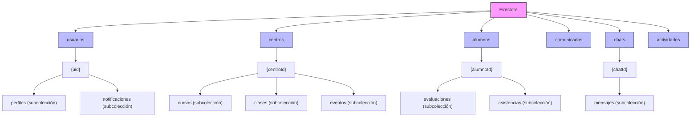
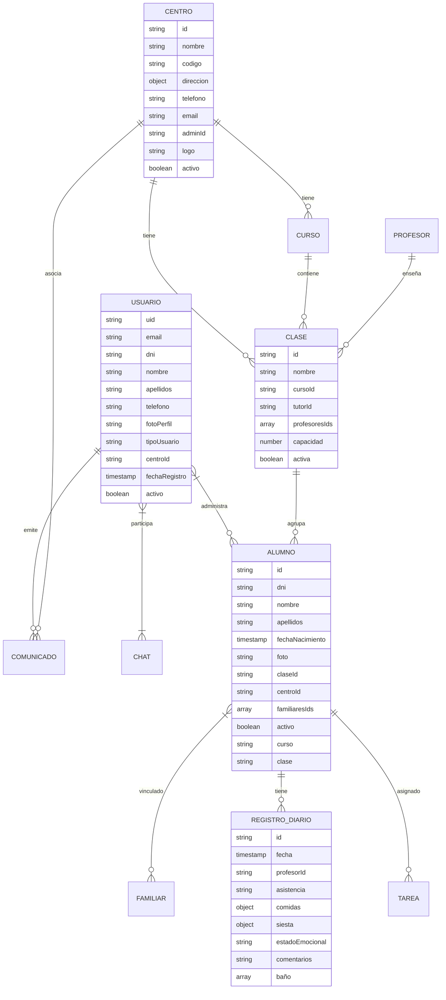
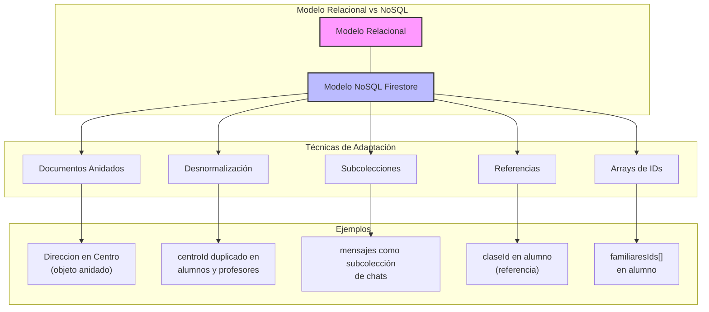
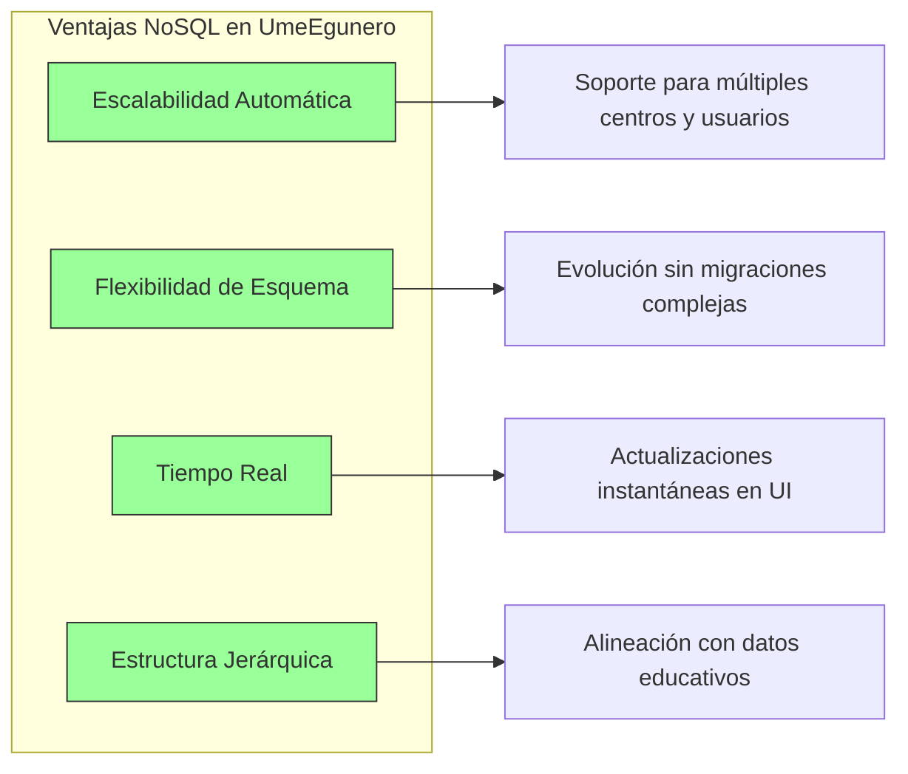
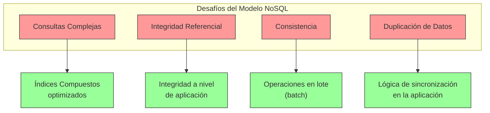

# Estructura de Base de Datos - UmeEgunero

## Introducción

Este documento detalla la estructura de la base de datos utilizada en UmeEgunero, implementada en Cloud Firestore. Aunque Firestore es una base de datos NoSQL orientada a documentos, este documento presenta tanto la estructura actual como su equivalente conceptual en términos de un modelo entidad-relación tradicional, facilitando su inclusión en la memoria del TFG.

## Modelo de Datos de Firestore

### Estructura General

UmeEgunero utiliza una estructura jerárquica de colecciones y documentos en Firestore, organizando los datos de la siguiente manera:



```
firestore/
├── usuarios/                    # Colección de usuarios
│   ├── {uid}/                   # Documento de usuario individual
│   │   ├── perfiles/            # Subcolección de perfiles
│   │   └── notificaciones/      # Subcolección de notificaciones
├── centros/                     # Colección de centros educativos
│   ├── {centroId}/              # Documento de centro individual
│   │   ├── cursos/              # Subcolección de cursos
│   │   ├── clases/              # Subcolección de clases
│   │   └── eventos/             # Subcolección de eventos
├── alumnos/                     # Colección de alumnos
│   └── {alumnoId}/              # Documento de alumno individual
│       ├── evaluaciones/        # Subcolección de evaluaciones
│       └── asistencias/         # Subcolección de registros de asistencia
├── comunicados/                 # Colección de comunicados generales
├── chats/                       # Colección de conversaciones
│   └── {chatId}/                # Documento de chat individual
│       └── mensajes/            # Subcolección de mensajes
└── actividades/                 # Colección de actividades preescolares
```

### Detalle de Colecciones Principales

#### Colección: `usuarios`

Almacena información de todos los usuarios registrados en la aplicación.

**Documento**: `{uid}` (ID generado por Firebase Auth)

```json
{
  "uid": "string",          // ID único de Firebase Auth
  "email": "string",        // Email del usuario
  "dni": "string",          // DNI/Documento de identidad
  "nombre": "string",       // Nombre completo
  "apellidos": "string",    // Apellidos
  "telefono": "string",     // Número de teléfono
  "fotoPerfil": "string",   // URL de la imagen de perfil
  "tipoUsuario": "string",  // Enum: "ADMIN_APP", "ADMIN_CENTRO", "PROFESOR", "FAMILIAR"
  "centroId": "string",     // Referencia al centro (para ADMIN_CENTRO, PROFESOR)
  "fechaRegistro": "timestamp", // Fecha de registro
  "activo": "boolean"       // Estado de la cuenta
}
```

**Subcolección**: `perfiles` (Solo para tipo FAMILIAR)

```json
{
  "alumnosIds": ["string"],  // Referencias a alumnos vinculados
  "relacion": "string"       // Relación con el alumno (padre/madre/tutor)
}
```

#### Colección: `centros`

Almacena información de los centros educativos.

**Documento**: `{centroId}`

```json
{
  "id": "string",            // ID único del centro
  "nombre": "string",        // Nombre del centro
  "codigo": "string",        // Código único para invitaciones
  "direccion": {
    "calle": "string",
    "ciudad": "string",
    "provincia": "string",
    "codigoPostal": "string"
  },
  "telefono": "string",      // Teléfono de contacto
  "email": "string",         // Email del centro
  "adminId": "string",       // Referencia al usuario administrador
  "logo": "string",          // URL del logo
  "activo": "boolean"        // Estado del centro
}
```

**Subcolección**: `cursos`

```json
{
  "id": "string",            // ID único del curso
  "nombre": "string",        // Nombre del curso (ej: "1º Infantil")
  "descripcion": "string",   // Descripción
  "anioAcademico": "string", // Año académico (ej: "2023-2024")
  "activo": "boolean"        // Estado del curso
}
```

**Subcolección**: `clases`

```json
{
  "id": "string",            // ID único de la clase
  "nombre": "string",        // Nombre de la clase (ej: "1º Infantil A")
  "cursoId": "string",       // Referencia al curso
  "tutorId": "string",       // Referencia al profesor tutor
  "profesoresIds": ["string"], // Referencias a profesores asignados
  "capacidad": "number",     // Capacidad máxima de alumnos
  "activa": "boolean"        // Estado de la clase
}
```

#### Colección: `alumnos`

Almacena información de los alumnos.

**Documento**: `{alumnoId}`

```json
{
  "id": "string",            // ID único del alumno
  "dni": "string",           // DNI/Documento de identidad
  "nombre": "string",        // Nombre
  "apellidos": "string",     // Apellidos
  "fechaNacimiento": "timestamp", // Fecha de nacimiento
  "foto": "string",          // URL de la foto
  "claseId": "string",       // Referencia a la clase
  "centroId": "string",      // Referencia al centro
  "familiaresIds": ["string"], // Referencias a usuarios tipo FAMILIAR
  "activo": "boolean",       // Estado del alumno
  "curso": "string",         // Curso al que pertenece
  "clase": "string"          // Grupo/clase específico
}
```

**Subcolección**: `registrosDiarios`

```json
{
  "id": "string",            // ID único del registro
  "fecha": "timestamp",      // Fecha del registro
  "profesorId": "string",    // Referencia al profesor
  "asistencia": "string",    // "PRESENTE", "AUSENTE", "RETRASO"
  "comidas": {
    "desayuno": "string",    // "COMPLETO", "PARCIAL", "NADA"
    "comida": "string",      // "COMPLETO", "PARCIAL", "NADA"
    "merienda": "string"     // "COMPLETO", "PARCIAL", "NADA"
  },
  "siesta": {
    "duracion": "number",    // Minutos
    "calidad": "string"      // "BUENA", "REGULAR", "MALA"
  },
  "estadoEmocional": "string", // "FELIZ", "NEUTRO", "TRISTE", "ENFADADO"
  "comentarios": "string",     // Notas adicionales
  "baño": [{
    "hora": "timestamp",
    "tipo": "string"         // "PAÑAL", "WC"
  }]
}
```

#### Colección: `comunicados`

Almacena los comunicados y circulares.

**Documento**: `{comunicadoId}`

```json
{
  "id": "string",            // ID único del comunicado
  "titulo": "string",        // Título
  "contenido": "string",     // Contenido del comunicado
  "emisorId": "string",      // Referencia al usuario emisor
  "centroId": "string",      // Referencia al centro
  "destinatarios": {
    "tipo": "string",        // "TODOS", "CLASE", "USUARIO"
    "ids": ["string"]        // IDs de clases o usuarios
  },
  "adjuntos": [{
    "nombre": "string",
    "url": "string"
  }],
  "fecha": "timestamp",      // Fecha de emisión
  "requiereConfirmacion": "boolean", // Si requiere confirmación de lectura
  "lecturas": [{             // Registro de lecturas
    "usuarioId": "string",
    "fecha": "timestamp",
    "confirmado": "boolean"
  }]
}
```

#### Colección: `chats`

Gestiona las conversaciones entre usuarios.

**Documento**: `{chatId}`

```json
{
  "id": "string",            // ID único del chat
  "participantes": ["string"], // Referencias a usuarios participantes
  "tipo": "string",          // "INDIVIDUAL", "GRUPO"
  "titulo": "string",        // Título (para chats grupales)
  "fechaCreacion": "timestamp" // Fecha de creación
}
```

**Subcolección**: `mensajes`

```json
{
  "id": "string",            // ID único del mensaje
  "emisorId": "string",      // Referencia al emisor
  "contenido": "string",     // Contenido del mensaje
  "fechaEnvio": "timestamp", // Fecha de envío
  "leido": "boolean",        // Estado de lectura
  "adjuntos": [{             // Archivos adjuntos
    "nombre": "string",
    "url": "string",
    "tipo": "string"
  }]
}
```

## Ejemplo de Consulta Firestore

Obtener todos los alumnos de un centro:

```kotlin
val alumnosRef = db.collection("alumnos")
    .whereEqualTo("centroId", centroId)
alumnosRef.get().addOnSuccessListener { ... }
```

Obtener todos los registros diarios de un alumno en un rango de fechas:

```kotlin
val startDate = Timestamp(fechaInicio)
val endDate = Timestamp(fechaFin)

val registrosRef = db.collection("alumnos")
    .document(alumnoId)
    .collection("registrosDiarios")
    .whereGreaterThanOrEqualTo("fecha", startDate)
    .whereLessThanOrEqualTo("fecha", endDate)
    .orderBy("fecha", Query.Direction.DESCENDING)

registrosRef.get().addOnSuccessListener { ... }
```

## Reglas de Seguridad Firestore (fragmento)

```js
service cloud.firestore {
  match /databases/{database}/documents {
    match /usuarios/{userId} {
      allow read, write: if request.auth.uid == userId;
    }
    match /alumnos/{alumnoId} {
      allow read: if request.auth != null;
      allow write: if request.auth.token.role in ["ADMIN_CENTRO", "PROFESOR"];
    }
  }
}
```

## Relación de Entidades (resumen)

- Un centro tiene muchos cursos y clases.
- Un alumno pertenece a una clase y puede estar vinculado a varios familiares.
- Los comunicados pueden estar dirigidos a usuarios, clases o cursos.
- Cada alumno puede tener múltiples registros diarios, tareas y actividades.



## Equivalente Relacional: Diagrama Entidad-Relación

A continuación se presenta la estructura de datos anterior adaptada a un modelo entidad-relación tradicional, que puede utilizarse para la memoria del TFG.

### Entidades Principales

1. **Usuario**
   - Atributos: ID, Email, DNI, Nombre, Apellidos, Teléfono, Tipo, CentroID, Estado, FechaRegistro
   - Clave primaria: ID

2. **Centro**
   - Atributos: ID, Nombre, Código, Dirección, Teléfono, Email, AdminID, Estado
   - Clave primaria: ID

3. **Curso**
   - Atributos: ID, CentroID, Nombre, Descripción, AñoAcadémico, Estado
   - Clave primaria: ID
   - Clave foránea: CentroID -> Centro.ID

4. **Clase**
   - Atributos: ID, Nombre, CursoID, TutorID, Capacidad, Estado
   - Clave primaria: ID
   - Claves foráneas: CursoID -> Curso.ID, TutorID -> Usuario.ID

5. **Alumno**
   - Atributos: ID, DNI, Nombre, Apellidos, FechaNacimiento, Foto, ClaseID, CentroID, Estado, Curso, Clase
   - Clave primaria: ID
   - Claves foráneas: ClaseID -> Clase.ID, CentroID -> Centro.ID

6. **RegistroDiario**
   - Atributos: ID, AlumnoID, Fecha, ProfesorID, Asistencia, Comidas, Siesta, EstadoEmocional, Comentarios
   - Clave primaria: ID
   - Claves foráneas: AlumnoID -> Alumno.ID, ProfesorID -> Usuario.ID

7. **Comunicado**
   - Atributos: ID, Título, Contenido, EmisorID, CentroID, Fecha, RequiereConfirmación
   - Clave primaria: ID
   - Claves foráneas: EmisorID -> Usuario.ID, CentroID -> Centro.ID

8. **Chat**
   - Atributos: ID, Tipo, Título, FechaCreación
   - Clave primaria: ID

9. **Mensaje**
   - Atributos: ID, ChatID, EmisorID, Contenido, FechaEnvío, Leído
   - Clave primaria: ID
   - Claves foráneas: ChatID -> Chat.ID, EmisorID -> Usuario.ID

10. **Tarea**
    - Atributos: ID, Título, Descripción, FechaAsignación, FechaVencimiento, ProfesorID, ClaseID
    - Clave primaria: ID
    - Claves foráneas: ProfesorID -> Usuario.ID, ClaseID -> Clase.ID

11. **EntregaTarea**
    - Atributos: ID, TareaID, AlumnoID, FechaEntrega, Comentarios, Archivos
    - Clave primaria: ID
    - Claves foráneas: TareaID -> Tarea.ID, AlumnoID -> Alumno.ID

12. **ActividadPreescolar**
    - Atributos: ID, Título, Descripción, Tipo, Edad, Duración, Materiales, Objetivos
    - Clave primaria: ID

## Adaptación al Modelo NoSQL de Firestore

Aunque conceptualmente podemos representar los datos de UmeEgunero en un modelo relacional tradicional, la implementación en Firestore aprovecha características específicas de bases de datos NoSQL:



1. **Documentos Anidados**: Datos relacionados se incluyen directamente en el documento principal.
   - Ejemplo: La dirección del centro se incluye como objeto anidado.

2. **Desnormalización**: Ciertos datos se duplican para optimizar consultas.
   - Ejemplo: El `centroId` se almacena tanto en usuarios como en alumnos.

3. **Subcolecciones**: Implementan relaciones jerárquicas.
   - Ejemplo: `mensajes` como subcolección de `chats`.

4. **Referencias**: Se usan IDs como referencias en lugar de claves foráneas tradicionales.
   - Ejemplo: `profesorId` en evaluaciones.

5. **Arrays de Referencias**: Para relaciones N:M.
   - Ejemplo: `familiaresIds` en documentos de alumnos.

## Consideraciones para Diagramas

### Diagrama Entidad-Relación

Para el diagrama E-R en la memoria del TFG, se recomienda utilizar el modelo conceptual presentado en la sección "Equivalente Relacional", que muestra entidades, atributos y relaciones de manera clara independientemente de la tecnología de implementación.

### Diagrama Lógico

Para el diagrama lógico, se puede adaptar el modelo E-R a la estructura de Firestore, mostrando:
- Colecciones como entidades
- Documentos como instancias
- Subcolecciones como relaciones jerárquicas
- Referencias como conexiones entre documentos

### Diagrama Físico

El diagrama físico puede representar la estructura real de Firestore con:
- Jerarquía de colecciones/subcolecciones
- Estructura de documentos con sus campos
- Índices clave para optimizar consultas
- Reglas de seguridad de Firestore

## Consideraciones de Diseño

### Ventajas del Modelo NoSQL para UmeEgunero



1. **Escalabilidad**: Firestore escala automáticamente para manejar gran número de usuarios y centros.
2. **Flexibilidad**: Facilita la evolución del esquema sin migraciones complejas.
3. **Consultas en Tiempo Real**: Permite implementar actualizaciones en tiempo real en la UI.
4. **Estructura Jerárquica**: Se alinea con la naturaleza jerárquica de los datos educativos.

### Desafíos y Soluciones



1. **Consultas Complejas**: Se implementan índices compuestos para optimizar consultas frecuentes.
2. **Integridad Referencial**: Se mantiene a nivel de aplicación mediante transacciones de Firestore.
3. **Consistencia**: Se utilizan lotes (batch) para operaciones que afectan múltiples documentos.
4. **Duplicación de Datos**: Se implementa lógica de sincronización para mantener consistencia. 

---

*Documento actualizado por:* Equipo de Desarrollo UmeEgunero  
*Fecha:* Mayo 2025  
*Versión:* 1.5.0 