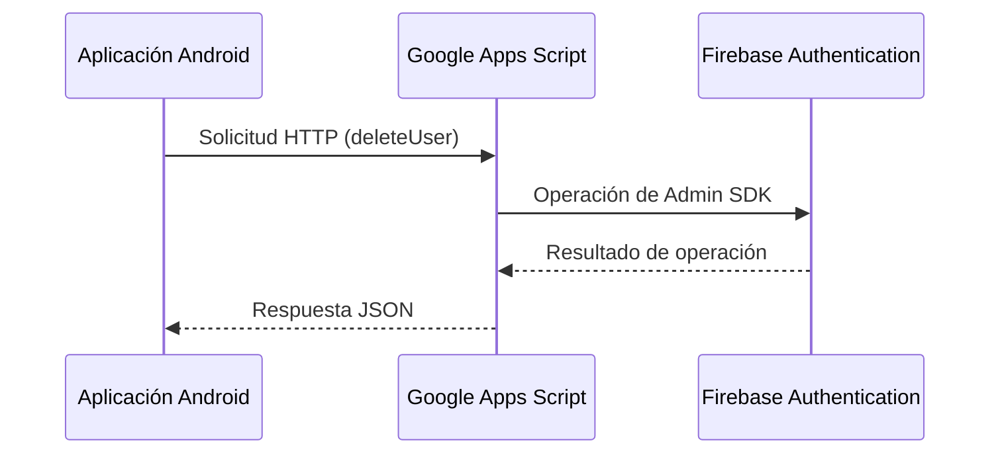

# Implementación de Google Apps Script como Alternativa a Firebase Functions

## Resumen

Este documento técnico describe la implementación de Google Apps Script como solución alternativa a Firebase Functions para operaciones administrativas en Firebase Authentication. La solución desarrollada permite realizar operaciones críticas como la eliminación de usuarios sin necesidad de utilizar servicios de pago, manteniendo una arquitectura robusta y segura.

## Introducción

Firebase Authentication proporciona una API robusta para la gestión de usuarios, pero ciertas operaciones administrativas, como la eliminación de usuarios por email, solo son posibles desde el servidor utilizando Admin SDK. Tradicionalmente, estas operaciones se implementarían mediante Firebase Functions, un servicio que requiere un plan de pago (Blaze) en Firebase.

Este documento presenta una implementación alternativa utilizando Google Apps Script, que proporciona:
- Una solución completamente gratuita
- Integración sencilla con Firebase
- Alta disponibilidad y fiabilidad
- Mantenimiento mínimo

## Arquitectura de la Solución

La arquitectura implementada sigue un enfoque de microservicio REST, donde:

1. La aplicación Android realiza solicitudes HTTP a un endpoint de Google Apps Script
2. El script ejecuta operaciones administrativas en Firebase Authentication
3. El resultado se devuelve a la aplicación en formato JSON



## Implementación Técnica

### 1. Servicio de Google Apps Script

El servicio se implementa como una aplicación web en Google Apps Script, que expone endpoints REST para operaciones administrativas:

```javascript
/**
 * Función que proporciona un endpoint web para eliminar usuarios
 * @param {Object} e Objeto de evento con los parámetros de la solicitud
 * @return {TextOutput} Respuesta JSON
 */
function doPost(e) {
  // Validación y procesamiento de solicitud
  const requestData = JSON.parse(e.postData.contents);
  
  // Ejecutar la acción correspondiente
  if (action === 'deleteUser') {
    const email = requestData.email;
    const firebase = getFirebaseAdmin();
    const result = firebase.deleteUserByEmail(email);
    
    return ContentService.createTextOutput(JSON.stringify(result))
      .setMimeType(ContentService.MimeType.JSON);
  }
}
```

### 2. Integración en la Aplicación Android

La aplicación Android utiliza OkHttp para realizar solicitudes al endpoint:

```kotlin
/**
 * Elimina un usuario de Firebase Authentication por su email.
 * 
 * @param email Correo electrónico del usuario a eliminar
 * @return Resultado encapsulado que indica éxito o error en la operación
 */
override suspend fun deleteUserByEmail(email: String): Result<Unit> = withContext(Dispatchers.IO) {
    try {
        // URL del servicio web de Google Apps Script
        val serviceUrl = "https://script.google.com/macros/s/[ID]/exec"
        
        // Solicitud HTTP
        val client = OkHttpClient()
        val json = JSONObject().apply {
            put("action", "deleteUser")
            put("email", email)
        }
        
        val requestBody = json.toString().toRequestBody("application/json".toMediaType())
        val request = Request.Builder()
            .url(serviceUrl)
            .post(requestBody)
            .build()
            
        // Ejecutar la solicitud y procesar resultado
        val response = client.newCall(request).execute()
        // Procesamiento de respuesta...
    } catch (e: Exception) {
        Result.Error(e)
    }
}
```

## Ventajas y Consideraciones

### Ventajas

1. **Costo cero**: A diferencia de Firebase Functions, Google Apps Script es completamente gratuito dentro de sus generosas cuotas diarias.
2. **Simplicidad**: No requiere configuración de entorno de desarrollo ni implementación compleja.
3. **Mantenimiento mínimo**: El servicio se ejecuta en la infraestructura de Google, sin necesidad de gestionar servidores.
4. **Seguridad integrada**: Utiliza OAuth2 para la autenticación con los servicios de Google.

### Consideraciones

1. **Cuotas y limitaciones**:
   - Hasta 20,000 llamadas a servicios externos por día
   - Tiempo máximo de ejecución de 30 segundos por solicitud
   - 90 minutos de tiempo total de ejecución diario
   
2. **Seguridad**:
   - Implementación de capa de autenticación adicional mediante clave API
   - Limitación de operaciones permitidas
   - Validación rigurosa de entradas

3. **Rendimiento**:
   - Latencia ligeramente mayor que Firebase Functions en algunas regiones
   - Optimizaciones para reducir tiempo de procesamiento

## Comparativa con Firebase Functions

| Característica | Google Apps Script | Firebase Functions |
|----------------|-------------------|-------------------|
| Costo | Gratuito | Requiere plan Blaze (pago) |
| Facilidad de implementación | Alta | Media |
| Escalabilidad | Limitada por cuotas | Alta |
| Integración con Firebase | A través de API REST | Nativa |
| Mantenimiento | Mínimo | Requiere CI/CD |
| Seguridad | OAuth 2.0 + clave API | IAM de Firebase |

## Conclusiones

La implementación de Google Apps Script como alternativa a Firebase Functions para operaciones administrativas en Firebase Authentication demuestra que es posible construir soluciones robustas y eficientes sin incurrir en costos adicionales. Esta arquitectura híbrida aprovecha lo mejor de ambas plataformas:

1. Firebase para la gestión principal de datos y autenticación
2. Google Apps Script para operaciones administrativas específicas

El enfoque presenta un excelente balance entre funcionalidad, costo y mantenimiento, siendo especialmente adecuado para proyectos académicos, startups y aplicaciones en fase inicial donde la optimización de recursos es crítica.

## Referencias

1. [Google Apps Script Documentation](https://developers.google.com/apps-script)
2. [Firebase Authentication REST API](https://firebase.google.com/docs/reference/rest/auth)
3. [OkHttp Client for Android](https://square.github.io/okhttp/)
4. [Cloud Functions for Firebase](https://firebase.google.com/docs/functions) 