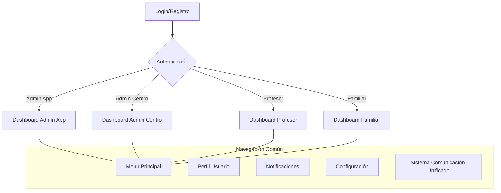
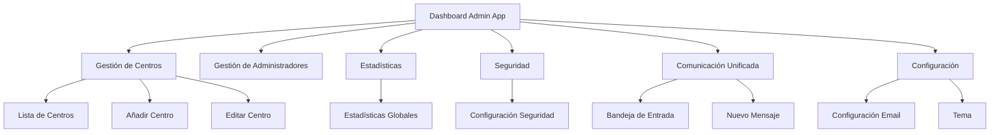
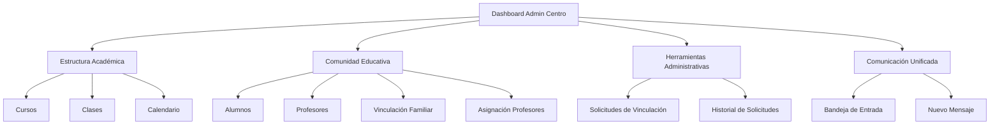
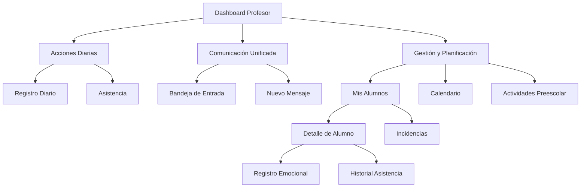
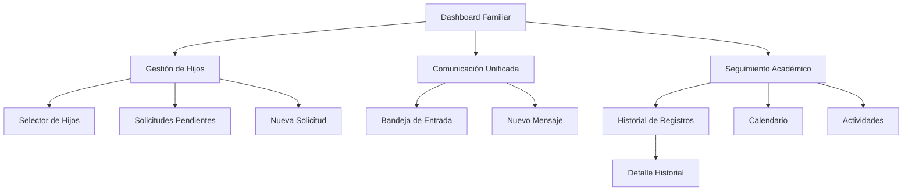
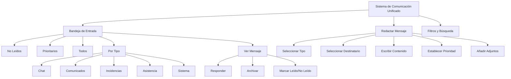

# Manual de Usuario - UmeEgunero

## Índice
1. [Introducción](#introducción)
2. [Requisitos del Sistema](#requisitos-del-sistema)
3. [Instalación](#instalación)
4. [Registro e Inicio de Sesión](#registro-e-inicio-de-sesión)
5. [Perfiles de Usuario](#perfiles-de-usuario)
   - [Administrador de Aplicación](#administrador-de-aplicación)
   - [Administrador de Centro](#administrador-de-centro)
   - [Profesor](#profesor)
   - [Familiar](#familiar)
6. [Módulos Principales](#módulos-principales)
   - [Sistema de Comunicación Unificado](#sistema-de-comunicación-unificado)
   - [Calendario y Eventos](#calendario-y-eventos)
   - [Gestión de Usuarios](#gestión-de-usuarios)
   - [Gestión Académica](#gestión-académica)
7. [Solución de Problemas](#solución-de-problemas)
8. [Preguntas Frecuentes](#preguntas-frecuentes)

## Introducción

Bienvenido a UmeEgunero, la aplicación integral para la gestión educativa que conecta centros escolares, profesores y familias. Este manual le guiará a través de todas las funcionalidades disponibles según su perfil de usuario.

UmeEgunero está diseñada para facilitar la comunicación entre todos los miembros de la comunidad educativa y ofrecer herramientas específicas para cada rol, mejorando la experiencia educativa y administrativa de los centros.

## Requisitos del Sistema

- Dispositivo Android versión 8.0 (API 26) o superior.
- Recomendado: Android 14 (API 34) para todas las funcionalidades.
- Conexión a Internet (algunas funciones están disponibles en modo offline).
- Espacio de almacenamiento mínimo: 100 MB.
- Se recomienda 2GB de memoria RAM o superior.

## Instalación

1. Descargue la aplicación desde Google Play Store.
2. Abra la aplicación una vez instalada.
3. Permita los permisos solicitados durante la instalación:
   - Almacenamiento: para guardar documentos y archivos.
   - Cámara: para tomar fotos de perfil o adjuntar a mensajes.
   - Notificaciones: para recibir alertas de comunicados y mensajes.
4. La aplicación realizará una verificación inicial y descargará recursos adicionales si es necesario.

## Registro e Inicio de Sesión

### Registro de Usuario Nuevo

El registro en UmeEgunero requiere un código de acceso proporcionado por el centro educativo o el administrador del sistema, dependiendo del tipo de perfil:

1. En la pantalla de bienvenida, pulse el botón "Registrarse".
2. Complete el formulario con:
   - Nombre completo
   - Correo electrónico
   - Contraseña (mínimo 8 caracteres, debe incluir mayúsculas, minúsculas y números)
   - Seleccione el tipo de usuario (Familiar, Profesor, Administrador de Centro)

3. **Para usuarios tipo Familiar**:
   - Introduzca el código de centro proporcionado por su centro educativo.
   - Introduzca el código de identificación familiar.
   - Seleccione el alumno o alumnos asociados a su cuenta.

4. **Para usuarios tipo Profesor**:
   - Introduzca el código de centro y el código de identificación de profesor.
   - El administrador del centro deberá validar su cuenta antes de tener acceso completo.

5. **Para administradores de centro**:
   - Necesitará el código especial proporcionado por el administrador de la aplicación.
   - Deberá completar la información del centro si es un centro nuevo.

6. **Para administradores de la aplicación**:
   - Este perfil solo puede ser creado por otro administrador existente.
   - Contacte con soporte técnico para solicitar este perfil.

7. Pulse "Completar Registro".
8. Verifique su correo electrónico siguiendo el enlace enviado.

### Inicio de Sesión

1. Introduzca su correo electrónico registrado.
2. Introduzca su contraseña.
3. Opcionalmente, active "Recordar usuario" para facilitar futuros accesos.
4. Pulse "Iniciar Sesión".
5. Si ha olvidado su contraseña, pulse "¿Olvidó su contraseña?" y siga las instrucciones para restablecerla a través de su correo electrónico.

### Autenticación de Dos Factores (Opcional)

Para mayor seguridad, puede activar la autenticación de dos factores:

1. Vaya a su perfil de usuario.
2. Seleccione "Configuración de seguridad".
3. Active "Autenticación de dos factores".
4. Siga las instrucciones para configurar la autenticación por SMS o aplicación autenticadora.

## Perfiles de Usuario

UmeEgunero distingue entre diferentes perfiles, cada uno con funcionalidades y flujos adaptados a sus necesidades. A continuación se describen los perfiles disponibles y se incluyen diagramas de flujo que muestran las principales rutas de navegación y funcionalidades para cada tipo de usuario.

### Visión General de Navegación

El siguiente diagrama muestra la estructura general de navegación en la aplicación:

### Administrador de Aplicación

El Administrador de Aplicación tiene acceso completo a la gestión global de la plataforma, incluyendo la creación y administración de centros educativos.

### Administrador de Centro

El Administrador de Centro gestiona todos los aspectos relacionados con su centro educativo, incluyendo la administración de profesores, familias, alumnos y recursos académicos.

### Profesor

El profesor gestiona el seguimiento de sus alumnos, registra actividades, gestiona evaluaciones y se comunica con las familias.

### Familiar

El familiar accede a la información de sus hijos, comunicaciones con profesores y participación en la comunidad educativa.

## Módulos Principales

### Sistema de Comunicación Unificado

El Sistema de Comunicación Unificado centraliza todas las formas de comunicación en una sola interfaz, simplificando la interacción entre todos los usuarios de la plataforma.

#### Bandeja de Entrada Unificada

La bandeja de entrada unificada muestra todos sus mensajes organizados por tipo, prioridad y estado de lectura.

1. **Acceder a la Bandeja de Entrada**:
   - Pulse el icono de "Comunicación" en cualquier dashboard.
   - La bandeja de entrada muestra todos sus mensajes con indicadores visuales de tipo y prioridad.
   - Los mensajes no leídos aparecen destacados.

2. **Filtrar Mensajes**:
   - Utilice los filtros en la parte superior para mostrar:
     - Todos los mensajes
     - Sólo no leídos
     - Por tipo (Chat, Comunicado, Incidencia, etc.)
     - Por prioridad (Normal, Alta, Urgente)
   - Puede combinar filtros para una búsqueda más específica.

3. **Ver Detalle de Mensaje**:
   - Pulse sobre cualquier mensaje para ver su contenido completo.
   - En la vista detallada puede:
     - Ver el remitente y destinatarios
     - Leer el contenido completo
     - Ver y descargar archivos adjuntos
     - Responder al mensaje
     - Marcar como leído/no leído
     - Archivar el mensaje

4. **Indicadores Visuales**:
   - Los mensajes utilizan un sistema de colores para indicar:
     - Azul: Mensajes de chat
     - Verde: Comunicados
     - Amarillo: Notificaciones del sistema
     - Naranja: Incidencias
     - Rojo: Asuntos urgentes

#### Redactar Nuevo Mensaje

Puede crear diferentes tipos de mensajes desde una interfaz unificada.

1. **Crear Nuevo Mensaje**:
   - Pulse el botón "+" flotante en la bandeja de entrada.
   - Seleccione el tipo de mensaje que desea crear:
     - Chat personal: Mensaje directo a otro usuario
     - Comunicado: Anuncio formal para múltiples destinatarios
     - Incidencia: Reporte de situación que requiere atención
     - Registro: Información sobre alumno (solo profesores)

2. **Seleccionar Destinatarios**:
   - Dependiendo del tipo de mensaje, podrá seleccionar:
     - Usuarios individuales
     - Grupos (clases, cursos completos)
     - Todos los usuarios de un perfil (todos los profesores, familias, etc.)

3. **Redactar el Mensaje**:
   - Escriba el título y contenido del mensaje.
   - Puede usar formato básico (negrita, cursiva, viñetas).
   - Ajuste la prioridad según la importancia (normal, alta, urgente).
   - Añada adjuntos si es necesario (hasta 5 archivos, máximo 10MB en total).

4. **Enviar y Seguimiento**:
   - Pulse "Enviar" para distribuir el mensaje.
   - Para comunicados, puede activar "Solicitar confirmación de lectura".
   - Los mensajes enviados aparecerán en su bandeja con indicador de estado (enviado, leído).

#### Notificaciones

El sistema le notifica cuando recibe nuevos mensajes:

1. **Notificaciones Push**:
   - Recibirá notificaciones en su dispositivo según el tipo y prioridad del mensaje.
   - Las notificaciones urgentes tienen un sonido distintivo.
   - Pulse la notificación para ir directamente al mensaje.

2. **Configurar Notificaciones**:
   - Acceda a "Configuración" > "Notificaciones" para personalizar:
     - Qué tipos de mensajes generan notificaciones
     - Sonidos según tipo de mensaje
     - Horario de silencio (no molestar)

3. **Indicadores en la App**:
   - El icono de comunicación muestra un contador con mensajes no leídos.
   - En la bandeja, los mensajes nuevos aparecen destacados.

### Calendario y Eventos

Gestione eventos, reuniones, exámenes y otras actividades importantes.

1. **Ver Calendario**:
   - Acceda desde "Calendario" en el menú.
   - Alterne entre vistas: Día, Semana, Mes.
   - Filtre por categorías de eventos (académicos, reuniones, extraescolares).
   - Pulse sobre un evento para ver detalles.

2. **Crear Evento** (Administradores y Profesores):
   - Pulse "+" en la esquina inferior de la vista de calendario.
   - Complete los campos: título, fecha, hora, lugar, descripción.
   - Seleccione la categoría y color del evento.
   - Elija destinatarios: centro, curso, clase o usuarios específicos.
   - Configure recordatorios (15min, 1h, 1 día antes).
   - Pulse "Guardar".

3. **Sincronizar con Calendario Personal**:
   - En la configuración del calendario, active "Sincronizar con mi calendario".
   - Seleccione la cuenta de Google o calendario del dispositivo.
   - Elija qué tipos de eventos desea sincronizar.

### Gestión de Usuarios

#### Para Administradores

1. **Añadir Usuario**:
   - Acceda a "Gestión de Usuarios" en el menú.
   - Pulse "+" para añadir nuevo usuario.
   - Seleccione el tipo de usuario y complete la información requerida.
   - Para profesores y administradores, asigne el centro correspondiente.
   - Pulse "Guardar" para crear el usuario y enviar las credenciales.

2. **Gestionar Permisos**:
   - Seleccione un usuario de la lista.
   - Pulse "Permisos" en su ficha.
   - Active o desactive funcionalidades específicas.
   - Para administradores de centro, configure el alcance de sus permisos.

3. **Gestión Masiva**:
   - Utilice "Importar Usuarios" para crear múltiples usuarios desde un archivo CSV.
   - Descargue la plantilla, complete los datos y súbala al sistema.
   - Revise los resultados y corrija errores si es necesario.

### Gestión Académica

#### Para Administradores de Centro

1. **Configurar Estructura Académica**:
   - Acceda a "Gestión Académica" en el menú.
   - Cree cursos con "Añadir Curso".
   - Dentro de cada curso, cree clases con "Añadir Clase".
   - Asigne tutores y capacidades a cada clase.

2. **Gestionar Horarios**:
   - Seleccione una clase y pulse "Horario".
   - Utilice la matriz de días/horas para asignar materias y profesores.
   - Guarde los cambios y publique el horario cuando esté completo.

3. **Gestionar Evaluaciones**:
   - Configure periodos de evaluación en "Configuración Académica".
   - Establezca criterios y plantillas de evaluación.
   - Defina fechas límite para la entrega de calificaciones.

## Solución de Problemas

### Problemas de Conexión

1. **La aplicación muestra "Sin conexión"**:
   - Verifique su conexión a Internet.
   - Intente cambiar entre WiFi y datos móviles.
   - Pulse "Reintentar" o cierre y vuelva a abrir la aplicación.
   - La mayoría de las funciones seguirán disponibles en modo offline y se sincronizarán cuando vuelva la conexión.

2. **Datos desactualizados**:
   - Pulse el icono de actualizar en la esquina superior.
   - Vaya a "Configuración" > "Sincronización" y pulse "Sincronizar ahora".
   - Si el problema persiste, cierre sesión y vuelva a iniciarla.

3. **Error al realizar una acción que envía correo electrónico** (Ej. Test de Email, aprobación de usuario, etc.):
   - La aplicación ahora utiliza un servicio externo para garantizar el envío correcto de correos HTML.
   - Si ve errores como "Error de red al enviar" o "Error del script", primero verifique su conexión a Internet.
   - Si el problema persiste con buena conexión, podría haber un problema temporal con el servicio de envío. Inténtelo de nuevo más tarde o contacte con soporte si el error es recurrente.

### Problemas de Cuenta

1. **No puedo iniciar sesión**:
   - Verifique que su correo y contraseña sean correctos.
   - Compruebe si su cuenta ha sido desactivada contactando con su administrador.
   - Utilice "¿Olvidó su contraseña?" para restablecerla.
   - Si el problema persiste, contacte con soporte.

2. **No veo a todos mis hijos/alumnos**:
   - Para familias: contacte con el administrador del centro para verificar la vinculación.
   - Para profesores: compruebe sus asignaciones de clase con el administrador.

### Problemas con Notificaciones (Push)

1. **No recibo notificaciones push**:
   - Vaya a Configuración del dispositivo > Aplicaciones > UmeEgunero > Notificaciones y verifique que estén habilitadas.
   - En la aplicación, vaya a "Configuración" > "Notificaciones" y compruebe la configuración.
   - Verifique que no tenga activo el modo "No molestar" en su dispositivo.

2. **Recibo notificaciones push duplicadas**:
   - Vaya a "Configuración" > "Notificaciones" > "Restablecer preferencias".
   - Cierre sesión y vuelva a iniciarla.

### Problemas con Archivos

1. **No puedo subir archivos**:
   - Verifique que el archivo no supere los 5MB.
   - Compruebe los formatos permitidos (.pdf, .doc, .docx, .jpg, .png).
   - Asegúrese de tener espacio suficiente en su dispositivo.
   - Verifique que tiene una conexión estable a Internet.

2. **No puedo abrir un archivo adjunto**:
   - Asegúrese de tener una aplicación compatible para el tipo de archivo.
   - Intente descargar el archivo en lugar de abrirlo directamente.
   - Si el problema persiste, contacte con el emisor del archivo.

## Preguntas Frecuentes

### Sobre Cuentas y Accesos

**P: ¿Puedo usar la misma cuenta en múltiples dispositivos?**
R: Sí, puede iniciar sesión con sus credenciales en varios dispositivos simultáneamente.

**P: ¿Cómo puedo cambiar mi contraseña?**
R: Vaya a su perfil de usuario, pulse "Seguridad" y seleccione "Cambiar contraseña".

**P: ¿Puedo tener diferentes perfiles en la misma cuenta?**
R: No, cada usuario tiene un tipo de perfil específico. Si necesita roles diferentes, deberá usar cuentas separadas.

### Sobre el Sistema de Comunicación Unificado

**P: ¿Cómo sé qué tipo de mensaje debo enviar?**
R: Utilice Chat para comunicaciones informales, Comunicados para anuncios oficiales, e Incidencias para reportar situaciones que requieren atención.

**P: ¿Puedo ver si un destinatario ha leído mi mensaje?**
R: Sí, para mensajes con confirmación de lectura, verá un indicador de "Leído" junto con la fecha y hora de lectura.

**P: ¿Hay límites en el envío de mensajes?**
R: No hay límite en la cantidad de mensajes, pero los adjuntos están limitados a 5 por mensaje y un máximo de 10MB en total.

**P: ¿Puedo recuperar un mensaje archivado?**
R: Sí, en la bandeja de entrada, vaya a "Filtros" > "Archivados" para acceder a mensajes archivados y poder restaurarlos.

### Sobre Uso General

**P: ¿La aplicación consume muchos datos móviles?**
R: El consumo es moderado. Puede reducirlo activando "Ahorro de datos" en la configuración, que limitará la descarga de imágenes y archivos grandes a conexiones WiFi.

**P: ¿Cómo cambio el idioma de la aplicación?**
R: La aplicación usa por defecto el idioma del sistema. Para cambiarlo, modifique el idioma en la configuración de su dispositivo.

**P: ¿Se guardan copias de seguridad de mis datos?**
R: Sí, toda la información se sincroniza con los servidores y se realizan copias de seguridad diarias.

**P: ¿Puedo usar la aplicación sin conexión?**
R: Sí, muchas funciones están disponibles offline. Los cambios se sincronizarán cuando recupere la conexión.

---

## Ejemplo de Caso de Uso

**Escenario:** Un familiar consulta el estado emocional y rutinas de su hijo/a y solicita una reunión con el tutor.

1. Accede al perfil del niño/a y visualiza su evolución reciente.
2. Consulta las rutinas diarias y mensajes del profesorado.
3. Solicita una reunión usando el formulario integrado.

---

## Ejemplo de Uso para Reflejar Mejoras y Enfoque Infantil

**Escenario:** Un profesor utiliza la aplicación para registrar el seguimiento emocional y social de sus alumnos y compartirlo con las familias.

1. Accede a la pantalla de seguimiento emocional y social.
2. Registra las observaciones y comentarios sobre el desarrollo de cada alumno.
3. Comparte el informe con las familias a través de la aplicación.

---

## Accesibilidad y Usabilidad

- Contraste de colores y fuentes adaptadas a infantil.
- Botones grandes y navegación sencilla.
- Compatibilidad con lectores de pantalla.

---

## Nuevas Pantallas y Mejoras UX

Se han añadido nuevas pantallas orientadas a la etapa infantil (2-4 años):
- Seguimiento emocional y social (profesor)
- Resumen de rutinas (profesor)
- Bienestar del niño/a (familia)
- Solicitud de reunión (familia)
- Centro de recursos familiares

Todas las pantallas siguen las directrices de Material 3 y buenas prácticas de accesibilidad.

---

## Ejemplo de Caso de Uso

**Escenario:** Un familiar consulta el bienestar y evolución de su hijo/a y solicita una reunión con el tutor.

1. Accede al perfil del niño/a y visualiza su evolución reciente.
2. Consulta las rutinas diarias y mensajes del profesorado.
3. Solicita una reunión usando el formulario integrado.

---

## Versión del manual: 1.3.0 (actualizado a la versión 1.0.0 de la aplicación - Mayo 2025)

Para más información sobre los componentes de UI disponibles, consulte [UI-COMPONENTS.md](UI-COMPONENTS.md).

### Consulta de Registros Diarios (Perfil Familiar)

Los familiares pueden consultar los registros diarios de sus hijos de forma sencilla y organizada:

1. Desde el Dashboard, acceda a la sección "Registros Diarios".
2. Seleccione el alumno cuya información desea consultar.
3. Se mostrarán los registros disponibles ordenados por fecha, con el más reciente primero.
4. Para ver el detalle completo, pulse sobre el registro deseado.

#### Filtrado por Fecha

Ahora puede filtrar los registros por fecha específica:

1. En la pantalla de detalle del registro, observe el selector de fecha en la parte superior.
2. Pulse sobre la tarjeta de fecha para desplegar el calendario de fechas disponibles.
3. Seleccione la fecha deseada para cargar automáticamente el registro correspondiente.
4. Las fechas que tienen registros disponibles se mostrarán destacadas.
5. Puede navegar fácilmente entre diferentes días sin necesidad de volver al listado general.

Este nuevo sistema de filtrado facilita la consulta histórica de la actividad del alumno a través del tiempo.

### Sistema de Comunicación Unificado

UmeEgunero incluye un sistema de comunicación integral que centraliza todos los tipos de mensajes y notificaciones en una única interfaz.

#### Acceso al Sistema de Comunicación

1. Desde cualquier Dashboard, pulse el icono de comunicación en la barra inferior o menú lateral.
2. La bandeja unificada mostrará todos sus mensajes ordenados por fecha.
3. Puede filtrar por tipo de mensaje (Chat, Notificación, Comunicado, etc.) utilizando los botones de filtro.

#### Lectura de Mensajes

1. Pulse sobre cualquier mensaje para ver su contenido completo.
2. Los mensajes se marcarán automáticamente como leídos al abrirlos.
3. En el caso de comunicados oficiales que requieren confirmación explícita, deberá pulsar el botón "Confirmar lectura".
4. El estado de lectura se sincroniza con todos sus dispositivos automáticamente.

#### Comunicación con Profesores

1. En la pantalla de detalle de un alumno o un registro, utilice el botón de mensajería para iniciar una conversación con el profesor.
2. También puede acceder a chats existentes desde la bandeja de comunicación unificada.
3. Los mensajes nuevos aparecerán destacados y generarán una notificación.

### Gestión de Informes y Exportación (Perfil Profesor)

#### Generación de Informes de Asistencia

Los profesores pueden generar informes detallados sobre la asistencia de los alumnos:

1. Acceda a la pantalla "Registro Diario" desde el Dashboard.
2. Pulse el icono de informe situado en la esquina superior derecha del selector de fecha.
3. Se mostrará un resumen con las estadísticas de asistencia del día:
   - Total de alumnos
   - Alumnos presentes
   - Alumnos ausentes
   - Porcentaje de asistencia
   - Alumnos con registro completado

#### Exportación de Informes a PDF

Ahora puede exportar los informes de asistencia en formato PDF para su archivo o envío:

1. En la ventana de informe, pulse el botón "Exportar PDF".
2. El sistema generará un documento PDF con:
   - Fecha del informe
   - Datos completos de la clase
   - Listado de alumnos presentes con sus DNI
   - Estadísticas detalladas
   - Información adicional relevante
3. Una vez generado, puede:
   - Compartir el PDF directamente desde la aplicación
   - Guardarlo en el almacenamiento del dispositivo
   - Enviarlo por correo electrónico o mensajería

El PDF generado es un documento oficial que puede utilizarse para fines administrativos y de seguimiento. 