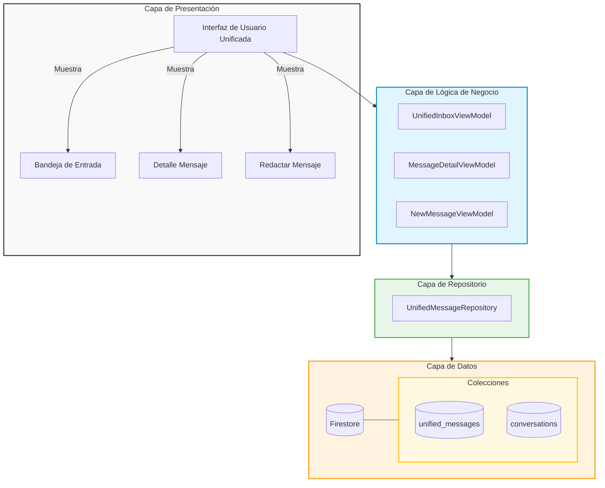
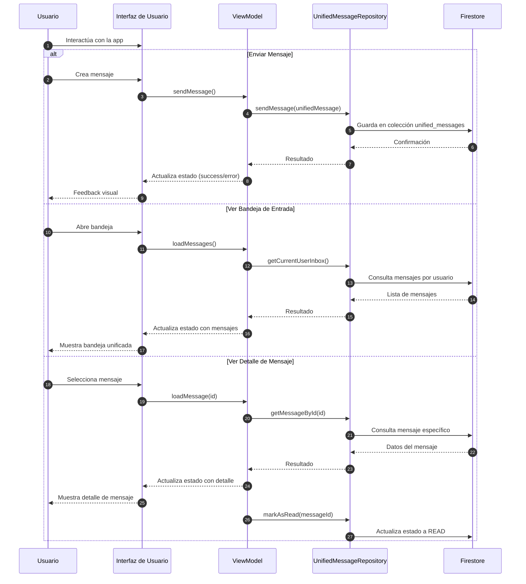
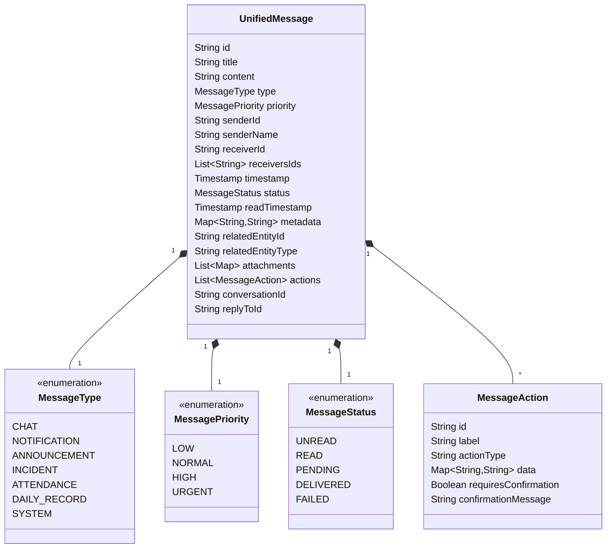
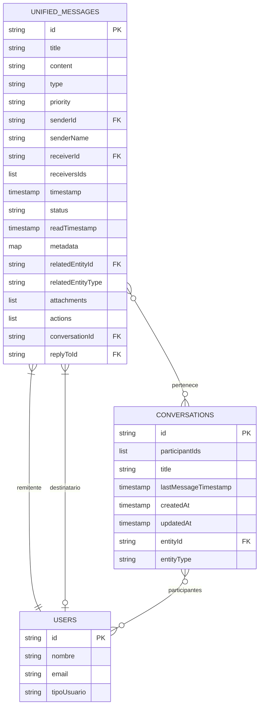
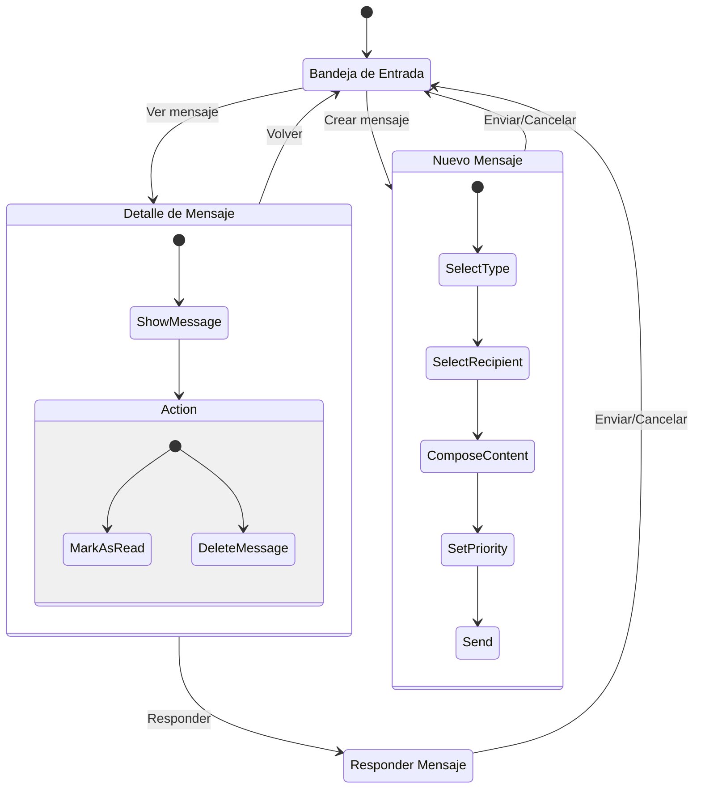
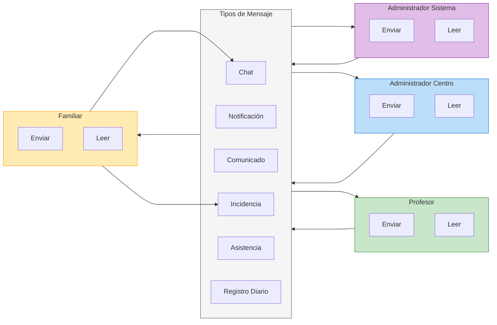
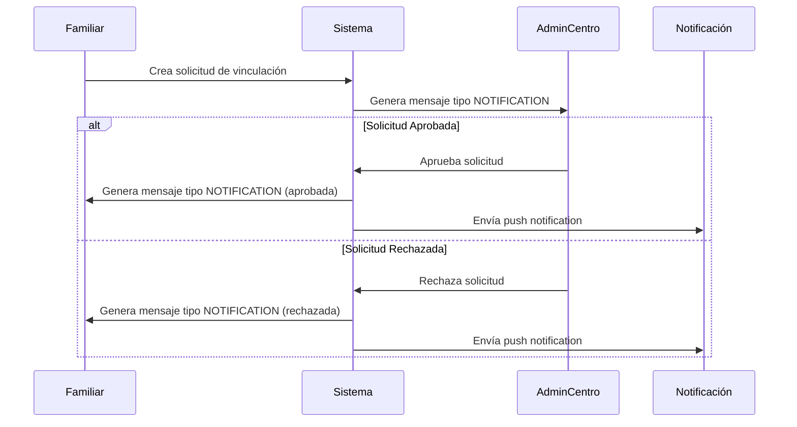
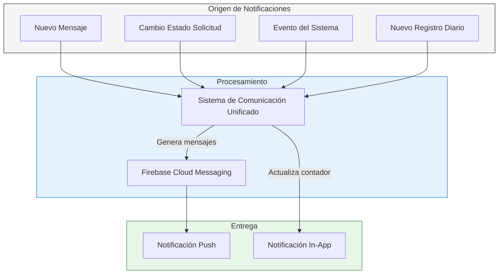

# Sistema de Comunicación Unificado

## Resumen

El sistema de comunicación unificado de UmeEgunero centraliza todas las formas de comunicación en una sola interfaz y arquitectura, simplificando la interacción del usuario, reduciendo la duplicación de código y ofreciendo una experiencia coherente independientemente del perfil del usuario.

## Diagrama de Arquitectura



## Estructura del Modelo

El sistema se basa en el modelo `UnifiedMessage` que unifica los conceptos de:
- Mensajes de chat
- Notificaciones
- Comunicados/anuncios
- Incidencias
- Registros de asistencia
- Mensajes del sistema

### Diagrama de Flujo de Mensajes



### Diagrama de Tipos de Mensaje



## Estructura de Datos

El sistema utiliza una colección principal en Firestore:

### Colección `unified_messages`

Almacena todos los mensajes independientemente del tipo. Cada documento contiene los campos del modelo `UnifiedMessage`.



## Flujo de Navegación



## Interacción entre Perfiles

### Diagrama de Comunicación



## Integración con Solicitudes de Vinculación

El sistema de comunicación unificado se integra con el sistema de solicitudes de vinculación para proporcionar notificaciones automáticas en diferentes puntos del proceso de vinculación entre familiares y alumnos.

### Diagrama de Flujo de Solicitudes



### Estructura de Mensaje de Solicitud

Los mensajes de solicitud se generan automáticamente y se almacenan en el sistema unificado con las siguientes características:

```mermaid
classDiagram
    class SolicitudVinculacionMessage {
        type = MessageType.NOTIFICATION
        priority = MessagePriority.HIGH
        title = "Solicitud de vinculación [estado]"
        content = "Información detallada de la solicitud"
        metadata {
            solicitudId: String
            alumnoDni: String
            estado: EstadoSolicitud
            tipoNotificacion: "SOLICITUD_VINCULACION"
        }
        relatedEntityId = "ID de la solicitud"
        relatedEntityType = "SOLICITUD_VINCULACION"
    }
```

## Integración con Sistema de Notificaciones

El sistema de comunicación unificado está estrechamente integrado con el sistema de notificaciones push de la aplicación mediante Firebase Cloud Messaging (FCM).

### Flujo de Notificaciones



### Estructura de Notificación Push

```mermaid
classDiagram
    class FCMNotification {
        notification {
            title: String
            body: String
        }
        data {
            type: "MENSAJE" | "SOLICITUD" | "SISTEMA" | "REGISTRO"
            entityId: String
            action: "VIEW" | "APPROVE" | "REJECT"
            deeplink: String
        }
        android {
            priority: "high"
            notification {
                channel_id: String
                icon: String
                color: String
                click_action: String
            }
        }
    }
```

## Ventajas del Sistema Unificado

1. **Experiencia de usuario mejorada**:
   - Interfaz única para todos los tipos de comunicación
   - Menor curva de aprendizaje
   - Acceso centralizado a toda la información

2. **Arquitectura simplificada**:
   - Menos código redundante
   - Mantenimiento simplificado
   - Coherencia en toda la aplicación

3. **Flexibilidad**:
   - Facilidad para añadir nuevos tipos de comunicación
   - Adaptable a diferentes perfiles de usuario
   - Extensible para futuras necesidades

4. **Mejor rendimiento**:
   - Consultas optimizadas a la base de datos
   - Menor duplicación de datos
   - Caché compartida

5. **Integración completa**:
   - Interoperabilidad con sistema de solicitudes
   - Conexión directa con el sistema de notificaciones push
   - Soporte para eventos del sistema y registros diarios

## Conclusión

El sistema de comunicación unificado representa una mejora significativa en la arquitectura y experiencia de usuario de UmeEgunero, simplificando la forma en que todos los actores del ecosistema educativo interactúan entre sí, manteniendo al mismo tiempo la separación lógica necesaria entre los diferentes tipos de comunicación. La integración con los sistemas de solicitudes y notificaciones garantiza que los usuarios reciban información importante a través de múltiples canales, mejorando la comunicación general y la experiencia de usuario en la aplicación.

## Detalles de Implementación

### Marcado de Mensajes como Leídos

#### Marcado Automático (Nuevo)

Para mejorar la experiencia de usuario, los mensajes ahora se marcan automáticamente como leídos cuando un usuario abre la pantalla de detalle:

```kotlin
@Composable
fun MessageDetailScreen(
    messageId: String,
    onBack: () -> Unit,
    onNavigateToConversation: (String) -> Unit = {},
    viewModel: MessageDetailViewModel = hiltViewModel()
) {
    // Cargar el mensaje
    LaunchedEffect(messageId) {
        viewModel.loadMessage(messageId)
    }
    
    val uiState by viewModel.uiState.collectAsState()
    
    // Marcar automáticamente como leído cuando se abre el mensaje
    LaunchedEffect(uiState.message) {
        uiState.message?.let { message ->
            if (!message.isRead) {
                viewModel.markAsRead()
            }
        }
    }
    
    // Resto del componente...
}
```

Excepciones al marcado automático:
- Comunicados que requieren confirmación explícita (flag `requireConfirmation`)
- Mensajes que ya están marcados como leídos

El marcado automático se implementa en el ViewModel:

```kotlin
fun markAsRead() {
    val currentMessage = _uiState.value.message ?: return
    
    viewModelScope.launch {
        try {
            val result = messageRepository.markAsRead(currentMessage.id)
            
            when (result) {
                is Result.Success -> {
                    // Actualizar el estado local
                    _uiState.update { state ->
                        state.copy(
                            message = state.message?.copy(
                                status = MessageStatus.READ
                            )
                        )
                    }
                }
                is Result.Error -> {
                    _uiState.update { it.copy(error = "Error al marcar como leído: ${result.message}") }
                }
                else -> {}
            }
        } catch (e: Exception) {
            Timber.e(e, "Error al marcar mensaje como leído: ${currentMessage.id}")
        }
    }
}
```

Esta funcionalidad:
1. Mejora la experiencia de usuario al eliminar pasos manuales
2. Mantiene sincronizado el estado de lectura en Firebase
3. Respeta los requisitos especiales para comunicados oficiales
4. Optimiza el flujo de trabajo con los mensajes 