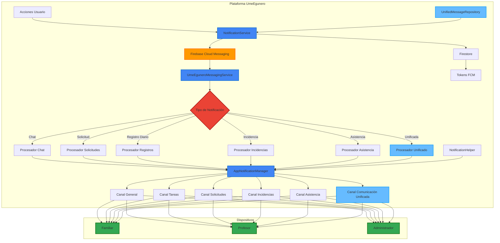
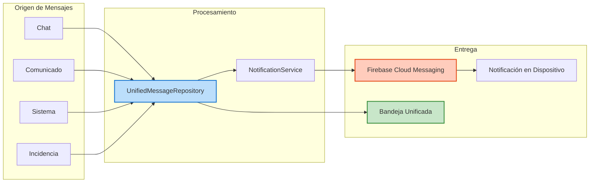
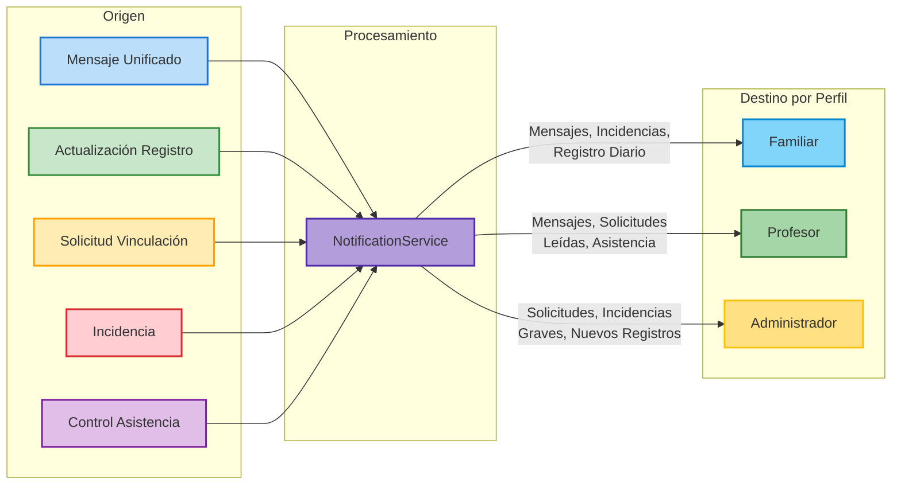
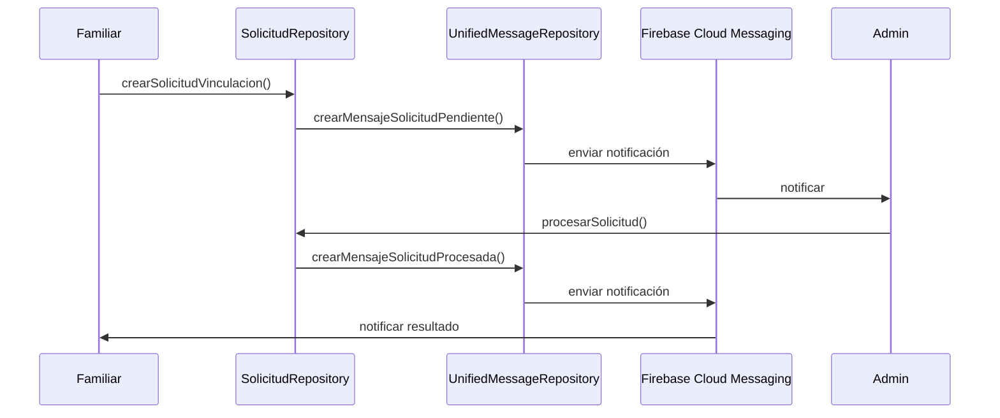

# Sistema de Notificaciones en UmeEgunero

## Visión General

El sistema de notificaciones de UmeEgunero proporciona un mecanismo centralizado, confiable y adaptado a cada perfil de usuario para mantener informados a todos los participantes del entorno educativo. Este sistema está completamente integrado con el Sistema de Comunicación Unificado, utilizando Firebase Cloud Messaging (FCM) como infraestructura principal.



## Arquitectura del Sistema de Notificaciones

### Componentes Principales

1. **AppNotificationManager**: Clase singleton responsable de:
   - Crear y gestionar canales de notificación
   - Mostrar notificaciones en el dispositivo
   - Gestionar la interacción con las notificaciones
   - Registrar tokens FCM

2. **NotificationService**: Servicio centralizado que maneja:
   - Envío de notificaciones a diferentes tipos de destinatarios
   - Mantenimiento de tokens FCM
   - Gestión de preferencias de notificación
   - Procesamiento de eventos que generan notificaciones

3. **UmeEguneroMessagingService**: Servicio que extiende FirebaseMessagingService para:
   - Recibir mensajes de FCM
   - Procesar diferentes tipos de notificaciones
   - Actualizar la interfaz mediante broadcasts
   - Integrar con el sistema de comunicación unificado

4. **NotificationHelper**: Clase utilitaria que simplifica:
   - Comprobación de permisos
   - Apertura de ajustes del sistema
   - Métodos específicos para cada tipo de notificación

5. **UnifiedMessageRepository**: Integración con el sistema de comunicación unificado:
   - Generación de mensajes en el sistema unificado cuando llegan notificaciones
   - Envío de notificaciones push cuando se crean mensajes en el sistema unificado

### Canales de Notificación

UmeEgunero implementa un sistema de canales que categoriza las notificaciones según su importancia y contenido:

| Canal | Importancia | Descripción | Usos |
|-------|-------------|-------------|------|
| General | Default | Notificaciones generales y chat | Mensajes, comunicados generales |
| Tareas | High | Registro diario y tareas | Actualizaciones de registro, tareas |
| Solicitudes | High | Solicitudes de vinculación | Peticiones nuevo alumno-familiar |
| Incidencias | Max | Alertas de alta prioridad | Incidencias urgentes, emergencias |
| Asistencia | High | Control de asistencia | Retrasos, ausencias, recogidas tempranas |
| Comunicación Unificada | High | Sistema de comunicación unificado | Todos los mensajes del sistema unificado |
| Sincronización | Low | Procesos en segundo plano | Sincronización de datos |

## Integración con el Sistema de Comunicación Unificado

El sistema de notificaciones está completamente integrado con el Sistema de Comunicación Unificado para proporcionar una experiencia consistente:



Cuando se crea un mensaje en el Sistema de Comunicación Unificado:
1. El `UnifiedMessageRepository` guarda el mensaje en Firestore
2. Desencadena una notificación a través de `NotificationService`
3. La notificación se entrega mediante FCM
4. `UmeEguneroMessagingService` procesa la notificación entrante
5. Se muestra la notificación con el canal apropiado según el tipo de mensaje
6. Al hacer clic, se navega directamente a la vista de detalle del mensaje

## Flujo de Trabajo de las Notificaciones

El sistema sigue un flujo de trabajo bien definido:

1. **Registro de dispositivo**:
   - Cada dispositivo obtiene un token FCM único
   - El token se almacena en Firestore vinculado al usuario
   - Se permite múltiples dispositivos por usuario

2. **Origen de notificaciones**:
   - Acción de usuario (mensaje, incidencia)
   - Evento del sistema (actualización de datos)
   - Mensaje creado en el sistema de comunicación unificado
   - Evento programado (recordatorio)

3. **Procesamiento**:
   - NotificationService determina destinatarios
   - Se construye el contenido personalizado
   - Se selecciona el canal apropiado
   - Para mensajes del sistema unificado, se usa el canal específico

4. **Envío**:
   - Se recuperan tokens FCM de los destinatarios
   - Se envía mediante FCM o simulación local
   - Se gestionan errores y tokens inválidos

5. **Recepción**:
   - UmeEguneroMessagingService recibe el mensaje
   - Se procesa según el tipo de notificación
   - Para mensajes unificados, se usa `procesarNotificacionUnificada`
   - Se muestra utilizando AppNotificationManager

6. **Interacción**:
   - Notificaciones abren secciones específicas (deeplinks)
   - Para mensajes unificados, se navega directamente a la vista de detalle
   - Se envían broadcasts para actualizar UI
   - Se registran interacciones para análisis

## Tipos de Notificaciones por Perfil de Usuario



### Integración con Solicitudes de Vinculación

El sistema de notificaciones se integra con las solicitudes de vinculación mediante el Sistema de Comunicación Unificado:

1. Cuando se crea una solicitud de vinculación:
   - Se genera un mensaje en el sistema unificado (tipo NOTIFICATION)
   - Se envía una notificación FCM a los administradores del centro
   - La notificación usa el canal de Solicitudes

2. Cuando se procesa una solicitud:
   - Se genera un mensaje en el sistema unificado para el familiar
   - Se envía una notificación FCM al familiar
   - La prioridad varía según sea aprobación o rechazo



## Implementación Técnica

### Canal de Notificación para Comunicación Unificada

```kotlin
// Canal para el sistema de comunicación unificado
val unifiedCommunicationChannel = NotificationChannel(
    CHANNEL_ID_UNIFIED_COMMUNICATION,
    CHANNEL_NAME_UNIFIED_COMMUNICATION,
    NotificationManager.IMPORTANCE_HIGH
).apply {
    description = "Notificaciones del sistema de comunicación unificado"
    enableLights(true)
    lightColor = Color.BLUE
    enableVibration(true)
    setSound(
        RingtoneManager.getDefaultUri(RingtoneManager.TYPE_NOTIFICATION),
        AudioAttributes.Builder()
            .setUsage(AudioAttributes.USAGE_NOTIFICATION)
            .setContentType(AudioAttributes.CONTENT_TYPE_SONIFICATION)
            .build()
    )
}
```

### Procesamiento de Mensajes Unificados

```kotlin
/**
 * Procesa notificaciones del sistema de comunicación unificado
 */
private fun procesarNotificacionUnificada(data: Map<String, String>) {
    val messageId = data["messageId"] ?: return
    
    serviceScope.launch(Dispatchers.IO) {
        // Cargar el mensaje desde el repositorio
        val messageResult = unifiedMessageRepository.getMessageById(messageId)
        
        val titulo = data["titulo"] ?: "Nuevo mensaje"
        val mensaje = data["mensaje"] ?: "Has recibido un nuevo mensaje"
        val notificationId = messageId.hashCode()
        
        // Determinar canal según tipo de mensaje
        val channelId = when (data["messageType"]) {
            MessageType.NOTIFICATION.name -> AppNotificationManager.CHANNEL_ID_UNIFIED_COMMUNICATION
            MessageType.ANNOUNCEMENT.name -> AppNotificationManager.CHANNEL_ID_UNIFIED_COMMUNICATION
            MessageType.CHAT.name -> AppNotificationManager.CHANNEL_ID_GENERAL
            MessageType.INCIDENT.name -> AppNotificationManager.CHANNEL_ID_INCIDENCIAS
            MessageType.ATTENDANCE.name -> AppNotificationManager.CHANNEL_ID_ASISTENCIA
            MessageType.DAILY_RECORD.name -> AppNotificationManager.CHANNEL_ID_TAREAS
            MessageType.SYSTEM.name -> AppNotificationManager.CHANNEL_ID_UNIFIED_COMMUNICATION
            else -> AppNotificationManager.CHANNEL_ID_UNIFIED_COMMUNICATION
        }
        
        mostrarNotificacion(titulo, mensaje, channelId, notificationId)
        
        // Enviar broadcast para actualizar la UI si la app está abierta
        sendBroadcast(Intent(ACTION_NUEVO_MENSAJE_UNIFICADO).apply {
            putExtra("messageId", messageId)
            putExtra("messageType", data["messageType"])
        })
    }
}
```

### Navegación desde Notificaciones

```kotlin
private fun modificarIntentSegunCanal(intent: Intent?, channelId: String, data: Map<String, String>? = null) {
    intent?.apply {
        // Código existente...
        
        when (channelId) {
            // Códigos de otros canales...
            
            AppNotificationManager.CHANNEL_ID_UNIFIED_COMMUNICATION -> {
                // Intent para abrir la bandeja de entrada unificada
                putExtra("openSection", "unified_inbox")
                data?.get("messageId")?.let { messageId ->
                    putExtra("messageId", messageId)
                }
            }
        }
    }
}
```

## Estrategias de Optimización

1. **Limpieza de Tokens Inválidos**:
   ```kotlin
   if (e.message?.contains("registration-token-not-registered") == true) {
       firestore.collection("usuarios").document(userId)
           .update("fcmTokens.$tokenId", FieldValue.delete())
   }
   ```

2. **Agrupación de Notificaciones**:
   - Notificaciones del mismo tipo para un usuario se agrupan
   - Se evita sobrecarga de notificaciones similares

3. **Priorización Inteligente**:
   - Las incidencias urgentes tienen máxima prioridad (vibración, sonido)
   - Los mensajes unificados se priorizan según su tipo y contenido
   - Las notificaciones de sincronización tienen prioridad baja (silenciosas)

4. **Personalización Contextual**:
   - El contenido se adapta al perfil y preferencias del usuario
   - Se incluyen datos relevantes para facilitar la decisión de interactuar

## Conclusión

El sistema de notificaciones de UmeEgunero representa un componente crítico de la plataforma, permitiendo una comunicación eficiente entre todos los actores del entorno educativo. Su profunda integración con el Sistema de Comunicación Unificado proporciona una experiencia coherente y consistente, garantizando que todos los usuarios reciban notificaciones relevantes de manera oportuna y contextual.

---

*Documento actualizado por:* Equipo de Desarrollo UmeEgunero  
*Fecha:* Mayo 2025  
*Versión:* 2.0 