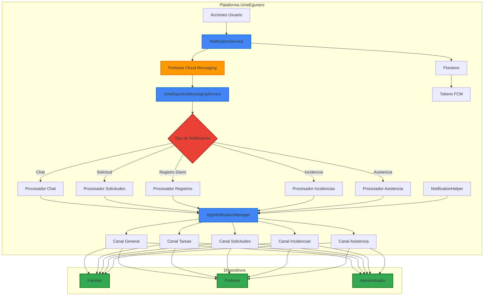
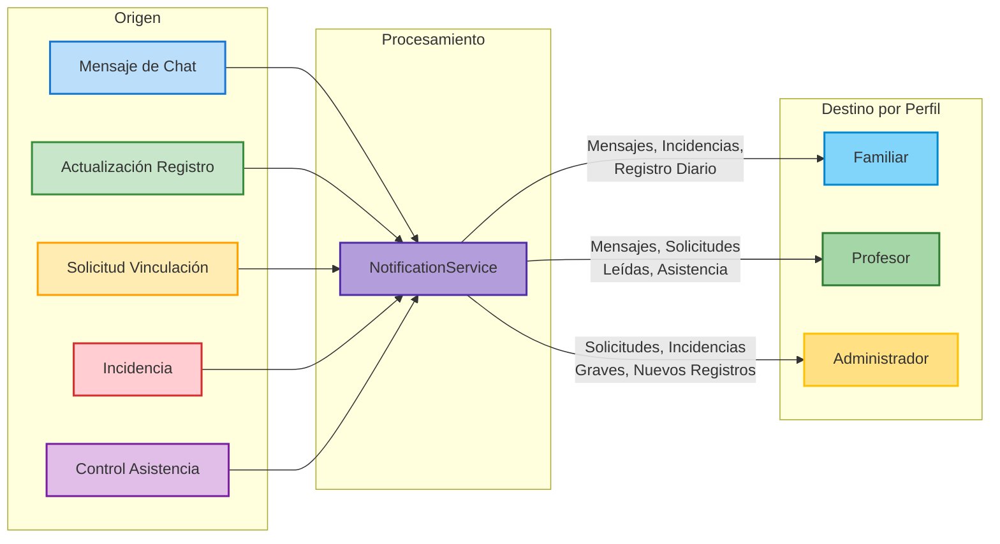

# Sistema de Notificaciones en UmeEgunero

## Visión General

El sistema de notificaciones de UmeEgunero proporciona un mecanismo centralizado, confiable y adaptado a cada perfil de usuario para mantener informados a todos los participantes del entorno educativo. Este sistema abarca desde notificaciones en tiempo real hasta comunicaciones programadas, y utiliza Firebase Cloud Messaging (FCM) como infraestructura principal.

<div align="center">

</div>

## Arquitectura del Sistema de Notificaciones

### Componentes Principales

1. **AppNotificationManager**: Clase singleton responsable de:
   - Crear y gestionar canales de notificación
   - Mostrar notificaciones en el dispositivo
   - Gestionar la interacción con las notificaciones
   - Registrar tokens FCM

2. **NotificationService**: Servicio centralizado que maneja:
   - Envío de notificaciones a diferentes tipos de destinatarios
   - Mantenimiento de tokens FCM
   - Gestión de preferencias de notificación
   - Procesamiento de eventos que generan notificaciones

3. **UmeEguneroMessagingService**: Servicio que extiende FirebaseMessagingService para:
   - Recibir mensajes de FCM
   - Procesar diferentes tipos de notificaciones
   - Actualizar la interfaz mediante broadcasts

4. **NotificationHelper**: Clase utilitaria que simplifica:
   - Comprobación de permisos
   - Apertura de ajustes del sistema
   - Métodos específicos para cada tipo de notificación

### Canales de Notificación

UmeEgunero implementa un sistema de canales que categoriza las notificaciones según su importancia y contenido:

| Canal | Importancia | Descripción | Usos |
|-------|-------------|-------------|------|
| General | Default | Notificaciones generales y chat | Mensajes, comunicados generales |
| Tareas | High | Registro diario y tareas | Actualizaciones de registro, tareas |
| Solicitudes | High | Solicitudes de vinculación | Peticiones nuevo alumno-familiar |
| Incidencias | Max | Alertas de alta prioridad | Incidencias urgentes, emergencias |
| Asistencia | High | Control de asistencia | Retrasos, ausencias, recogidas tempranas |
| Sincronización | Low | Procesos en segundo plano | Sincronización de datos |

## Flujo de Trabajo de las Notificaciones

El sistema sigue un flujo de trabajo bien definido:

1. **Registro de dispositivo**:
   - Cada dispositivo obtiene un token FCM único
   - El token se almacena en Firestore vinculado al usuario
   - Se permite múltiples dispositivos por usuario

2. **Origen de notificaciones**:
   - Acción de usuario (mensaje, incidencia)
   - Evento del sistema (actualización de datos)
   - Evento programado (recordatorio)

3. **Procesamiento**:
   - NotificationService determina destinatarios
   - Se construye el contenido personalizado
   - Se selecciona el canal apropiado

4. **Envío**:
   - Se recuperan tokens FCM de los destinatarios
   - Se envía mediante FCM o simulación local
   - Se gestionan errores y tokens inválidos

5. **Recepción**:
   - UmeEguneroMessagingService recibe el mensaje
   - Se procesa según el tipo de notificación
   - Se muestra utilizando AppNotificationManager

6. **Interacción**:
   - Notificaciones abren secciones específicas (deeplinks)
   - Se envían broadcasts para actualizar UI
   - Se registran interacciones para análisis

## Tipos de Notificaciones por Perfil de Usuario

<div align="center">

</div>

### Perfil: Administrador del Centro

#### Recibe Notificaciones de:
- **Solicitudes de Vinculación**: Cuando un familiar solicita vincularse a un alumno
- **Nuevos Registros**: Cuando se registra un nuevo profesor en el centro
- **Incidencias Graves**: Eventos importantes reportados por profesores
- **Información del Sistema**: Actualizaciones o mantenimiento de la plataforma

#### Ejemplo de Implementación:

```kotlin
fun enviarNotificacionSolicitud(centroId: String, solicitudId: String, titulo: String, mensaje: String) {
    // Buscar administradores del centro
    val adminSnapshot = firestore.collection("usuarios")
        .whereArrayContains("perfiles", mapOf(
            "tipo" to "ADMIN_CENTRO",
            "centroId" to centroId,
            "verificado" to true
        ))
        .get()
        .await()
    
    // Enviar notificación a cada administrador...
}
```

### Perfil: Profesor

#### Recibe Notificaciones de:
- **Mensajes de Familiares**: Comunicaciones directas sobre alumnos
- **Confirmaciones**: Cuando un familiar confirma lectura de un comunicado
- **Asignaciones**: Cuando se le asigna una nueva clase o alumno
- **Eventos del Centro**: Reuniones, formaciones, eventos importantes

#### Puede Enviar:
- **Actualizaciones de Registro Diario**: Comidas, siestas, actividades de alumnos
- **Comunicados a Familiares**: Información importante sobre alumnos
- **Incidencias**: Situaciones que requieren atención especial
- **Registros de Asistencia**: Información sobre ausencias o retrasos

#### Ejemplo de UI para Enviar Notificaciones:

La pantalla de "Nueva Incidencia" permite a los profesores:
- Seleccionar un alumno
- Escribir título y descripción de la incidencia
- Marcar si es urgente (genera notificación prioritaria)
- Enviar notificación a los familiares vinculados

### Perfil: Familiar

#### Recibe Notificaciones de:
- **Actualizaciones de Registro Diario**: Actividades, comidas, siestas de su hijo/a
- **Mensajes de Profesores**: Comunicaciones directas sobre el alumno
- **Incidencias**: Situaciones especiales reportadas por profesores
- **Estado de Solicitudes**: Aprobación/rechazo de vinculaciones con alumnos
- **Asistencia**: Información sobre ausencias, retrasos o recogidas tempranas

#### Puede Enviar:
- **Mensajes a Profesores**: Consultas o información sobre el alumno
- **Justificantes**: Documentación sobre ausencias o situaciones especiales

#### Gestión de Preferencias:

Los familiares pueden personalizar sus notificaciones desde la sección "Notificaciones" en su perfil:
- Activar/desactivar notificaciones por tipo
- Configurar horarios de recepción
- Silenciar temporalmente

## Implementación Técnica

### Permisos de Notificaciones

En Android 13 (API 33) y superiores, se requiere solicitar explícitamente el permiso `POST_NOTIFICATIONS`:

```kotlin
fun checkNotificationPermission(): Boolean {
    return if (Build.VERSION.SDK_INT >= Build.VERSION_CODES.TIRAMISU) {
        ContextCompat.checkSelfPermission(
            context,
            Manifest.permission.POST_NOTIFICATIONS
        ) == PackageManager.PERMISSION_GRANTED
    } else {
        true // En versiones anteriores, no se requiere permiso explícito
    }
}
```

### Registro de Tokens FCM

```kotlin
suspend fun registerDeviceToken(): String {
    return try {
        val token = FirebaseMessaging.getInstance().token.await()
        Timber.d("Token FCM obtenido: $token")
        token
    } catch (e: Exception) {
        Timber.e(e, "Error al obtener token FCM")
        ""
    }
}
```

### Envío de Notificaciones

El modelo utiliza una función centralizada que puede ser personalizada según el tipo:

```kotlin
private fun enviarMensajeDirectoFCM(
    token: String,
    titulo: String,
    mensaje: String,
    datos: Map<String, String>,
    channelId: String = AppNotificationManager.CHANNEL_ID_GENERAL
) {
    // Generar un ID único para la notificación
    val notificationId = Random.nextInt(1000000)
    
    // En desarrollo, simular con notificación local
    notificationManager.showNotification(
        titulo,
        mensaje,
        channelId,
        notificationId
    )
    
    // En producción: implementación HTTP para FCM
}
```

### Procesamiento de Notificaciones Recibidas

```kotlin
override fun onMessageReceived(remoteMessage: RemoteMessage) {
    // Determinar tipo y canal de notificación
    val channelId = when (remoteMessage.data["tipo"]) {
        "solicitud_vinculacion" -> AppNotificationManager.CHANNEL_ID_SOLICITUDES
        "chat" -> AppNotificationManager.CHANNEL_ID_GENERAL
        "registro_diario" -> AppNotificationManager.CHANNEL_ID_TAREAS
        "incidencia" -> if (remoteMessage.data["urgente"] == "true") {
            AppNotificationManager.CHANNEL_ID_INCIDENCIAS
        } else {
            AppNotificationManager.CHANNEL_ID_GENERAL
        }
        "asistencia" -> AppNotificationManager.CHANNEL_ID_ASISTENCIA
        else -> AppNotificationManager.CHANNEL_ID_GENERAL
    }
    
    // Procesar según tipo
    when (remoteMessage.data["tipo"]) {
        "chat" -> procesarNotificacionChat(remoteMessage.data)
        "registro_diario" -> procesarNotificacionRegistroDiario(remoteMessage.data)
        // etc...
    }
}
```

### Deeplinks para Navegación Directa

```kotlin
// Modificar el intent según el tipo de notificación
when (channelId) {
    AppNotificationManager.CHANNEL_ID_INCIDENCIAS -> {
        intent?.apply {
            action = Intent.ACTION_VIEW
            putExtra("openSection", "incidencias")
            putExtra("urgent", true)
            flags = Intent.FLAG_ACTIVITY_CLEAR_TOP or Intent.FLAG_ACTIVITY_SINGLE_TOP
        }
    }
    // Otros tipos...
}
```

## Estrategias de Optimización

1. **Limpieza de Tokens Inválidos**:
   ```kotlin
   if (e.message?.contains("registration-token-not-registered") == true) {
       firestore.collection("usuarios").document(userId)
           .update("fcmTokens.$tokenId", FieldValue.delete())
   }
   ```

2. **Agrupación de Notificaciones**:
   - Notificaciones del mismo tipo para un usuario se agrupan
   - Se evita sobrecarga de notificaciones similares

3. **Priorización Inteligente**:
   - Las incidencias urgentes tienen máxima prioridad (vibración, sonido)
   - Las notificaciones de sincronización tienen prioridad baja (silenciosas)

4. **Personalización Contextual**:
   - El contenido se adapta al perfil y preferencias del usuario
   - Se incluyen datos relevantes para facilitar la decisión de interactuar

## Monitorización y Análisis

El sistema incluye capacidades de monitorización:

1. **Registros de Envío**:
   - Se registra cada intento de envío de notificación
   - Se documenta el resultado (éxito/fracaso)

2. **Métricas de Interacción**:
   - Se registran aperturas e interacciones con notificaciones
   - Permite ajustar estrategias según patrones de uso

3. **Depuración**:
   - Sistema de log detallado con Timber
   - Información específica para cada etapa del proceso

## Consideraciones de Seguridad

1. **Tokenización**:
   - Cada dispositivo tiene un token único
   - Los tokens se almacenan de forma segura en Firestore

2. **Validación de Permisos**:
   - Solo usuarios autorizados pueden enviar ciertos tipos de notificaciones
   - Los profesores solo pueden notificar a familiares de sus alumnos

3. **Protección de Datos**:
   - Las notificaciones no incluyen información sensible directamente
   - Se utilizan referencias e identificadores en lugar de datos completos

## Conclusión

El sistema de notificaciones de UmeEgunero representa un componente crítico de la plataforma, permitiendo una comunicación eficiente entre todos los actores del entorno educativo. Su diseño modular, adaptado a cada perfil de usuario y optimizado para diferentes escenarios, proporciona una experiencia inmersiva y funcional que mejora significativamente la interacción entre el centro educativo y las familias.

---

## Anexo: Guía de Depuración de Notificaciones

Para desarrolladores que necesiten depurar el sistema de notificaciones:

1. **Verificar Registro FCM**:
   ```kotlin
   Log.d("NOTIFICACIONES", "Token: ${FirebaseMessaging.getInstance().token.await()}")
   ```

2. **Forzar Actualización de Token**:
   ```kotlin
   FirebaseMessaging.getInstance().deleteToken()
   ```

3. **Simular Notificaciones**:
   ```kotlin
   notificationHelper.enviarNotificacionIncidencia(
       alumnoId = "alumno123",
       profesorId = "profesor456",
       titulo = "Test Notificación",
       mensaje = "Esta es una notificación de prueba",
       urgente = true
   ) { success, message -> 
       Log.d("TEST_NOTIFICACION", "Resultado: $success - $message") 
   }
   ``` 