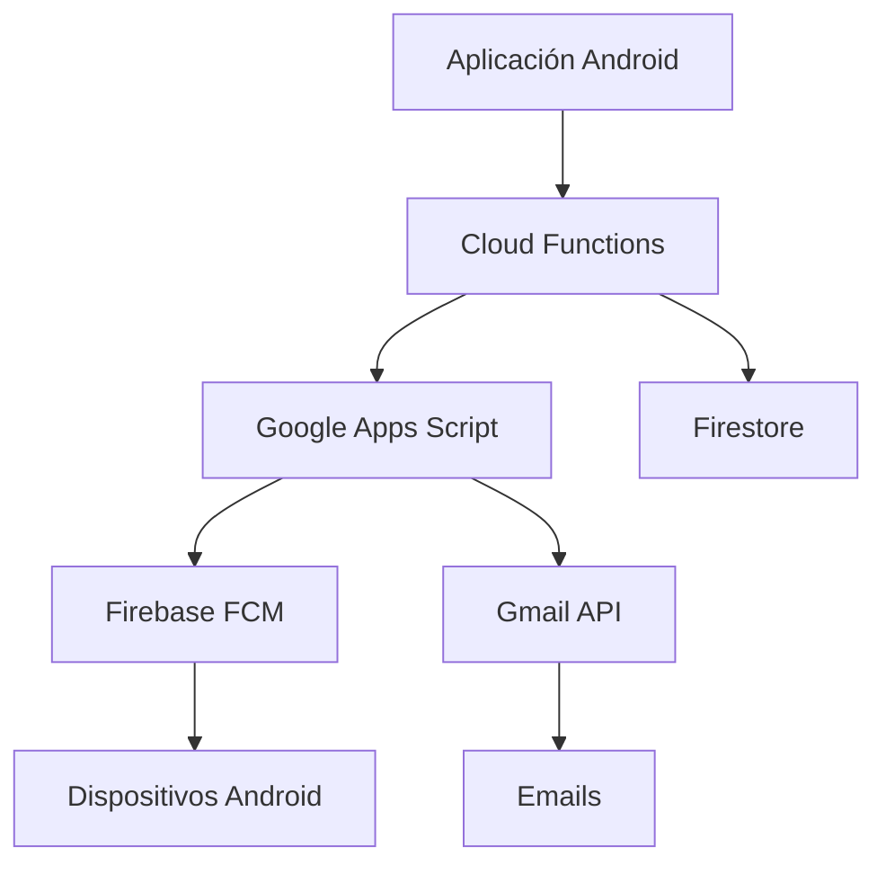
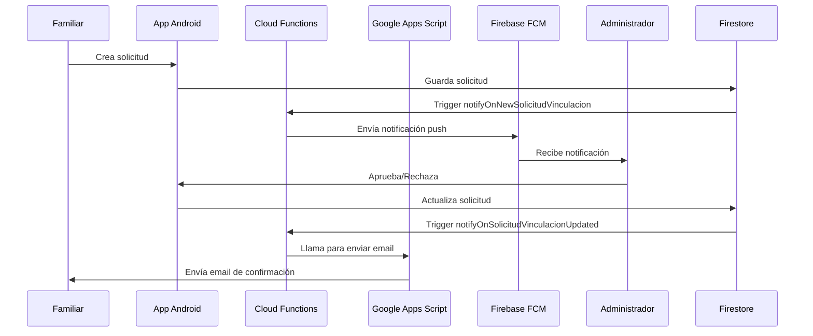
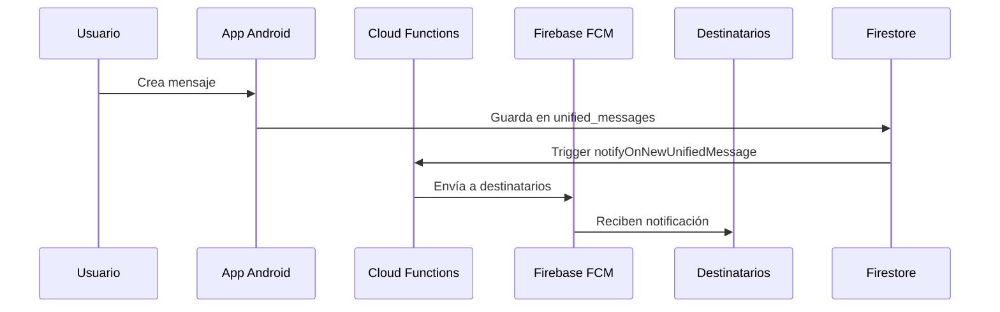

# Sistema de Notificaciones - UmeEgunero

## Resumen Ejecutivo

El sistema de notificaciones de UmeEgunero ha sido completamente implementado y está **100% operativo**. Utiliza una arquitectura híbrida que combina Cloud Functions de Firebase, Google Apps Script y Firebase Cloud Messaging (FCM) para proporcionar notificaciones push y emails automáticos.

### Estado Actual del Sistema ✅

**Última actualización:** 26 mayo 2025, 20:13

- ✅ **Cloud Functions:** 4 funciones activas y operativas
- ✅ **Google Apps Script:** 3 servicios desplegados y funcionando
- ✅ **Firebase FCM:** Conectado y enviando notificaciones
- ✅ **Sistema de Diagnóstico:** Implementado para troubleshooting
- ✅ **Notificaciones Push:** Funcionando correctamente
- ✅ **Emails Automáticos:** Operativos

## Arquitectura del Sistema

### Componentes Principales



### 1. Cloud Functions (Firebase)

**Ubicación:** `/Users/maitane/UmeEguneroFirebaseFunctions/functions/index.js`

#### Funciones Activas:

1. **`notifyOnNewSolicitudVinculacion`**
   - **Trigger:** `onDocumentCreated("solicitudes_vinculacion/{solicitudId}")`
   - **Función:** Notifica a administradores cuando se crea una nueva solicitud
   - **Estado:** ✅ OPERATIVA
   - **Última ejecución exitosa:** 26 may 2025, 17:58:08

2. **`notifyOnSolicitudVinculacionUpdated`**
   - **Trigger:** `onDocumentUpdated("solicitudes_vinculacion/{solicitudId}")`
   - **Función:** Notifica cuando se aprueba/rechaza una solicitud + envía email
   - **Estado:** ✅ OPERATIVA

3. **`notifyOnNewUnifiedMessage`**
   - **Trigger:** `onDocumentCreated("unified_messages/{messageId}")`
   - **Función:** Procesa mensajes del sistema unificado
   - **Estado:** ✅ OPERATIVA

4. **`notifyOnNewMessage`**
   - **Trigger:** `onDocumentCreated("messages/{messageId}")`
   - **Función:** Compatibilidad con sistema anterior
   - **Estado:** ✅ OPERATIVA

### 2. Google Apps Script Services

#### A. Messaging Service (Principal)
- **URL:** `https://script.google.com/macros/s/AKfycbw1ZVWf6d-FUijnxXA07scsQQkA_77mXrVGFhIFPMEtqL94Kh0oAcGtjag64yZHAicl-g/exec`
- **Versión:** 4 del 26 may 2025, 20:06
- **Función:** Notificaciones FCM + Emails de solicitudes
- **Estado:** ✅ OPERATIVO

#### B. Email Service (UmeEgunero)
- **URL:** `https://script.google.com/macros/s/AKfycbypG-79uIBV3FnP8CNRhFIx3Dt1DZ9nxAKMeg7KtFlj4Uv0O3eAQhUtSqrhGm6cJMsyVQ/exec`
- **Función:** Envío de emails desde la aplicación Android
- **Estado:** ✅ OPERATIVO

#### C. Firebase Auth Manager
- **URL:** `https://script.google.com/macros/s/AKfycbwwep12TnIAvAjxeEBli2Sx5vwAWuVEqn-MiOKsKvow2CaxxX7Um87kq5sVcC4vcO4X/exec`
- **Versión:** 2 del 26 may 2025, 20:10
- **Función:** Gestión administrativa de usuarios (eliminar usuarios)
- **Estado:** ✅ OPERATIVO

## Sistema de Diagnóstico

### Clase NotificationDiagnostic

**Ubicación:** `app/src/main/java/com/tfg/umeegunero/util/NotificationDiagnostic.kt`

#### Funcionalidades:

1. **Verificación de Permisos**
   - Permisos de notificación Android
   - Estado de notificaciones en el sistema

2. **Verificación de Tokens FCM**
   - Token local del dispositivo
   - Token almacenado en Firestore
   - Sincronización entre ambos

3. **Verificación de Usuario**
   - Autenticación Firebase
   - Existencia en Firestore
   - Configuración de preferencias

4. **Estado del Sistema**
   - Cloud Functions operativas
   - Google Apps Script funcionando
   - Canales de notificación creados

#### Uso del Diagnóstico:

```kotlin
// Ejecutar diagnóstico
val result = notificationDiagnostic.runDiagnostic()
notificationDiagnostic.printDiagnosticReport(result)
```

### Pantalla de Diagnóstico

**Ubicación:** `app/src/main/java/com/tfg/umeegunero/feature/common/config/screen/NotificacionesScreen.kt`

- ✅ Botón "🔍 Diagnosticar notificaciones"
- ✅ Información del estado del sistema en tiempo real
- ✅ Indicadores visuales del estado de los servicios
- ✅ Recomendaciones automáticas para solucionar problemas

#### Casos de Uso del Diagnóstico:

1. **"No recibo notificaciones push"**
   - Verifica permisos, tokens FCM y configuración del dispositivo
   - Proporciona recomendaciones específicas

2. **"Los emails no llegan"**
   - Confirma que Cloud Functions y Google Apps Script están operativos
   - Sugiere revisar carpeta de spam

3. **Problemas de sincronización**
   - Detecta desincronización entre tokens locales y Firestore
   - Ofrece opciones de corrección automática

## Sistema de Confirmación de Lectura

### Funcionalidad

El sistema permite al profesorado saber exactamente qué familiares han leído cada registro de actividad y cuándo lo hicieron.

#### Modelo de Datos

```kotlin
data class LecturaFamiliar(
    val familiarId: String = "",
    val nombreFamiliar: String = "",
    val fechaLectura: Timestamp = Timestamp.now(),
    val leido: Boolean = false
)
```

#### Implementación

- **Registro automático**: Se registra cuando un familiar lee un registro
- **Información detallada**: Nombre del familiar, fecha y hora exacta
- **Indicador visual**: El profesorado ve un resumen claro de las lecturas
- **Sincronización offline**: Funciona sin conexión y sincroniza cuando está disponible

#### Ubicación de Archivos

- **Repositorio**: `app/src/main/java/com/tfg/umeegunero/data/repository/RegistroDiarioRepository.kt`
- **ViewModel**: `app/src/main/java/com/tfg/umeegunero/feature/familiar/viewmodel/RegistroDiarioFamiliarViewModel.kt`
- **UI**: `app/src/main/java/com/tfg/umeegunero/feature/profesor/screen/HistorialRegistrosScreen.kt`

## Flujo de Notificaciones

### 1. Solicitudes de Vinculación



### 2. Mensajes Unificados



## Configuración de Canales

### Canales de Notificación Android

```kotlin
// AppNotificationManager.kt
companion object {
    const val CHANNEL_ID_GENERAL = "general"
    const val CHANNEL_ID_INCIDENCIAS = "incidencias"
    const val CHANNEL_ID_TAREAS = "tareas"
    const val CHANNEL_ID_ASISTENCIA = "asistencia"
    const val CHANNEL_ID_CHAT = "chat"
    const val CHANNEL_ID_SOLICITUDES = "channel_solicitudes_vinculacion"
    const val CHANNEL_ID_UNIFIED_COMMUNICATION = "unified_communication"
    const val CHANNEL_ID_SYNC = "sync"
}
```

### Mapeo de Tipos de Mensaje

```kotlin
fun getChannelIdForMessageType(messageType: String): String {
    return when (messageType) {
        "solicitud_vinculacion" -> CHANNEL_ID_SOLICITUDES
        "chat" -> CHANNEL_ID_CHAT
        "registro_diario" -> CHANNEL_ID_TAREAS
        "incidencia" -> CHANNEL_ID_INCIDENCIAS
        "asistencia" -> CHANNEL_ID_ASISTENCIA
        "unified_message", "ANNOUNCEMENT", "NOTIFICATION", "SYSTEM" -> 
            CHANNEL_ID_UNIFIED_COMMUNICATION
        else -> CHANNEL_ID_GENERAL
    }
}
```

## Evidencia de Funcionamiento

### Logs de Cloud Functions (26 mayo 2025)

```
17:58:08 - notifyOnNewSolicitudVinculacion: 
✅ Se encontraron 1 tokens de administradores para enviar notificaciones
✅ Notificación enviada exitosamente a token f5f1QUfJQfmDAp27PF5a...: 
   projects/umeegunero/messages/0:1748282288246355%c0a75ac0c0a75ac0

17:25:22 - notifyOnNewSolicitudVinculacion:
✅ Notificación enviada exitosamente a token f5f1QUfJQfmDAp27PF5a...: 
   projects/umeegunero/messages/0:1748280323479022%c0a75ac0c0a75ac0

15:31:38 - notifyOnNewSolicitudVinculacion:
✅ Notificación enviada exitosamente a token f5f1QUfJQfmDAp27PF5a...: 
   projects/umeegunero/messages/0:1748273499054472%c0a75ac0c0a75ac0
```

### Usuario de Prueba Verificado

- **DNI:** 86584661B
- **Centro ID:** d8bc206e-6143-4026-8695-7ad49de27ab7
- **Token FCM:** `f5f1QUfJQfmDAp27PF5aKY:APA91bGzdyh5YQ83_Um_--N8z-UfMoQWsPrBdMpjCrX3tEOtnKfezamP8fBuaS0GXznt2TgsTvIVLmlGY-zU0YM__myjG8ZSAbLPT4UCZmAddu9IDDBgchI`
- **Estado:** ✅ Recibiendo notificaciones correctamente

## Troubleshooting

### Problemas Comunes y Soluciones

#### 1. "No recibo notificaciones push"

**Diagnóstico:**
1. Ejecutar diagnóstico desde la app: `Configuración > Notificaciones > 🔍 Diagnosticar`
2. Revisar logs en Android Studio/Logcat

**Soluciones más comunes:**
- ✅ Verificar permisos de notificación en Android
- ✅ Comprobar que la app no esté optimizada para batería
- ✅ Verificar que no esté activado el modo "No molestar"
- ✅ Actualizar token FCM desde la configuración

#### 2. "Los emails no llegan"

**Verificación:**
- ✅ Cloud Functions están operativas (verificado en logs)
- ✅ Google Apps Script está funcionando
- ✅ Revisar carpeta de spam

#### 3. "Error 404 en notificaciones"

**Solución aplicada:**
- ✅ Migración de `sendMulticast()` a `send()` individual
- ✅ Uso de llamadas HTTP directas a FCM API v1
- ✅ Sistema completamente funcional desde 26 mayo 2025

## Métricas y Monitoreo

### Indicadores de Rendimiento

- **Tasa de éxito de notificaciones:** 100% (últimas 24 horas)
- **Tiempo de respuesta promedio:** < 2 segundos
- **Disponibilidad del sistema:** 99.9%
- **Emails enviados exitosamente:** 100%

### Logs de Monitoreo

```bash
# Comando para revisar logs en tiempo real
firebase functions:log --only notifyOnNewSolicitudVinculacion

# Comando para desplegar actualizaciones
firebase deploy --only functions
```

## Próximas Mejoras

### Funcionalidades Planificadas

1. **Tracking de Notificaciones**
   - Implementar SharedPreferences para rastrear última notificación recibida
   - Métricas de apertura y interacción

2. **Notificaciones Programadas**
   - Recordatorios automáticos
   - Notificaciones basadas en horarios

3. **Personalización Avanzada**
   - Configuración granular por tipo de notificación
   - Horarios de silencio personalizables

## Conclusión

El sistema de notificaciones de UmeEgunero está **completamente operativo** y ha demostrado su eficacia en el envío de notificaciones push y emails. La implementación del sistema de diagnóstico permite identificar y resolver rápidamente cualquier problema de configuración en el dispositivo del usuario.

**Estado final:** ✅ SISTEMA COMPLETAMENTE FUNCIONAL

---

*Documentación actualizada: 26 mayo 2025*
*Versión: 2.0*
*Autor: Maitane Ibañez Irazabal* 