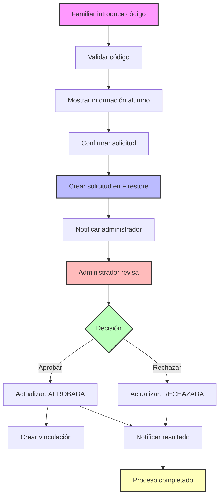
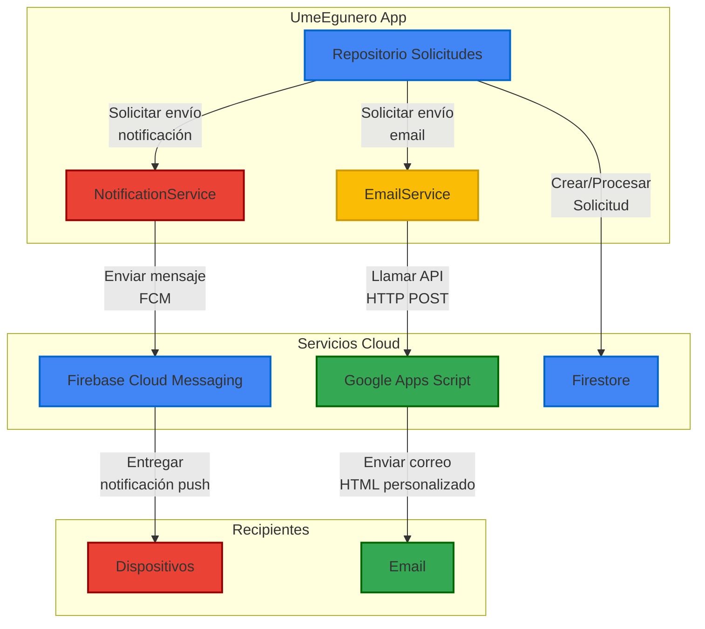
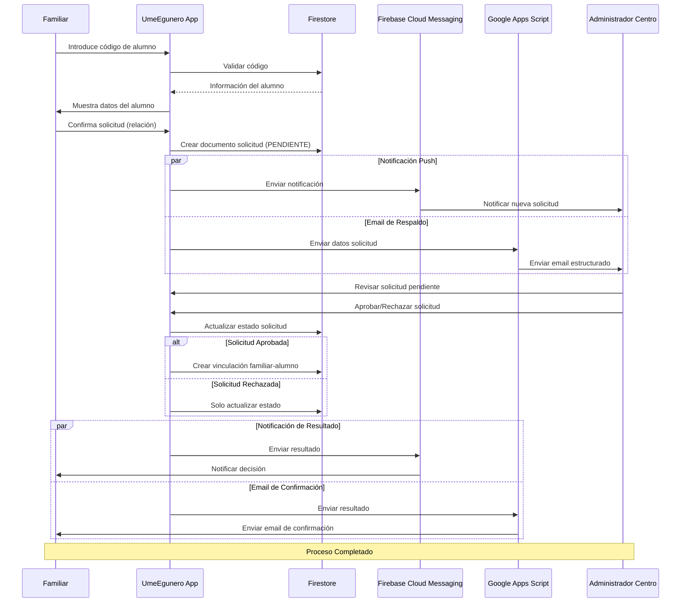

# Sistema de Solicitudes en UmeEgunero

## Visión General

El sistema de solicitudes de UmeEgunero es un componente fundamental que gestiona el proceso de vinculación entre familiares y alumnos. Esta funcionalidad es clave para garantizar la privacidad y seguridad de la información de los menores, implementando un flujo de aprobación controlado por los administradores del centro educativo.

<div align="center">

</div>

## Flujo de Solicitudes

### 1. Creación de la Solicitud

El proceso comienza cuando un familiar intenta vincularse a un alumno:

1. El familiar introduce el código único del alumno (proporcionado por el centro)
2. La aplicación valida el código y muestra la información básica del alumno
3. El familiar confirma la solicitud, indicando su relación con el alumno
4. El sistema crea un documento de solicitud en Firestore con estado "PENDIENTE"

### 2. Notificación al Administrador

Una vez creada la solicitud:

1. Se envía una notificación push a todos los administradores del centro
2. La solicitud aparece en el panel de administración del centro
3. Se envía un correo electrónico de respaldo al correo oficial del centro

### 3. Revisión y Respuesta

El administrador del centro tiene la capacidad de:

1. Ver todas las solicitudes pendientes
2. Acceder a la información detallada de cada solicitud
3. Aprobar o rechazar cada solicitud
4. Añadir comentarios o solicitar información adicional

### 4. Finalización del Proceso

Al procesar la solicitud:

1. Se actualiza el estado en Firestore ("APROBADA" o "RECHAZADA")
2. Se envía una notificación push al familiar solicitante
3. Se crea la vinculación en la base de datos (si fue aprobada)
4. Se envía un correo electrónico de confirmación

## Implementación Técnica

UmeEgunero utiliza dos métodos complementarios para gestionar el proceso de solicitudes, combinando las ventajas de Firebase Cloud Messaging (FCM) para notificaciones en tiempo real y Google Apps Script para comunicaciones asíncronas vía correo electrónico.

<div align="center">

</div>

### Método 1: Firebase Cloud Messaging (FCM)

FCM proporciona el canal principal para notificaciones en tiempo real dentro de la aplicación.

#### Componentes Clave:

1. **NotificationService**: Servicio centralizado que maneja el envío de notificaciones relacionadas con solicitudes:

```kotlin
fun enviarNotificacionSolicitud(centroId: String, solicitudId: String, titulo: String, mensaje: String) {
    serviceScope.launch {
        try {
            // Buscar administradores del centro
            val adminSnapshot = firestore.collection("usuarios")
                .whereArrayContains("perfiles", mapOf(
                    "tipo" to "ADMIN_CENTRO",
                    "centroId" to centroId,
                    "verificado" to true
                ))
                .get()
                .await()
                
            // Para cada admin, obtener tokens FCM y enviar notificación
            for (adminDoc in adminSnapshot.documents) {
                val fcmTokens = adminData["fcmTokens"] as? Map<String, String> ?: continue
                
                // Enviar la notificación a cada token del administrador
                for ((tokenId, token) in fcmTokens) {
                    enviarMensajeDirectoFCM(token, titulo, mensaje, mapOf(
                        "tipo" to "solicitud_vinculacion",
                        "solicitudId" to solicitudId,
                        "centroId" to centroId,
                        "click_action" to "SOLICITUD_PENDIENTE"
                    ))
                }
            }
        } catch (e: Exception) {
            Timber.e(e, "Error al enviar notificaciones a administradores")
        }
    }
}
```

2. **UmeEguneroMessagingService**: Gestiona la recepción y procesamiento de notificaciones FCM:

```kotlin
private fun procesarNotificacionSolicitud(data: Map<String, String>) {
    // Extraer datos relevantes
    val titulo = data["titulo"] ?: "Nueva solicitud"
    val mensaje = data["mensaje"] ?: "Hay una nueva solicitud pendiente"
    val solicitudId = data["solicitudId"] ?: ""
    
    // Mostrar notificación
    mostrarNotificacion(
        titulo, 
        mensaje, 
        AppNotificationManager.CHANNEL_ID_SOLICITUDES,
        solicitudId.hashCode()
    )
    
    // Enviar broadcast para actualizar UI si la app está abierta
    val action = if (data["click_action"] == "SOLICITUD_PENDIENTE") {
        ACTION_NUEVA_SOLICITUD
    } else {
        ACTION_SOLICITUD_PROCESADA
    }
    
    sendBroadcast(Intent(action).apply {
        putExtra("solicitudId", solicitudId)
        putExtra("centroId", data["centroId"])
        putExtra("estado", data["estado"])
    })
}
```

3. **SolicitudRepository**: Maneja la lógica de negocio y las operaciones de base de datos:

```kotlin
suspend fun crearSolicitudVinculacion(solicitud: SolicitudVinculacion): Result<String> {
    return try {
        // Crear documento en Firestore
        val solicitudRef = firestore.collection("solicitudes").document()
        val id = solicitudRef.id
        val solicitudWithId = solicitud.copy(id = id)
        
        solicitudRef.set(solicitudWithId).await()
        
        // Enviar notificación a administradores
        notificationService.enviarNotificacionSolicitud(
            centroId = solicitud.centroId,
            solicitudId = id,
            titulo = "Nueva solicitud de vinculación",
            mensaje = "El familiar ${solicitud.nombreFamiliar} solicita vincularse con ${solicitud.nombreAlumno}"
        )
        
        // Enviar correo electrónico mediante Apps Script
        emailService.enviarCorreoSolicitud(
            solicitudWithId,
            CentroRepository.obtenerEmailCentro(solicitud.centroId)
        )
        
        Result.Success(id)
    } catch (e: Exception) {
        Result.Error("Error al crear solicitud: ${e.message}")
    }
}
```

#### Ventajas del Método FCM:

- **Comunicación en tiempo real**: Notificaciones inmediatas en la aplicación
- **Alta fiabilidad**: Sistema respaldado por la infraestructura de Google
- **Interacción directa**: Permite abrir pantallas específicas al hacer tap
- **Seguimiento**: Facilita el seguimiento del estado de las solicitudes

### Método 2: Google Apps Script para Correos Electrónicos

Como complemento al sistema FCM, UmeEgunero utiliza Google Apps Script para enviar correos electrónicos estructurados, proporcionando un canal de comunicación alternativo.

#### Arquitectura:

1. **Servicio REST desplegado en Google Apps Script**:
```javascript
// Función principal que maneja las solicitudes POST
function doPost(e) {
  try {
    const payload = JSON.parse(e.postData.contents);
    const { action, data } = payload;
    
    let result;
    switch (action) {
      case 'solicitudVinculacion':
        result = enviarCorreoSolicitudVinculacion(data);
        break;
      case 'solicitudProcesada':
        result = enviarCorreoSolicitudProcesada(data);
        break;
      default:
        return ContentService.createTextOutput(
          JSON.stringify({ success: false, error: 'Acción desconocida' })
        ).setMimeType(ContentService.MimeType.JSON);
    }
    
    return ContentService.createTextOutput(
      JSON.stringify({ success: true, result })
    ).setMimeType(ContentService.MimeType.JSON);
    
  } catch (error) {
    return ContentService.createTextOutput(
      JSON.stringify({ success: false, error: error.toString() })
    ).setMimeType(ContentService.MimeType.JSON);
  }
}

// Función para enviar correo de solicitud de vinculación
function enviarCorreoSolicitudVinculacion(data) {
  const { centroEmail, centroNombre, familiarNombre, alumnoNombre, relacion, solicitudId } = data;
  
  const subject = `[${centroNombre}] Nueva solicitud de vinculación`;
  const htmlBody = HtmlService.createTemplateFromFile('solicitudTemplate').evaluate().getContent()
    .replace('{{centroNombre}}', centroNombre)
    .replace('{{familiarNombre}}', familiarNombre)
    .replace('{{alumnoNombre}}', alumnoNombre)
    .replace('{{relacion}}', relacion)
    .replace('{{solicitudId}}', solicitudId);
  
  GmailApp.sendEmail(centroEmail, subject, "", {
    htmlBody: htmlBody,
    name: "UmeEgunero - Notificaciones"
  });
  
  return { mensaje: `Correo enviado a ${centroEmail}` };
}
```

2. **Cliente HTTP en Kotlin**:
```kotlin
class EmailService @Inject constructor() {
    private val client = HttpClient(CIO) {
        install(ContentNegotiation) {
            json(Json {
                prettyPrint = true
                isLenient = true
            })
        }
        install(Logging) {
            logger = Logger.DEFAULT
            level = LogLevel.HEADERS
        }
    }
    
    suspend fun enviarCorreoSolicitud(solicitud: SolicitudVinculacion, emailCentro: String) {
        try {
            val response = client.post {
                url(APPS_SCRIPT_URL)
                contentType(ContentType.Application.Json)
                setBody(SolicitudEmailRequest(
                    action = "solicitudVinculacion",
                    data = SolicitudEmailData(
                        centroEmail = emailCentro,
                        centroNombre = solicitud.nombreCentro,
                        familiarNombre = solicitud.nombreFamiliar,
                        alumnoNombre = solicitud.nombreAlumno,
                        relacion = solicitud.relacion,
                        solicitudId = solicitud.id
                    )
                ))
            }
            
            val responseData = response.body<EmailResponse>()
            if (!responseData.success) {
                Timber.e("Error en Apps Script: ${responseData.error}")
            }
        } catch (e: Exception) {
            Timber.e(e, "Error al enviar correo de solicitud")
        }
    }
}
```

#### Ventajas del Método Google Apps Script:

- **Canal alternativo**: Proporciona respaldo cuando las notificaciones push fallan
- **Persistencia**: Los correos quedan registrados en la bandeja del centro
- **Formalidad**: Formato oficial para comunicaciones importantes
- **Personalización**: Plantillas HTML personalizadas con la identidad visual de la app
- **Independencia**: Funciona incluso si el usuario no tiene la app instalada

## Flujo Completo del Proceso

<div align="center">

</div>

### Creación de una Solicitud

1. **En la Aplicación Móvil**:
```kotlin
fun enviarSolicitudVinculacion() {
    viewModelScope.launch {
        try {
            _uiState.update { it.copy(isLoading = true) }
            
            val solicitud = SolicitudVinculacion(
                id = "",  // Se generará en el servidor
                familiarId = currentUserId,
                alumnoId = uiState.value.alumnoId,
                centroId = uiState.value.centroId,
                nombreFamiliar = uiState.value.nombreFamiliar,
                nombreAlumno = uiState.value.nombreAlumno,
                nombreCentro = uiState.value.nombreCentro,
                relacion = uiState.value.relacion,
                fechaSolicitud = Timestamp.now(),
                estado = "PENDIENTE",
                fechaProcesado = null,
                observaciones = ""
            )
            
            // Llamar al repositorio para crear la solicitud
            val result = solicitudRepository.crearSolicitudVinculacion(solicitud)
            
            // Actualizar el estado según el resultado
            when (result) {
                is Result.Success -> {
                    _uiState.update { 
                        it.copy(
                            isLoading = false,
                            isSuccess = true,
                            mensaje = "Solicitud enviada correctamente"
                        )
                    }
                }
                is Result.Error -> {
                    _uiState.update { 
                        it.copy(
                            isLoading = false,
                            error = result.message ?: "Error desconocido"
                        )
                    }
                }
            }
        } catch (e: Exception) {
            _uiState.update { 
                it.copy(
                    isLoading = false,
                    error = "Error al enviar solicitud: ${e.message}"
                )
            }
        }
    }
}
```

2. **En Firestore**: 
   - Se crea un documento en la colección "solicitudes"
   - Se registra con estado "PENDIENTE"
   - Se incluyen todos los metadatos relevantes

3. **Notificación a Administradores**:
   - FCM envía notificación push a todos los administradores del centro
   - Google Apps Script envía un correo electrónico al centro

### Procesamiento de Solicitudes

1. **Panel de Administración**:
```kotlin
fun procesarSolicitud(solicitudId: String, aprobar: Boolean, observaciones: String) {
    viewModelScope.launch {
        try {
            _uiState.update { it.copy(isLoading = true) }
            
            // Llamar al repositorio para procesar la solicitud
            val result = solicitudRepository.procesarSolicitudVinculacion(
                solicitudId = solicitudId,
                aprobada = aprobar,
                observaciones = observaciones,
                adminId = currentUserId
            )
            
            // Actualizar estado según el resultado
            when (result) {
                is Result.Success -> {
                    _uiState.update { 
                        it.copy(
                            isLoading = false,
                            solicitudProcesada = true,
                            mensaje = if (aprobar) "Solicitud aprobada" else "Solicitud rechazada"
                        )
                    }
                }
                is Result.Error -> {
                    _uiState.update { 
                        it.copy(
                            isLoading = false,
                            error = result.message ?: "Error desconocido"
                        )
                    }
                }
            }
        } catch (e: Exception) {
            _uiState.update { 
                it.copy(
                    isLoading = false,
                    error = "Error al procesar solicitud: ${e.message}"
                )
            }
        }
    }
}
```

2. **En el Repositorio**:
```kotlin
suspend fun procesarSolicitudVinculacion(
    solicitudId: String, 
    aprobada: Boolean, 
    observaciones: String,
    adminId: String
): Result<Boolean> {
    return try {
        // Obtener la solicitud actual
        val solicitudDoc = firestore.collection("solicitudes")
            .document(solicitudId)
            .get()
            .await()
            
        val solicitud = solicitudDoc.toObject(SolicitudVinculacion::class.java)
            ?: return Result.Error("Solicitud no encontrada")
        
        // Actualizar el estado de la solicitud
        firestore.collection("solicitudes")
            .document(solicitudId)
            .update(
                mapOf(
                    "estado" to if (aprobada) "APROBADA" else "RECHAZADA",
                    "fechaProcesado" to FieldValue.serverTimestamp(),
                    "observaciones" to observaciones,
                    "procesadaPor" to adminId
                )
            )
            .await()
        
        // Si es aprobada, crear vinculación entre familiar y alumno
        if (aprobada) {
            firestore.collection("vinculaciones")
                .add(
                    mapOf(
                        "familiarId" to solicitud.familiarId,
                        "alumnoId" to solicitud.alumnoId,
                        "relacion" to solicitud.relacion,
                        "fechaCreacion" to FieldValue.serverTimestamp(),
                        "estado" to "ACTIVA"
                    )
                )
                .await()
                
            // Actualizar lista de familiares del alumno
            firestore.collection("alumnos")
                .document(solicitud.alumnoId)
                .update(
                    "familiaresIds", 
                    FieldValue.arrayUnion(solicitud.familiarId)
                )
                .await()
        }
        
        // Enviar notificación al familiar
        notificationService.enviarNotificacionFamiliar(
            familiarId = solicitud.familiarId,
            solicitudId = solicitudId,
            estado = if (aprobada) "APROBADA" else "RECHAZADA",
            titulo = "Respuesta a su solicitud de vinculación",
            mensaje = if (aprobada) 
                "Su solicitud para vincularse con ${solicitud.nombreAlumno} ha sido aprobada." 
            else 
                "Su solicitud para vincularse con ${solicitud.nombreAlumno} ha sido rechazada."
        )
        
        // Enviar correo de confirmación
        emailService.enviarCorreoResultadoSolicitud(
            solicitud = solicitud,
            aprobada = aprobada,
            observaciones = observaciones
        )
        
        Result.Success(true)
    } catch (e: Exception) {
        Result.Error("Error al procesar solicitud: ${e.message}")
    }
}
```

## Seguridad y Consideraciones

### Validaciones y Seguridad

1. **Verificación de Código de Alumno**:
   - Los códigos son generados por el centro y únicos para cada alumno
   - Incluyen mecanismos para evitar adivinación (alfanuméricos, longitud adecuada)

2. **Prevención de Duplicados**:
   - El sistema verifica si ya existe una solicitud pendiente o aprobada para la misma combinación familiar-alumno
   - Se previene la creación de múltiples solicitudes activas

3. **Reglas de Seguridad en Firestore**:
```javascript
// Reglas para la colección 'solicitudes'
match /solicitudes/{solicitudId} {
  // Solo el creador y los administradores del centro pueden leer
  allow read: if request.auth.uid == resource.data.familiarId ||
               isAdminOfCentro(resource.data.centroId);
  
  // Cualquier usuario autenticado puede crear
  allow create: if request.auth != null &&
                request.resource.data.familiarId == request.auth.uid &&
                request.resource.data.estado == "PENDIENTE";
  
  // Solo administradores del centro pueden actualizar
  allow update: if isAdminOfCentro(resource.data.centroId);
}

// Función auxiliar para verificar si un usuario es administrador de un centro
function isAdminOfCentro(centroId) {
  let userDoc = get(/databases/$(database)/documents/usuarios/$(request.auth.uid)).data;
  return userDoc != null && 
         ("perfiles" in userDoc) && 
         userDoc.perfiles.hasAny([{
           tipo: "ADMIN_CENTRO", 
           centroId: centroId, 
           verificado: true
         }]);
}
```

### Monitorización y Estadísticas

El sistema incluye capacidades para:

1. **Dashboard de Administración**:
   - Visualización de solicitudes pendientes y procesadas
   - Estadísticas de tiempo de respuesta
   - Métricas de solicitudes por centro/aula

2. **Registro de Auditoría**:
   - Cada solicitud mantiene un historial completo de cambios
   - Se registra quién procesó cada solicitud

## Conclusión

El sistema de solicitudes de UmeEgunero representa un ejemplo claro de arquitectura híbrida que combina las fortalezas de diferentes tecnologías:

1. **Firebase y FCM** proporcionan una infraestructura robusta para la gestión de datos y notificaciones en tiempo real, facilitando una experiencia fluida dentro de la aplicación.

2. **Google Apps Script** ofrece un complemento flexible para comunicaciones formales a través de correo electrónico, asegurando que ninguna solicitud se pierda y proporcionando un canal de respaldo oficial.

Esta combinación de tecnologías garantiza un proceso de vinculación seguro, trazable y eficiente, manteniendo en todo momento la privacidad y seguridad de la información de los alumnos, un aspecto crítico en aplicaciones educativas que manejan datos de menores. 