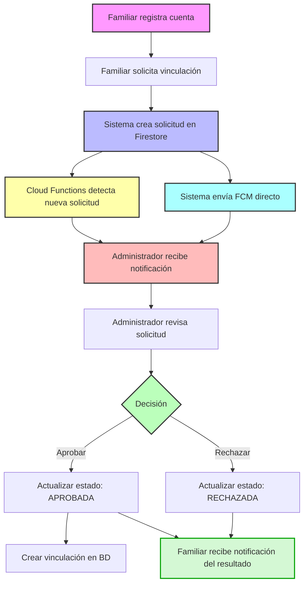

# Sistema de Vinculación Familiar en UmeEgunero

## Visión General del Sistema

El Sistema de Vinculación Familiar de UmeEgunero representa uno de los componentes críticos de la aplicación, permitiendo establecer relaciones seguras entre familiares y alumnos. Este proceso ha sido diseñado con múltiples capas de seguridad para proteger la privacidad de los menores, implementando un flujo de aprobación controlado por los administradores del centro educativo.



## Arquitectura del Sistema

El sistema utiliza una arquitectura multicapa que integra diversas tecnologías:

1. **Capa de Aplicación**: Interfaz de usuario y lógica de negocio en Kotlin/Jetpack Compose
2. **Capa de Datos**: Firestore como base de datos principal
3. **Capa de Notificaciones**: Firebase Cloud Messaging (FCM) para notificaciones push
4. **Capa de Procesamiento en Nube**: Google Cloud Functions y Google Apps Script (GAS)
5. **Capa de Comunicación**: Sistema unificado de mensajería interna

### Componentes Principales

- **SolicitudRepository**: Repositorio central que gestiona operaciones CRUD para solicitudes
- **NotificationService**: Servicio que maneja el envío de notificaciones push
- **EmailNotificationService**: Servicio para envío de correos electrónicos mediante GAS
- **Cloud Functions**: Funciones serverless que detectan cambios en Firestore y procesan eventos
- **GAS**: Scripts de Google Apps Script para procesamiento adicional y envío de emails

## Flujo Detallado del Proceso

### 1. Registro y Creación de Solicitud

El familiar, tras crear su cuenta, inicia el proceso de vinculación:

```kotlin
// En FamiliarDashboardViewModel.kt
fun crearSolicitudVinculacion(alumnoDni: String, centroId: String) {
    viewModelScope.launch {
        try {
            // Crear objeto de solicitud
            val solicitud = SolicitudVinculacion(
                id = "", // Se generará automáticamente
                familiarId = familiarId,
                alumnoDni = alumnoDni.uppercase(),
                centroId = centroId,
                fechaSolicitud = Timestamp.now(),
                estado = EstadoSolicitud.PENDIENTE
            )
            
            // Enviar solicitud
            when (val result = solicitudRepository.crearSolicitudVinculacion(solicitud)) {
                is Result.Success -> {
                    // Actualizar UI
                }
                is Result.Error -> {
                    // Manejar error
                }
            }
        } catch (e: Exception) {
            // Manejar excepción
        }
    }
}
```

### 2. Procesamiento de la Solicitud en el Repositorio

El `SolicitudRepository` crea la solicitud en Firestore y desencadena notificaciones:

```kotlin
suspend fun crearSolicitudVinculacion(solicitud: SolicitudVinculacion): Result<SolicitudVinculacion> {
    return try {
        val docRef = firestore.collection(COLLECTION_SOLICITUDES).document()
        val solicitudConId = solicitud.copy(id = docRef.id)
        
        docRef.set(solicitudConId).await()
        
        // Enviar notificación a los administradores del centro
        enviarNotificacionSolicitudPendiente(solicitudConId)
        
        // Crear mensaje en el sistema unificado para los administradores
        crearMensajeSolicitudPendiente(solicitudConId)
        
        Result.Success(solicitudConId)
    } catch (e: Exception) {
        Result.Error(e)
    }
}
```

### 3. Envío de Notificaciones a Administradores

La aplicación utiliza dos métodos complementarios para notificar a los administradores:

#### 3.1. Notificación Directa vía FCM

```kotlin
suspend fun enviarNotificacionSolicitudPendiente(solicitud: SolicitudVinculacion) {
    try {
        // Preparar datos para la notificación
        val titulo = "Nueva solicitud de vinculación"
        val mensaje = "El familiar ${solicitud.nombreFamiliar} ha solicitado vincularse con ${solicitud.alumnoNombre}"
        
        // Usar el servicio de notificaciones local
        notificationService.enviarNotificacionSolicitud(
            centroId = solicitud.centroId,
            solicitudId = solicitud.id,
            titulo = titulo,
            mensaje = mensaje,
            onCompletion = { exito, mensajeResultado ->
                Timber.d("Resultado envío notificación: $exito - $mensajeResultado")
            }
        )
    } catch (e: Exception) {
        Timber.e(e, "Error al enviar notificación de solicitud pendiente")
    }
}
```

#### 3.2. Procesamiento mediante Cloud Functions

El sistema también utiliza Cloud Functions que se activan automáticamente cuando se crea un nuevo documento en Firestore:

```javascript
// Cloud Function que se activa al crear un nuevo documento en la colección "unified_messages"
exports.notifyOnNewUnifiedMessage = onDocumentCreated("unified_messages/{messageId}", async (event) => {
  const snap = event.data;
  if (!snap) {
    console.log("No data associated with the event");
    return;
  }
  const newMessage = snap.data();
  
  // Procesar tipo de mensaje (solicitud de vinculación)
  if (newMessage.relatedEntityType === "SOLICITUD_VINCULACION") {
    // Lógica específica para notificaciones de solicitudes
    // Recuperar tokens FCM y enviar notificaciones push
  }
  
  // Obtener tokens FCM de los destinatarios
  const usersSnapshot = await admin.firestore().collection("usuarios")
    .where(admin.firestore.FieldPath.documentId(), "in", recipientsIds)
    .get();
  
  // Enviar notificaciones a todos los tokens
  // Configurar prioridad según tipo de mensaje (alta para solicitudes)
});
```

### 4. Procesamiento por Administradores

Los administradores reciben la notificación y pueden procesar la solicitud desde la interfaz de administración:

```kotlin
fun procesarSolicitud(solicitudId: String, aprobar: Boolean, observaciones: String = "") {
    viewModelScope.launch {
        try {
            val resultado = solicitudRepository.procesarSolicitud(
                solicitudId = solicitudId,
                nuevoEstado = if (aprobar) EstadoSolicitud.APROBADA else EstadoSolicitud.RECHAZADA,
                observaciones = observaciones,
                adminId = _uiState.value.administrador?.id ?: "",
                nombreAdmin = "${_uiState.value.administrador?.nombre} ${_uiState.value.administrador?.apellidos}".trim()
            )
            
            when (resultado) {
                is Result.Success -> {
                    // Actualizar UI para mostrar éxito
                }
                is Result.Error -> {
                    // Manejar error
                }
            }
        } catch (e: Exception) {
            // Manejar excepción
        }
    }
}
```

### 5. Notificación al Familiar sobre Resultado

Cuando el administrador procesa la solicitud, se envía una notificación al familiar:

```kotlin
suspend fun enviarNotificacionSolicitudProcesada(solicitud: SolicitudVinculacion) {
    try {
        val alumnoNombre = /* ... */
        
        val estado = solicitud.estado
        val titulo = when (estado) {
            EstadoSolicitud.APROBADA -> "Solicitud aprobada"
            EstadoSolicitud.RECHAZADA -> "Solicitud rechazada"
            else -> "Actualización de solicitud"
        }
        
        val mensaje = when (estado) {
            EstadoSolicitud.APROBADA -> "Tu solicitud para vincularte con $alumnoNombre ha sido aprobada"
            EstadoSolicitud.RECHAZADA -> "Tu solicitud para vincularte con $alumnoNombre ha sido rechazada"
            else -> "El estado de tu solicitud para vincularte con $alumnoNombre ha cambiado a $estado"
        }
        
        // Enviar notificación al familiar
        notificationService.enviarNotificacionFamiliar(
            familiarId = solicitud.familiarId,
            solicitudId = solicitud.id,
            estado = estado.name,
            titulo = titulo,
            mensaje = mensaje,
            onCompletion = { exito, mensajeResultado ->
                Timber.d("Resultado envío notificación: $exito - $mensajeResultado")
            }
        )
    } catch (e: Exception) {
        Timber.e(e, "Error al enviar notificación de solicitud procesada")
    }
}
```

### 6. Creación de Vinculación (si es aprobada)

Si la solicitud es aprobada, se crea la vinculación en la base de datos:

```kotlin
private suspend fun vincularFamiliarSiAprobado(solicitud: SolicitudVinculacion) {
    try {
        if (solicitud.estado == EstadoSolicitud.APROBADA) {
            // Realizar la vinculación utilizando el FamiliarRepository
            val resultado = familiarRepository.vincularFamiliarAlumno(
                familiarId = solicitud.familiarId,
                alumnoId = solicitud.alumnoDni, // Usar alumnoDni como ID del alumno
                parentesco = solicitud.tipoRelacion
            )
            
            when (resultado) {
                is Result.Success -> {
                    Timber.d("✅ Vinculación exitosa entre familiar y alumno")
                }
                is Result.Error -> {
                    Timber.e(resultado.exception, "❌ Error al vincular familiar con alumno")
                }
            }
        }
    } catch (e: Exception) {
        Timber.e(e, "Error al vincular familiar: ${e.message}")
    }
}
```

## Integración con GAS para Notificaciones por Email

Además de las notificaciones push, el sistema utiliza Google Apps Script para enviar emails en momentos clave:

```kotlin
suspend fun enviarEmailSolicitudProcesada(
    destinatario: String,
    nombre: String,
    esAprobacion: Boolean,
    nombreAlumno: String,
    observaciones: String = "",
    contenidoHtml: String? = null
): Boolean {
    val tipoPlantilla = if (esAprobacion) TipoPlantilla.APROBACION else TipoPlantilla.RECHAZO
    val accion = if (esAprobacion) "Aprobada" else "Rechazada"
    val asunto = "Solicitud $accion en UmeEgunero - Vinculación con $nombreAlumno"
    
    return sendEmail(
        destinatario = destinatario,
        nombre = nombre,
        tipoPlantilla = tipoPlantilla,
        asuntoPersonalizado = asunto,
        contenido = contenidoHtml
    )
}
```

## Estructura de la Base de Datos

El sistema utiliza las siguientes colecciones en Firestore:

1. **solicitudes_vinculacion**: Almacena las solicitudes de vinculación
2. **vinculaciones**: Guarda las relaciones establecidas entre familiares y alumnos
3. **usuarios**: Contiene información de todos los usuarios, incluyendo tokens FCM
4. **alumnos**: Información de los alumnos, incluidos IDs de familiares vinculados
5. **unified_messages**: Sistema de mensajes unificado que incluye notificaciones de solicitudes

## Aspectos de Seguridad

1. **Validación de Autorización**: Solo administradores del centro pueden aprobar solicitudes
2. **Verificación de Identidad**: Proceso de verificación para confirmar la identidad del familiar
3. **Auditoría**: Registro completo de todas las acciones (quién, cuándo, resultado)
4. **Protección de Datos**: Información sensible cifrada en tránsito y reposo
5. **Gestión de Tokens**: Limpieza automática de tokens FCM inválidos

## Optimizaciones y Consideraciones

1. **Rendimiento**:
   - Indexación optimizada para consultas frecuentes
   - Carga bajo demanda para listas de solicitudes grandes

2. **Experiencia de Usuario**:
   - Notificaciones en tiempo real mediante FCM
   - Interfaz intuitiva para facilitar el proceso

3. **Robustez**:
   - Manejo de errores en cada capa
   - Reintentos automáticos para operaciones fallidas

4. **Escalabilidad**:
   - Diseño que permite gestionar múltiples centros educativos
   - Arquitectura preparada para alto volumen de solicitudes

## Conclusión

El Sistema de Vinculación Familiar representa un componente esencial de UmeEgunero, combinando seguridad, usabilidad y rendimiento. La implementación multicapa con Firebase, Cloud Functions y Google Apps Script proporciona un sistema robusto y escalable que satisface los requisitos de privacidad y seguridad necesarios en entornos educativos.

La integración con el sistema de notificaciones garantiza que todas las partes interesadas sean informadas oportunamente sobre el estado de las solicitudes, mientras que el proceso de aprobación por administradores del centro añade una capa adicional de seguridad para proteger la información de los alumnos.

---

*Documentación preparada por:* Maitane Ibañez Irazabal  
*Fecha:* Mayo 2024  
*Versión:* 1.0 