# Estrategias de Testing en Android - UmeEgunero

## Índice
1. [Introducción](#introducción)
2. [Tipos de Pruebas Implementadas](#tipos-de-pruebas-implementadas)
   1. [Pruebas Unitarias](#pruebas-unitarias)
   2. [Pruebas de Integración](#pruebas-de-integración)
   3. [Pruebas de UI](#pruebas-de-ui)
   4. [Pruebas de Rendimiento](#pruebas-de-rendimiento)
3. [Estructura del Testing](#estructura-del-testing)
4. [Herramientas Utilizadas](#herramientas-utilizadas)
5. [Patrones y Buenas Prácticas](#patrones-y-buenas-prácticas)
6. [Cobertura de Código](#cobertura-de-código)
7. [Automatización de Pruebas](#automatización-de-pruebas)
8. [Estrategias para Probar Firebase](#estrategias-para-probar-firebase)
9. [Conclusiones](#conclusiones)

## Introducción

El testing es una parte fundamental del ciclo de desarrollo de software que garantiza la calidad y fiabilidad de la aplicación. En el contexto de UmeEgunero, una aplicación Android para la gestión educativa, se ha implementado una estrategia de pruebas completa que abarca diferentes niveles y aspectos del sistema.

Este documento describe la estrategia de testing aplicada en el desarrollo de UmeEgunero, detallando los tipos de pruebas implementados, las herramientas utilizadas, los patrones seguidos y las mejores prácticas aplicadas.

### Visión General de la Estrategia de Testing

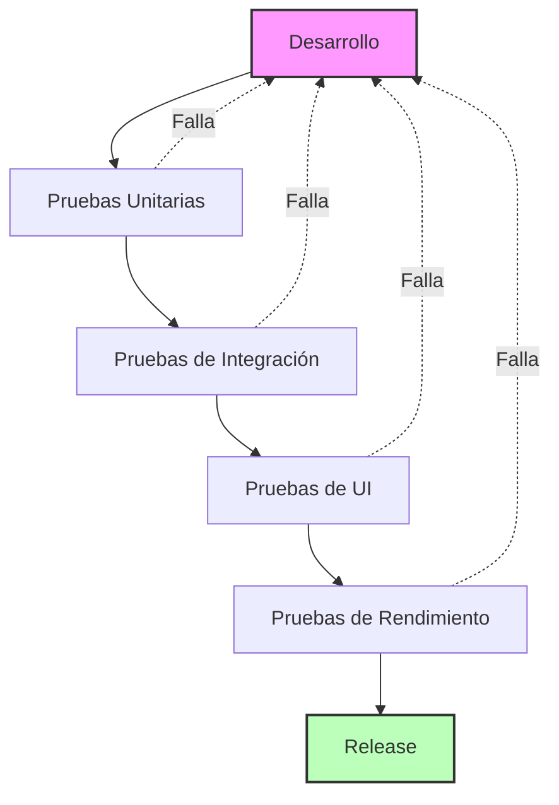

## Tipos de Pruebas Implementadas

### Pruebas Unitarias

Las pruebas unitarias verifican el correcto funcionamiento de componentes individuales de la aplicación en aislamiento. En UmeEgunero, estas pruebas se enfocan principalmente en la lógica de negocio, repositorios y ViewModels.

**Ubicación:** `/app/src/test/`

**Ejemplos implementados:**

- **Pruebas de Repositorios**: Verifican las operaciones CRUD con la base de datos Firebase.
  - `CursoRepositoryTest.kt`: Prueba las operaciones relacionadas con cursos académicos.
  - `AuthRepositoryTest.kt`: Prueba las operaciones de autenticación.

- **Pruebas de ViewModels**: Verifican la lógica de presentación y transformación de datos.
  - `LoginViewModelTest.kt`: Prueba la lógica de autenticación y validación.
  - `AddUserViewModelTest.kt`: Prueba la lógica de creación de usuarios.

**Ejemplo de código:**
```kotlin
@Test
fun `obtenerCursosPorCentro retorna lista de cursos cuando hay datos`() = runTest {
    // Given: Un centro con cursos
    val centroId = "centro123"
    val cursos = listOf(
        Curso(id = "curso1", nombre = "1º Infantil", centroId = centroId),
        Curso(id = "curso2", nombre = "2º Infantil", centroId = centroId)
    )
    
    // Configurar el comportamiento de los mocks
    every { cursosCollection.whereEqualTo("centroId", centroId) } returns query
    every { query.get().await() } returns querySnapshot
    every { querySnapshot.documents } returns cursos.map { ... }
    
    // When: Obtenemos los cursos del centro
    val result = cursoRepository.obtenerCursosPorCentro(centroId)
    
    // Then: Verificamos resultados y comportamiento
    assertTrue(result is Result.Success)
    assertEquals(2, (result as Result.Success).data.size)
    assertEquals("1º Infantil", result.data[0].nombre)
}
```

### Modelo de Pruebas Unitarias

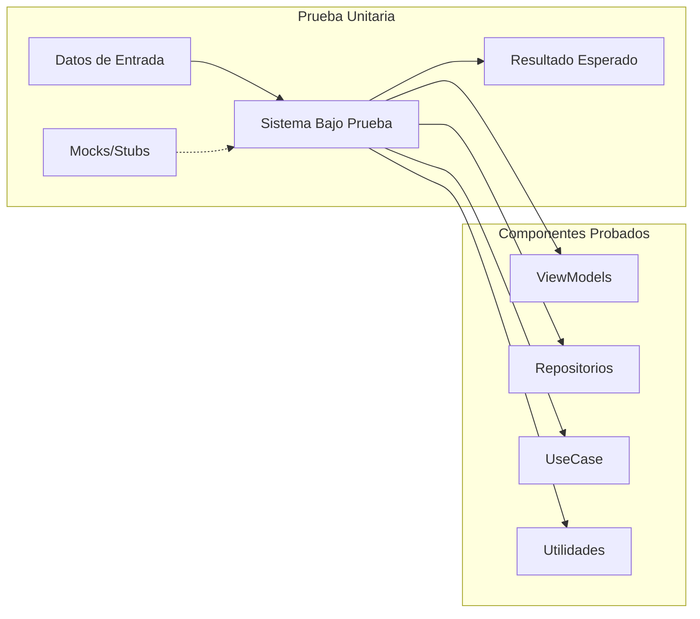

### Pruebas de Integración

Las pruebas de integración verifican la interacción entre diferentes componentes del sistema, asegurando que funcionan correctamente juntos.

**Ubicación:** `/app/src/androidTest/`

**Ejemplos implementados:**

- **Pruebas de Flujos Completos**: Verifican flujos de usuario completos a través de múltiples pantallas.
  - `CreacionUsuarioTest.kt`: Prueba el proceso completo de crear un nuevo usuario.
  - `CreacionCentroTest.kt`: Prueba el proceso de crear un nuevo centro educativo.

- **Pruebas de Navegación**: Verifican que la navegación entre pantallas funciona correctamente.
  - `NavegacionTest.kt`: Prueba las transiciones entre diferentes pantallas de la aplicación.

**Ejemplo de código:**
```kotlin
@Test
fun testCrearUsuarioProfesor() {
    // Navegar al panel de administración
    composeTestRule.waitUntil(5000) {
        composeTestRule.onAllNodesWithText("Gestión de Usuarios").fetchSemanticsNodes().isNotEmpty()
    }
    composeTestRule.onNodeWithText("Gestión de Usuarios").performClick()

    // Rellenar el formulario con datos válidos
    val dni = generarDNIAleatorio()
    composeTestRule.onNodeWithTag("campo_dni").performTextInput(dni)
    // ...más interacciones...
    
    // Guardar y verificar resultados
    composeTestRule.onNodeWithText("Guardar").performClick()
    composeTestRule.onNodeWithText(nombre).assertIsDisplayed()
}
```

### Modelo de Pruebas de Integración

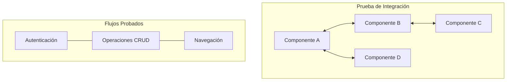

### Pruebas de UI

Las pruebas de UI verifican que la interfaz de usuario se muestra correctamente y responde adecuadamente a las interacciones del usuario.

**Ubicación:** `/app/src/androidTest/`

**Ejemplos implementados:**

- **Pruebas de Componentes UI**: Verifican componentes individuales de la interfaz.
  - `LoginScreenTest.kt`: Prueba la pantalla de inicio de sesión.

- **Pruebas de Validación de Campos**: Verifican la correcta validación de entradas del usuario.
  - `AddUserScreenTest.kt`: Prueba la validación de formularios.

**Ejemplo de código:**
```kotlin
@Test
fun loginScreen_invalidEmail_showsError() {
    // Given: La pantalla de login
    composeTestRule.setContent {
        LoginScreen(onLoginSuccess = {}, ...)
    }

    // When: Introducimos un email inválido
    composeTestRule.onNodeWithTag("email_field").performTextInput("invalid-email")
    composeTestRule.onNodeWithTag("password_field").performClick()

    // Then: Debería mostrarse un mensaje de error
    composeTestRule.onNodeWithText("Email no válido").assertIsDisplayed()
}
```

### Modelo de Pruebas de UI con Compose

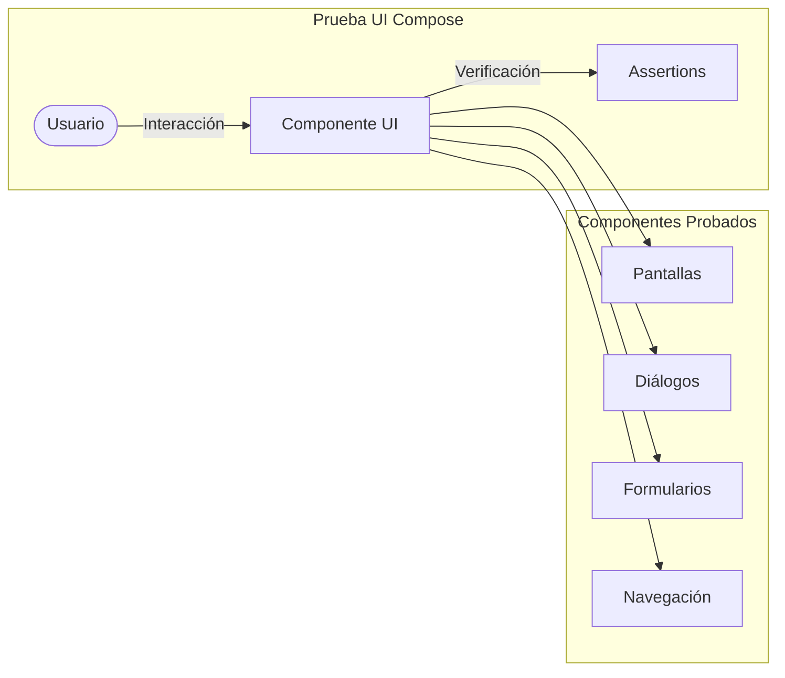

### Pruebas de Rendimiento

Las pruebas de rendimiento evalúan el comportamiento de la aplicación bajo diferentes condiciones de carga y verifican que responde dentro de límites aceptables.

**Ubicación:** `/app/src/androidTest/`

**Ejemplos implementados:**

- **Pruebas de Tiempo de Respuesta**: Miden el tiempo que tardan operaciones críticas.
  - `FirebaseLoadingPerformanceTest.kt`: Mide tiempos de carga desde Firebase.

- **Pruebas de Consumo de Recursos**: Miden el uso de memoria y CPU.

**Ejemplo de código:**
```kotlin
@Test
fun testTiempoCargaCentros() {
    val startTime = Instant.now()
    
    // Ejecutar la operación de carga
    val result = centroRepository.getAllCentros()
    
    val duration = Duration.between(startTime, Instant.now())
    
    // Verificar que la operación se completó en menos de 3 segundos
    assertTrue("La carga de centros tardó demasiado: ${duration.toMillis()} ms", 
               duration.toMillis() < 3000)
}
```

### Modelo de Pruebas de Rendimiento

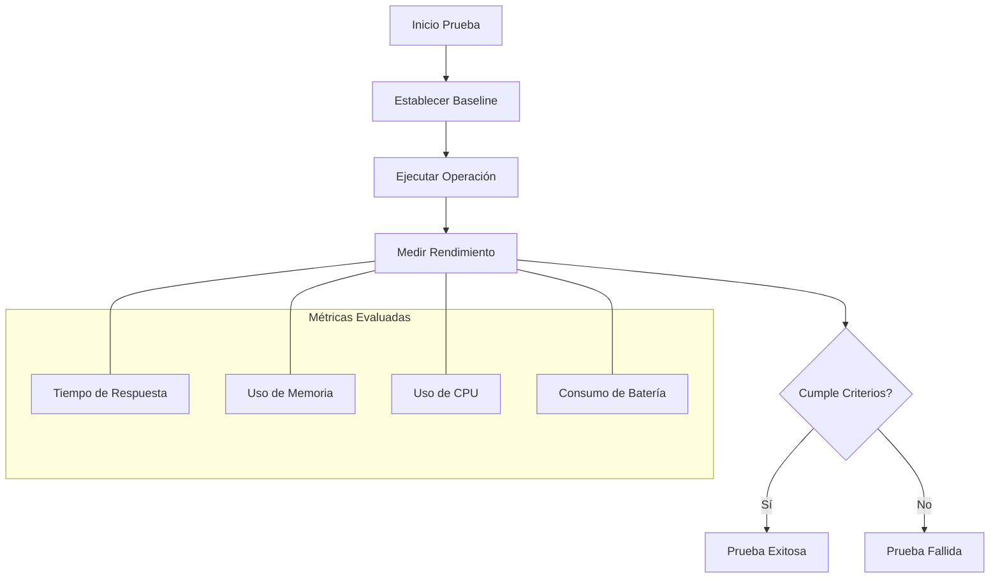

## Estructura del Testing

En Android, las pruebas se dividen en dos directorios principales:

- **`/app/src/test/`**: Para pruebas que se ejecutan en la JVM local, sin necesidad de un dispositivo Android o emulador. Aquí se incluyen las pruebas unitarias simples.

- **`/app/src/androidTest/`**: Para pruebas que requieren un dispositivo Android o emulador, como pruebas de UI, integración o rendimiento.

Esta estructura permite una clara separación de responsabilidades y optimiza los tiempos de ejecución de las pruebas.

### Organización del Código de Pruebas

En UmeEgunero, las pruebas siguen una estructura de paquetes que refleja la organización del código de producción:

```
app/
├── src/
│   ├── test/                           # Pruebas unitarias (JVM local)
│   │   └── java/com/tfg/umeegunero/
│   │       ├── data/repository/        # Pruebas de repositorios
│   │       │   ├── AuthRepositoryTest.kt
│   │       │   ├── CursoRepositoryTest.kt
│   │       │   └── ...
│   │       ├── feature/common/viewmodel/ # Pruebas de ViewModels
│   │       │   ├── LoginViewModelTest.kt
│   │       │   └── ...
│   │       └── util/                   # Pruebas de utilidades
│   │
│   └── androidTest/                    # Pruebas con componentes Android
│       └── java/com/tfg/umeegunero/
│           ├── feature/                # Pruebas de características
│           │   ├── common/             # Características comunes
│           │   │   └── LoginScreenTest.kt
│           │   ├── admin/              # Características de administrador
│           │   │   └── CreacionCentroTest.kt
│           │   └── ...
│           ├── navigation/             # Pruebas de navegación
│           │   └── NavegacionTest.kt
│           └── performance/            # Pruebas de rendimiento
│               └── FirebaseLoadingPerformanceTest.kt
```

### Estructura Visual de los Directorios de Pruebas

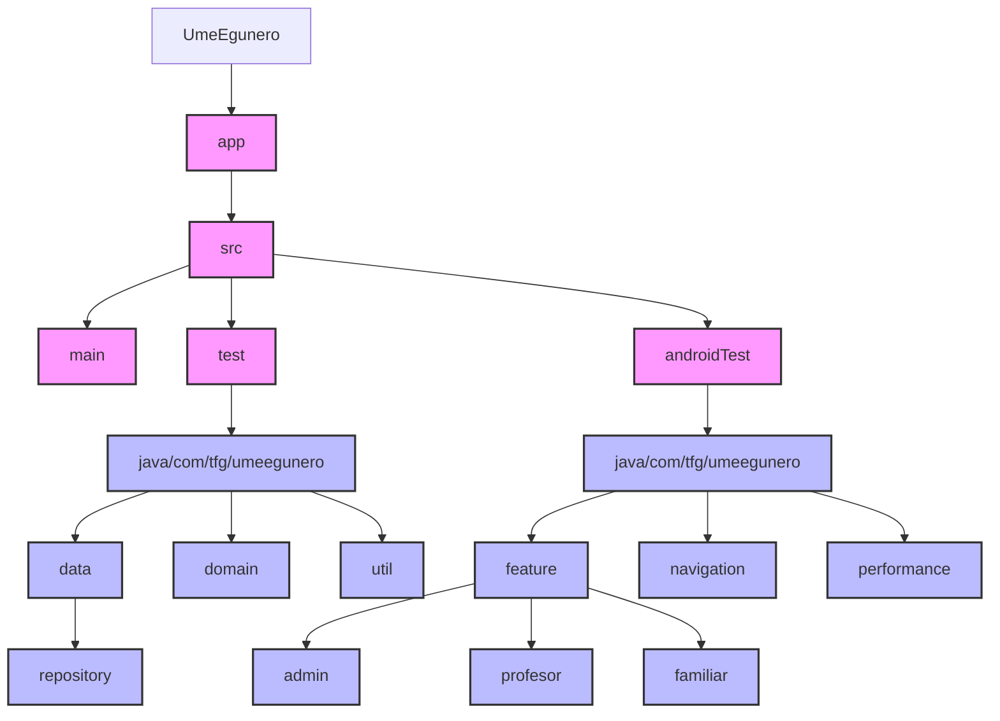

## Herramientas Utilizadas

En el desarrollo de las pruebas para UmeEgunero, se han utilizado diversas herramientas y bibliotecas:

### Para Pruebas Unitarias:
- **JUnit 4**: Marco principal para pruebas unitarias.
- **MockK/Mockito**: Bibliotecas de mocking para simular dependencias.
- **Kotlin Coroutines Test**: Para probar código asíncrono con corrutinas.
- **Truth**: Biblioteca para aserciones más legibles.

### Para Pruebas de UI e Integración:
- **Compose UI Test**: Para pruebas de interfaz de usuario en Jetpack Compose.
- **Espresso**: Para interacciones con la interfaz de usuario.
- **Hilt Testing**: Para inyección de dependencias en pruebas.
- **Navigation Testing**: Para pruebas de navegación.

### Para Pruebas de Rendimiento:
- **Benchmark**: Para medir rendimiento de componentes específicos.
- **Firebase Performance Testing**: Para analizar rendimiento con Firebase.

### Integración de Herramientas

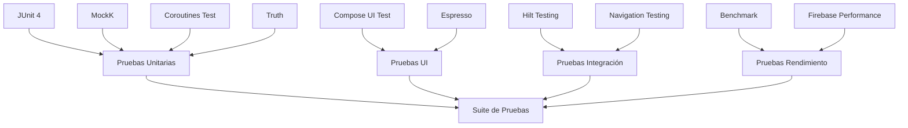

## Patrones y Buenas Prácticas

### Patrón Given-When-Then (Arrange-Act-Assert)

Todas las pruebas en UmeEgunero siguen el patrón Given-When-Then para una mayor claridad:

1. **Given (Dado)**: Preparar el estado inicial para la prueba.
2. **When (Cuando)**: Ejecutar la acción a probar.
3. **Then (Entonces)**: Verificar los resultados esperados.

```kotlin
@Test
fun `login con credenciales correctas inicia sesión exitosamente`() = runTest {
    // GIVEN: Email y contraseña válidos
    val email = "user@example.com"
    val password = "password123"
    whenever(authRepository.loginWithEmailAndPassword(email, password))
        .thenReturn(Result.Success("userId"))
    
    // WHEN: Ejecutamos login
    loginViewModel.updateEmail(email)
    loginViewModel.updatePassword(password)
    loginViewModel.login()
    
    // THEN: Verificar resultados esperados
    verify(authRepository).loginWithEmailAndPassword(email, password)
    val state = loginViewModel.uiState.first()
    assertTrue(state.isLoginSuccess)
}
```

### Flujo de Patrones de Prueba

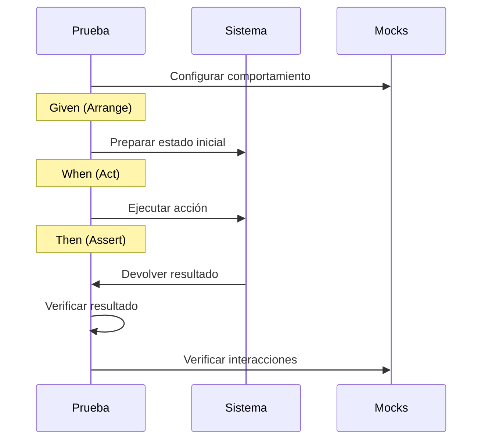

### Test Doubles (Dobles de Prueba)

Se utilizan varios tipos de dobles de prueba para aislar el componente bajo prueba:

- **Mocks**: Para verificar interacciones entre componentes.
- **Stubs**: Para proporcionar respuestas predefinidas.
- **Fakes**: Implementaciones ligeras para reemplazar componentes complejos.

### Técnicas de Dobles de Prueba

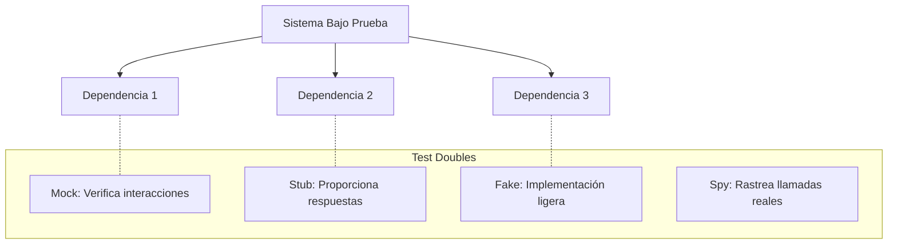

### Testing Asíncrono

Para manejar operaciones asíncronas, se utilizan:

- **Coroutines Test**: Para pruebas de código con corrutinas.
- **waitUntil**: Para esperar condiciones en pruebas de UI.
- **Timeout assertions**: Para asegurar que las operaciones se completan dentro de límites de tiempo.

### Flujo de Prueba Asíncrona

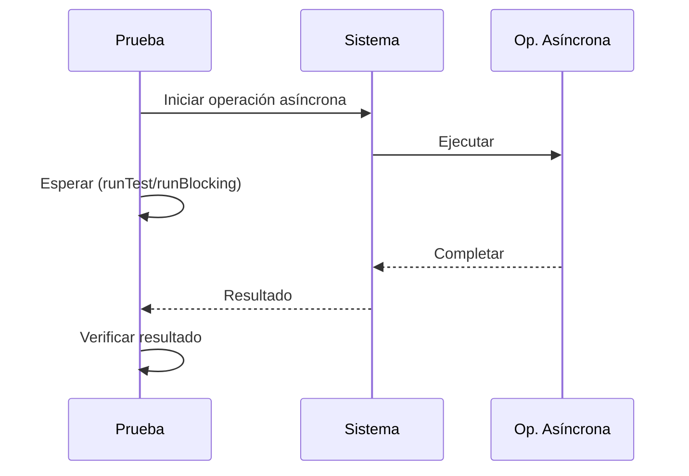

## Cobertura de Código

La cobertura de código es una métrica importante para evaluar la calidad de las pruebas. En UmeEgunero, se utiliza JaCoCo para generar informes de cobertura.

### Objetivos de Cobertura:

- **Repositorios**: > 85% de cobertura
- **ViewModels**: > 90% de cobertura
- **Utilidades y Modelos**: > 80% de cobertura
- **Cobertura global**: > 75% de cobertura

### Visualización de Cobertura

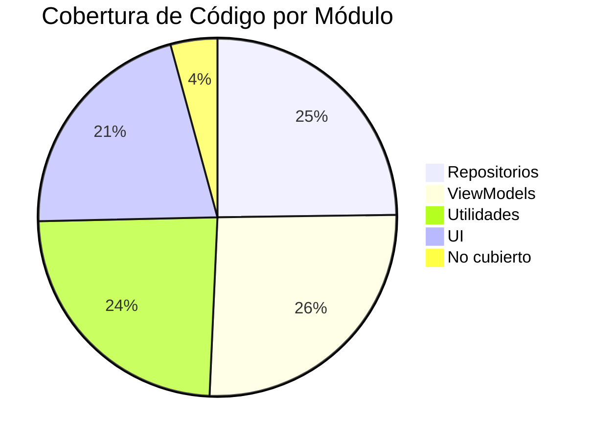

## Automatización de Pruebas

La automatización de pruebas es fundamental para mantener la calidad del código a lo largo del tiempo.

### Integración Continua (CI):

Las pruebas se ejecutan automáticamente en cada push o pull request mediante GitHub Actions:

```yaml
name: Android Tests

on:
  push:
    branches: [ main, develop ]
  pull_request:
    branches: [ main, develop ]

jobs:
  test:
    runs-on: ubuntu-latest
    steps:
      - uses: actions/checkout@v3
      - name: Set up JDK 17
        uses: actions/setup-java@v3
        with:
          distribution: 'temurin'
          java-version: '17'
      - name: Run Unit Tests
        run: ./gradlew testDebugUnitTest
      - name: Generate Test Report
        run: ./gradlew jacocoTestReport
```

## Estrategias para Probar Firebase

Al ser Firebase una dependencia externa, plantea desafíos particulares para las pruebas:

### Enfoque 1: Mocking

Para pruebas unitarias, se mockean las interacciones con Firebase:

```kotlin
// Mock de FirebaseFirestore
private val firestore: FirebaseFirestore = mockk(relaxed = true)
private val collection: CollectionReference = mockk(relaxed = true)
every { firestore.collection("usuarios") } returns collection
```

### Enfoque 2: Emuladores de Firebase

Para pruebas de integración, se utilizan los emuladores locales de Firebase:

```kotlin
// Configuración del emulador en el setUp
firebaseFirestore.useEmulator("10.0.2.2", 8080)
firebaseAuth.useEmulator("10.0.2.2", 9099)
```

### Enfoque 3: Proyectos de Prueba

Para pruebas más completas, se utiliza un proyecto Firebase separado para testing.

### Estrategias de Testing para Firebase

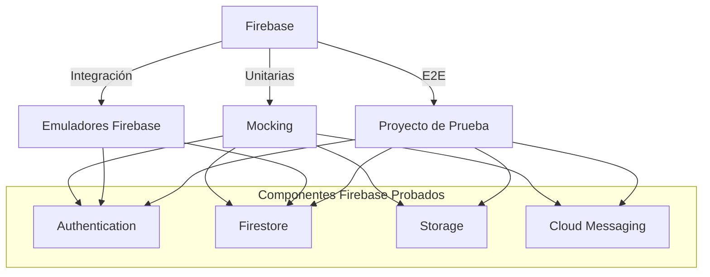

## Conclusiones

La implementación de una estrategia de pruebas completa y bien estructurada ha sido fundamental para garantizar la calidad de UmeEgunero. Las diferentes capas de pruebas (unitarias, integración, UI y rendimiento) proporcionan una red de seguridad que permite detectar problemas tempranamente y facilita la evolución y mantenimiento de la aplicación.

El enfoque adoptado, combinando diferentes técnicas y herramientas, ha permitido alcanzar un alto nivel de confianza en el funcionamiento correcto de la aplicación, asegurando que cumple con los requisitos funcionales y no funcionales establecidos.

La automatización de las pruebas dentro del proceso de integración continua garantiza que la calidad se mantenga a lo largo del tiempo, permitiendo un desarrollo ágil y seguro.

### Resultados del Enfoque de Testing

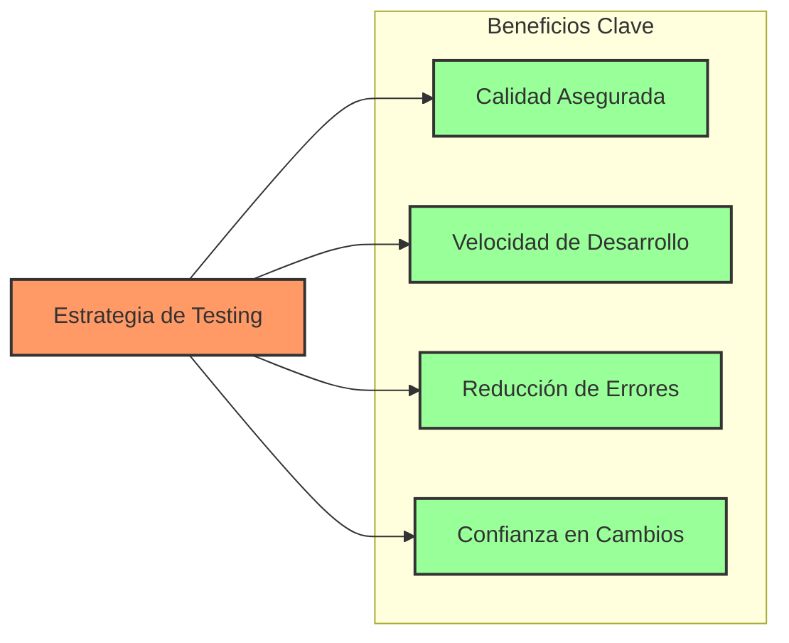

---

*Documento actualizado por:* Equipo de Desarrollo UmeEgunero  
*Fecha:* Mayo 2025  
*Versión:* 2.0 